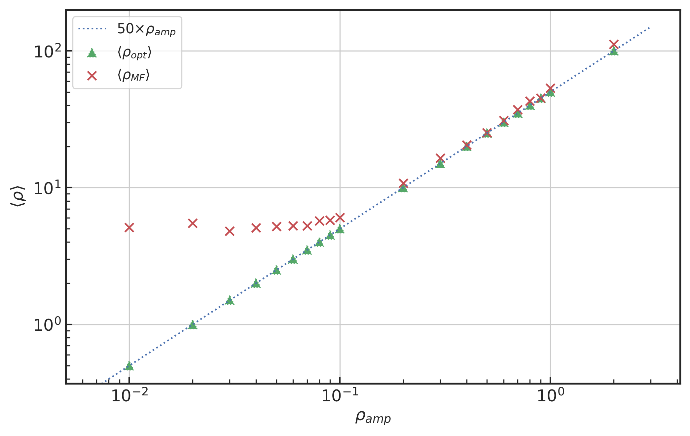
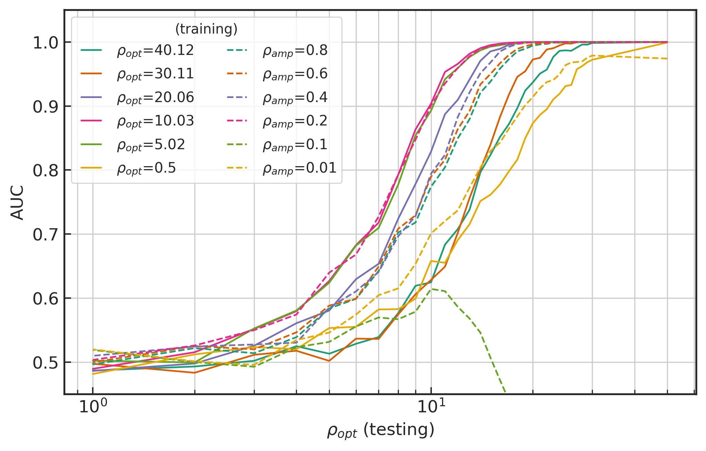
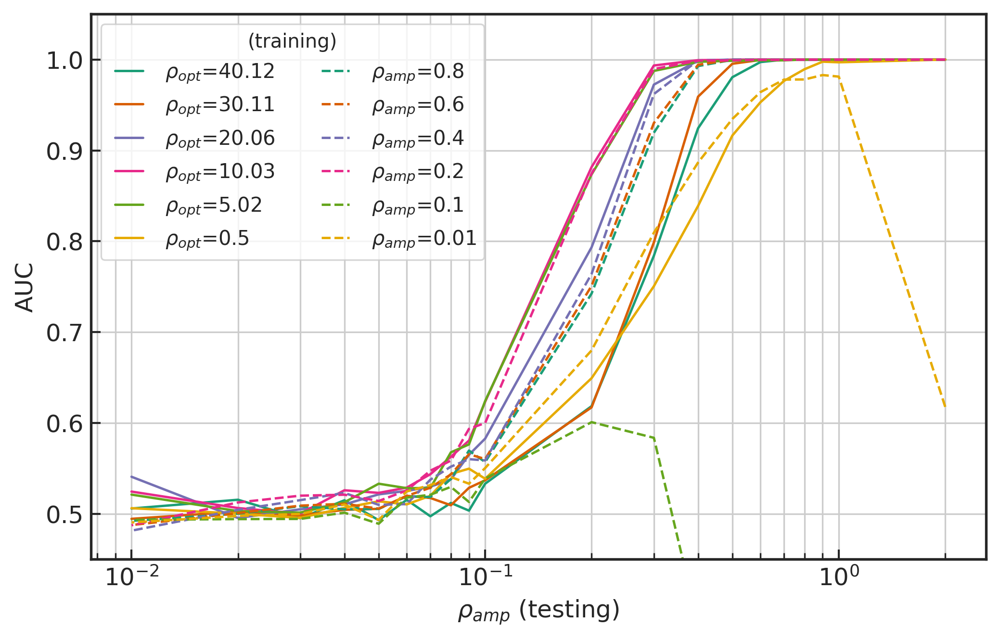
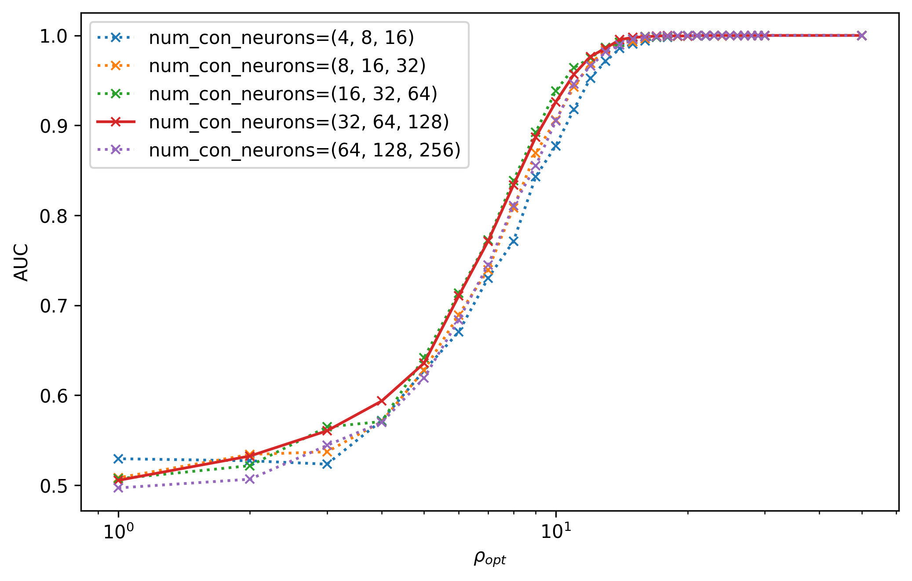
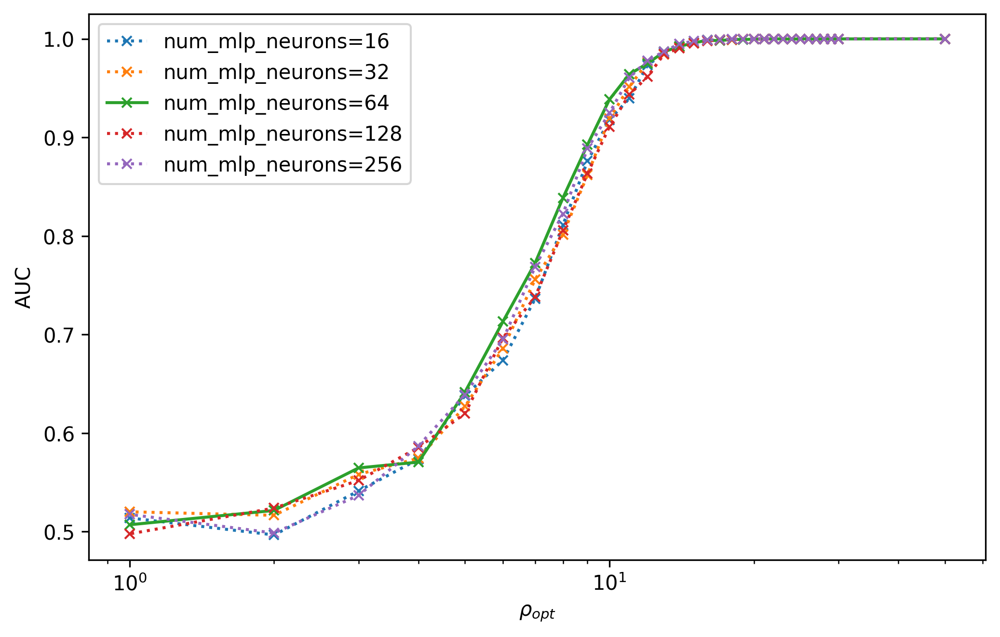
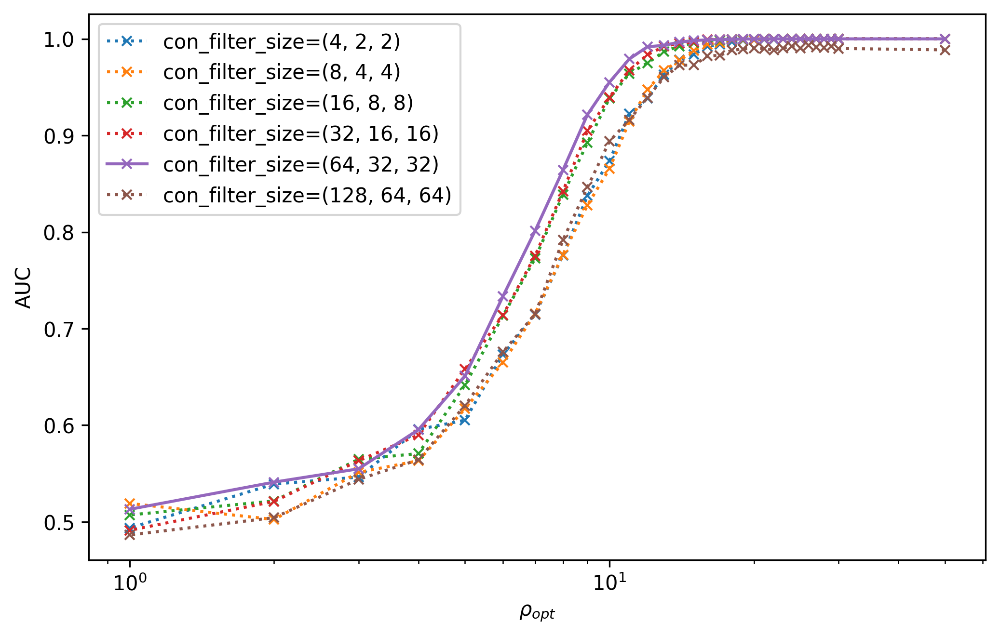
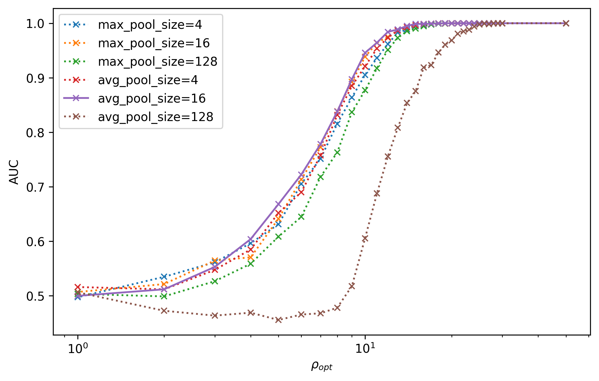
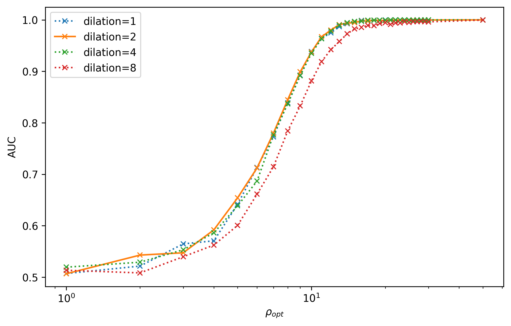
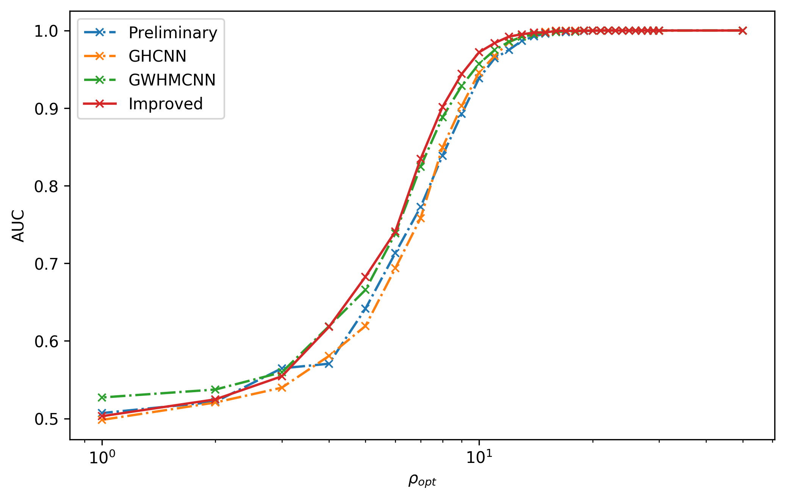
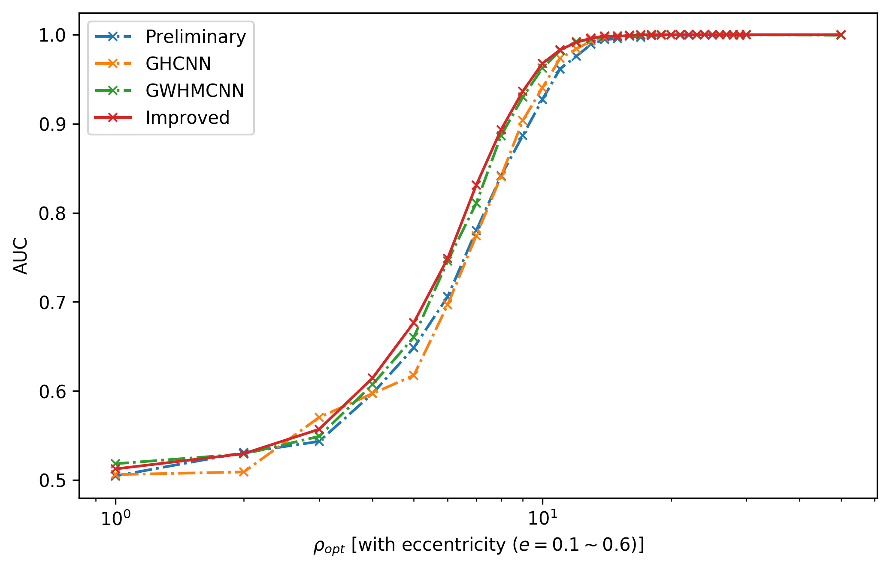

 

[TOC]

 

---

# 第五章 卷积神经网络结构对引力波信号识别的性能研究

 

## 5.1 引言

 

引力波天文学已经发展成为一个非常成熟的研究领域。截止到第二次运行阶段 (O2) 结束，高新激光干涉仪引力波天文台 aLIGO [@2016AbbottGW150914AdvancedLIGO] [@2015AasiAdvancedLIGO] 与欧洲的 aVirgo [@2015AcerneseAdvancedVirgosecond] 引力波探测器联合观测到数十个双黑洞系统的引力波并合事件。如此瞩目的成就再一次印证了爱因斯坦广义相对论的准确预言 [@2016AbbottObservationGravitationalWaves] [@2016AbbottGW151226ObservationGravitational] [@2017AbbottGW170104Observation50] [@2017AbbottGW170608Observation19] [@2017AbbottGW170814ThreeDetector]，也意味着引力波天文学正式迈入了收获丰硕成果的引力波观测新时代。

引力波的成功探测将会为引力理论和天文学的研究提供全新的方式和观测手段，尤其是开辟了多信使天文学的崭新局面。引力波作为信息的载体，不仅可以提供电磁波不能提供的信息，还可以为后续的光学观测预警，这就是基于联合观测的多信使天文学 [@2017AbbottMultimessengerObservations]。GW170817 [@2017AbbottGW170817ObservationGravitational] 是人们第一次成功进行的多信使天文学观测事件。随着 aLIGO 和 aVirgo 的探测器灵敏度进一步的提升，未来的多信使天文学将结合各地的天文台 [@2005Abbottdarkenergysurvey] [@2013AbdosecondFermiLarge] [@2002TysonLargesynopticsurvey] [@2002TysonSurveyothertelescope] [@2013AmendolaCosmologyfundamentalphysics] [@2015GehrelsWideFieldInfraRed] [@2016AdrianMartinezHighenergyNeutrino] 会观测到更多的引力波事件和更多类型的引力波波源，也会接收到更多关于宇宙环境中各种天体的运动、结构、起源和演化的丰富信息。

随着多信使天文学的发展，人们逐渐地意识到当前正在面临着机遇与挑战并存的研究现状。为了充分发挥多信使天文学中协同观测的能力，计算开销是目前最主要的限制因素。首先，低延迟的引力波探测技术的计算开销很大程度上是受限于信号处理中的匹配滤波技术 (matched-filtering)。匹配滤波是一种用于在高斯、稳态和加性的噪声中，探测特定的已知波形形状信号的线性最优算法。在目前的引力波探测领域中，匹配滤波技术仍仅从 4D 波源参数空间 (即双星各自的总质量 $(m_1,m_2)$ 和非零自旋角动量 ($s_1^z,s_2^z$)) 外加一个轨道偏心率 ($e$) 所构成的波形模板库 (template bank) 搜寻引力波信号。将匹配滤波算法运用在完全放开的高维波源参数空间上搜寻引力波信号，在计算开销上是不现实的，因为这会要求所需要的模板库波形数目上升数个数量级 [@2017IndikReducingnumbertemplates] [@2016HarrySearchingGravitationalWaves]。目前的引力波后续观测预警使用的是高误报率、低信息量方式。这大大地增加了后续观测的难度。此外，该算法只能适用于搜寻延时短的引力波波源信号，对于较长的引力波波形的信噪比表现并不理想。

近些年来，引力波天文学中运用机器学习来实现信号处理的工作是一个正在茁长成长的领域 [@2011GraffBAMBIblindaccelerated] [@2016MukundTransientClassificationLIGO] [@2017PowellClassificationmethodsnoise] [@2015PowellClassificationmethodsnoise],[@2016ZevinGravitySpyIntegrating] [@2017BahaadiniDeepMultiview]。对于传统的机器学习技术，甚至包括如浅层 ANNs，都需要人工对数据中的特征进行抽取，而不是对原始数据本身直接作为输入。然而，深度神经网络可以实现自动地特征提取，在低信噪比的数据环境中成功地探测识别引力波信号 (可见第[四](C4.md)章)。在以往的研究 [@2018GeorgeDeepNeuralNetworks] [@2018GabbardMatchingMatchedFiltering] 中，研究者们尝试了在高斯噪声背景和模拟的 aLIGO 探测器噪声下就深度卷积神经网络的引力波信号识别能力，发现探测某种非高斯特征是很有效的，现在这些非高斯性就对应于输入数据中特定的片段中，并且有着比传统机器学习方法优异的表现，并与匹配滤波技术相比较也有着可比拟的信号识别率。然而，还尚未有研究针对不同文献中所提出的不同网络模型结构之间的性能差异进行比较。此外，由于缺乏数据预处理流程的详细描述，还少有研究者曾讨论过数据集中信噪比定义的不同考量对泛化性能的影响。

在本章，我们将根据 aLIGO 引力波探测器的灵敏度模拟引力波背景噪声数据，通过在不同信噪比约定下完成数据预处理流程和数据集的制备 (第 [5.2](C5.md#52) 节)，我们对比了训练数据分布的差异对卷积神经网络在低信噪比引力波信号识别能力的影响和规律 (第 [5.3](C5.md#53) 节)。随后，我们对卷积神经网络的结构超参数进行较系统性地考察、微调和优化 (第 [5.4](C5.md#54) 节)，提出一个改进版的卷积神经网络构架。通过与前人研究的模型结构作比较，发现我们所提出的改进版算法模型不论是内插还是外插泛化性能上都有着更好的表现。

 

## 5.2 引力波数据的制备和处理流程

 

在监督深度学习算法中，数据量越大模型的性能会越有优势 [@2016GoodfellowDeepLearning]。通常来说，获取大量高质量的带标签的训练数据是非常困难和繁琐的，尤其是在绝大多数深度学习应用领域中，如计算机视觉领域、语音识别和自然语言处理等。不过，在引力波数据处理中，我们并不会面对这些困难，这是因为我们总可以通过理论数值模拟得到源源不断的引力波波形和模拟噪声数据。

为简单起见，我们假定引力波信号都是根据单个探测器理想定向的 (optimally oriented)，并且根据 SEOBNRE [@2017CaoWaveformmodeleccentric],[@2019PanAccuracysourcelocalization] 模型来生成双黑洞系统波源对应自旋都为零且无轨道偏心率的引力波波形。如此一来，我们的波源参数空间的维度就约化到了二维，即双黑洞系统各自的质量。与第[四](C4.md)章一致，我们同样限制总质量参数以一个太阳质量为间隔，在 $5M_\odot$ 和 $150M_\odot$ 之间采样，并根据双黑洞的质量比从 1 到 10 间隔 0.1 均匀采样来生成波形模板数据。由此，共生成 3220 个引力波波形。我们仍要求模型输入数据的时序序列窗口为 1 秒的时长，并且在 8192Hz 上均匀采样。在这个采样率上进行机器学习建模是比较有效的 [@2018GeorgeDeepNeuralNetworks]。值得留意的是，真实的引力波数据是连续的时序数据流，以时序窗口作为算法的输入进行时域扫描。可见，模型输入序列的窗口大小也是本文所考虑的学习任务的可调参数之一，该超参数对模型训练和引力波搜寻的影响将会在第[六](C6.md)章中讨论。

>(左图) 模拟探测器噪声的 $\text{ASD}=\sqrt{\text{PSD}}$
>(右图) 一个经过数据处理流程后的训练样本数据 ($35M_\odot+35M_\odot,\,\rho_\text{opt}=10$)
{: style="zoom:15%"}{: style="zoom:15%"}

与通常的引力波数据分析方法相同，我们以引力波探测器 “Zero-detuned High Power” [^azdhp] 设计灵敏度曲线 [@2015AasiAdvancedLIGO] 为基准模拟背景噪声和估测 aLIGO 的噪声功率谱密度，并以此来对引力波数据进行白化。如上方上图所示表示在不同频率下对 aLIGO 探测器的近似灵敏度。很多引力波数据分析的研究都需要模拟噪声的来源，比如很早就有为构造机器学习算法而模拟背景噪声 [@2015PowellClassificationmethodsnoise] [@2015VeitchParameterestimationcompact] [@2016TorresForneDenoisinggravitationalwave]，也有为了测试算法性能而采样了真实的 aLIGO 探测器噪声 [@2017PowellClassificationmethodsnoise]。在本章中，我们对第[四](C4.md)章模拟的高斯背景噪声进行“上色”，使得其可以表征真实引力波探测器的功率谱密度，在该高斯有色的探测器噪声背景下，构建用于引力波信号识别的神经网络模型。

[^azdhp]: [https://dcc.ligo.org/LIGO-T0900288/public](https://dcc.ligo.org/LIGO-T0900288/public)

与第[四](C4.md)章中数据集生成办法一致，我们依据一定的信噪比将所有混合后数据都分成独立的两部分，分别对应为训练集和测试集，并且测试集中引力波波形模板对应的总质量参数是与训练集的样本相错开 $0.5M_\odot$ 采样的。可见，各含有 1610 个引力波波形的两个数据集中并没有共同存在的波形模板。如此生成数据集合，就可以确保两个数据集是独立同分布的，满足机器学习模型优化的基本假设。并且这样也可以在一定程度上避免过拟合问题。两个数据集中波形模板的质量分布可见第[四](C4.md)章中的质量分布图。

在开始模型训练之前，我们对数据集中所有数据样本都进行相同的一套数据清理流程，如下方图所示 (仅展示数值为正的引力波数据)。先取 2 秒时长的引力波波形模板，并将每个波形的峰值都居中在 0.8 秒范围内随机排布。为了减少能谱泄露所带来的影响，我们使用一个 Tukey 窗函数来去掉两侧约 50\% 的波形信息。根据特定的信噪比需求以及对应不同的噪声估计来源，数据中波形模板的幅度会乘以一个缩放因子 $\alpha$，再和 2 秒时长的有色背景噪声混合，随后根据噪声功率谱密度对混合后的数据样本进行加窗和白化处理。最后，通过截取居中的 1 秒时长的数据样本，与第[四](C4.md)章一样为了优化模型训练的过程 [@2012LeCunEfficientBackProp] [@1998LecunGradientbasedlearning]，再经过标准化处理 (均值为0，方差为1) 后就可以制备出深度神经网络模型的输入数据集。类似地也可以生成一个等规模的模拟噪声数据集，从而扩大整个训练集和测试集的样本数目，分别有 3220 个数据样本。如上方右图所示，是一个训练样例数据。

>引力波数据预处理流程示意图
{: style="zoom:16%"}

在实际的模拟噪声生成过程中，我们使用了 PyCBC [^pycbc] 软件程序包 [@2016UsmanPyCBCsearchgravitational] [@2020NitzgwastropycbcPyCBCRelease] 来模拟 aLIGO 引力波探测器设计灵敏度的随机噪声。上述的数据处理流程参考自 Gabbard 等人 [@2018GabbardMatchingMatchedFiltering] 在 2018 年发表在 Physical Review Letters 上的处理方法和源代码 [^code]。他们通过模拟的噪声和引力波模板发现在较低的匹配滤波信噪比和相同误报率下，卷积神经网络与匹配滤波算法相比有着相当的引力波信号探测率。考虑到模拟探测器有色噪声对模型性能的影响，我们将在下一节来探讨匹配滤波信噪比和基于引力波振幅的信噪比之间的关系，以及在深度学习算法下，该选用哪种信噪比定义来构建训练数据集分布对模型的泛化性能更有效。

[^pycbc]: [https://ligo-cbc.github.io](https://ligo-cbc.github.io)
[^code]: [https://github.com/hagabbar/cnn_matchfiltering](https://github.com/hagabbar/cnn_matchfiltering)

 

## 5.3 引力波数据分析中信噪比的比较分析

 

在上一节的数据处理流程过程中，我们是通过一个缩放因子来改变数据中引力波模板的波形幅度，从而控制波形信号与噪声之间的关系，我们用信噪比标记制备出来的数据集。在不同的引力波数据处理文献中，信噪比的定义并不完全统一，一般都会在文献中明确表明当前工作中所使用的信噪比是如何定义的。在绝大多数的引力波信号处理文献 [@2017AbbottGW170817ObservationGravitational] [@2018GabbardMatchingMatchedFiltering] 中，都会使用匹配滤波信噪比 $\rho_\text{opt}$ 来衡量引力波信号在所给定的噪声功率谱下的探测能力 (第 [2.4](C2.md#24) 节)，

$$
    \rho_\text{opt}^2 = \langle h|h \rangle
$$

该定义一般称作关于模板信号 $h(t)$ 的最佳匹配滤波信噪比 (optimal matched-filtering SNR) 或特征匹配滤波信噪比 (characteristic matched-filtering SNR)。之所以称其为“最佳”，是因为该定义对应于一段引力波数据 $d(t)$ 上对模板信号做滤波匹配结果的期望。所以，在用模板波形搜寻引力波信号时，会用基于匹配滤波结果关于该段数据 $d(t)$ 上的匹配滤波信噪比 $\rho_\text{MF}$ [@2014CaoGravitationallensingeffects] 定义为

$$
\begin{align}
    \rho_\text{MF}^{2}(t_0) 
    &=\frac{1}{|\langle h | h\rangle|}|\langle d | h\rangle(t_0)|^{2} \\
    \langle d | h\rangle(t)
    &=4  \int_{0}^{\infty} \frac{\hat{d}(f) \hat{h}^{*}(f)}{S_{n}(f)} e^{i 2 \pi f t} d f
\end{align}
$$

其中，$t_0$ 是在给定区间上 $\rho_\text{MF}$ 的最大值似然所对应的信号到达时间。

在有些深度学习引力波数据处理文献中，会使用另外一种信噪比定义(如 [@2018GeorgeDeepNeuralNetworks] [@2017LiMethodDetectingGravitational] 和本文第[四](C4.md)章):

$$
    \rho_\text{amp}=\frac{\max _{t} h}{\sqrt{\sigma_{\text{noise }}}}
$$

该信噪比的定义简单，操作方便，运算速度快。对于稳态高斯背景噪声而言，信号的幅度与该信噪比之间也成正比关系。为了便于对比研究文献中不同信噪比定义下的研究结果，以及探究清楚不同信噪比的定义对我们构建数据集分布的影响，以及会对训练机器学习模型性能的影响，我们将先分别对 $\rho_\text{opt}$ 和 $\rho_\text{amp}$ 这两种定义下的信噪比在引力波数据中做统计意义的比较分析。

>分布基于信噪比 $\rho_\text{amp}=0.03, 0.05, 0.1, 0.3, 0.5$ 时的数据集波形样本中 
>(左) 信噪比 $\rho_\text{rho}$ 分布，和 
>(右) 最大化的信噪比 $\rho_\text{MF}$ 分布
{: style="zoom:15%"}{: style="zoom:15%"}

首先，通过上一节中所介绍的数据集构造方法，我们根据 $\rho_\text{amp}$ 信噪比定义分别基于 $0.03, 0.05, 0.1, 0.3, 0.5$ 来制备数据集，并探讨这些数据集上所有的数据样本中关于信噪比定义 $\rho_\text{opt}$ 和 $\rho_\text{MF}$ 的分布情况，如上方图像所示。从上方左图中的统计分布规律可以看到，对于给定的某 $\rho_\text{amp}$ (所有波形有相同的最大振幅) 来说，其各波形样本所对应的 $\rho_\text{opt}$ 信噪比会随着 $\rho_\text{amp}$ 的减小而线性的降低。而从上方右图中可知，当对这些不同振幅高度的 $\rho_\text{amp}$ 数据样本去做匹配滤波后，给出各数据样本的匹配滤波信噪比会收敛在 $\rho_\text{MF}=5$ 左右处。

通过在各数据集样本上统计 $\rho_\text{opt}$ 和 $\rho_\text{MF}$ 信噪比的平均值，进而对这三个信噪比含义作比较，如下方图所示。可以看到 $\rho_\text{opt}$ 的平均值与 $\rho_\text{amp}$ 是明确的线性正比关系。这很容易理解，因为这两个定义都与波形的振幅成正比。$\rho_\text{MF}$ 在背景噪声的影响下，会在 $\rho_\text{amp}<0.1$ 上最低收敛在 $5$ 左右。这也就是为何在实际的引力波探测搜寻过程中，一般都是取匹配滤波信噪比的阈值为 $5\sim6$ 来标记疑似引力波信号。

>信噪比 $\rho_\text{rho}$ 和最大化的 $\rho_\text{MF}$ 的平均值与信噪比 $\rho_\text{amp}$ 之间的关系
{: style="zoom:30%"}

在机器学习的最大似然估计理论里，算法模型本质上是在学习训练数据集的经验分布 (第 [3.2.1](C3.md#321) 节)。所以，采用不同的信噪比定义其所构造的训练数据分布会对模型的训练表现和泛化能力产生影响。下面，我们就来量化这个训练分布的差异所带来的影响。为了让实验具有可比性，我们将采用 $\rho_\text{amp}$ 和 $\rho_\text{opt}$ 这两种信噪比定义，分别在 2, 1, 0.9, 0.8, 0.7, 0.6, 0.5, 0.4, 0.3, 0.2, 0.1, 0.05, 0.01 和对应的 $\rho_\text{opt}$ 期望值 100.41, 50.18, 45.17, 40.12, 35.11, 30.11, 25.11, 20.06, 15.05, 10.03, 5.02, 2.51, 0.5 上，通过逐步缩放数据集中引力波波形的幅度分别构建训练数据集，并在相同的卷积神经网络模型 (模型结构可见第[四](C4.md)章中的网络结构图) 上训练优化。完成训练收敛后，在各训练数据集上所达到的准确率，如下方图像所示。图中上方的红色横轴对应的是 $\rho_\text{opt}$，下方的蓝色横轴对应的是 $\rho_\text{amp}$。可以看到网络模型对于引力波信号埋入噪声中的不同方式，有着不同的训练难度和优化效率。基于信号与噪声功率谱的 $\rho_\text{opt}$ 信噪比所刻画的引力波数据分布有着更优秀的训练收敛效果。

>在不同的信噪比 $\rho_\text{amp}$ (蓝色)和 $\rho_\text{opt}$ (红色)上模型训练收敛，训练集上对引力波波形的识别准确率
{: style="zoom:30%"}

为了无偏向的对比 $\rho_\text{opt}$ 和 $\rho_\text{amp}$ 这两个信噪比定义下测试数据上泛化能力，我们分别用他们构建了一系列引力波测试数据集来考察上述分别在不同数据分布意义下训练模型的泛化表现，如下方图像所示。从两图中可以看到，两种数据分布下训练收敛后的最佳泛化模型都分别处在 $\rho_\text{opt}=5\sim10$ (实线)和 $\rho_\text{amp}=0.2$ (虚线)，并且模型所对应测试数据集上的最佳泛化表现是非常接近的。在对应训练信噪比较大的模型中 (如$\rho_\text{opt}>30,\rho_\text{amp}>0.6$)，基于 $\rho_\text{opt}$ 训练构建的模型泛化表现是次于在 $\rho_\text{amp}$ 上构建的模型。然而在更低的 $\rho_\text{amp}<0.2$ 信噪比上训练收敛后，基于 $\rho_\text{opt}$ 信噪比制备数据集而训练的模型泛化稳定性就表现得很好。

>分别基于 (左) $\rho_\text{opt}$ 和 (右) $\rho_\text{amp}$ 构建的测试数据集上，在不同数据分布上训练收敛后的模型泛化表现 AUC 图
{: style="zoom:15%"}{: style="zoom:15%"}

综上所述，我们考虑基于匹配滤波的 $\rho_\text{opt}$ 信噪比所描述的训练数据分布来优化神经网络，并且逐步向降低信噪比的方向迁移学习时，在 $\rho_\text{opt}\in(5,10)$ 之间选取泛化表现最好的网络参数作为最终训练收敛的机器学习模型。为了方便与传统信号处理领域中的引力波数据分析做对比，在未特别说明的情况下，我们也默认使用 $\rho_\text{opt}$ 信噪比作为引力波波形幅度缩放的定量标准，以此构建测试数据集并考察神经网络模型的泛化能力。

 

## 5.4 卷积神经网络的超参数调优和性能比较

 

作为深度学习技术的常用算法，卷积神经网络基于人体视觉系统的工作模式所提出和得以发展，在计算机视觉、语音识别和自然语言处理等领域中应用非常广泛。作为全连接神经网络的特例 (第[三](C3.md)章)，卷积神经网络经典的模型组件包括卷积运算层、非线性激活层和池化层等共三个层级（在本文中不考虑卷积的规范化）。近年来，已有不少研究者，如 [@2018GeorgeDeepNeuralNetworks] (GH) 和 [@2018GabbardMatchingMatchedFiltering] (GWHM)等，都是基于卷积神经网络成功地构建了引力波信号识别模型。虽然他们在模型构造上有一定的差异，但都在 aLIGO 模拟噪声下与传统的机器学习算法和匹配滤波技术的比较中有着可圈可点的优势。在本节，我们将根据第[四](C4.md)章中的卷积神经网络作为初始模型，从网络模型的基础构造出发，切实地对卷积神经网络的算法实现进一步优化和改进。通过对结构组件的作用加强认识，我们将提出一个优化版的卷积神经网络结构，并与 GH 和 GWHM 在引力波信号识别的泛化性能上做比较。

卷积神经网络都以1秒内的 8192 个引力波时序数据作为特征输入到网络中，并且输出一个二维特征向量来表征当前样本数据中存在引力波的概率。模型结构在整体上分为两部分，一部分是由卷积层构造的特征提取部分，另一部分是全连接的神经网络层构成的分类器。开始模型优化之前，需要先确定模型结构的系统参数，即所谓的超参数 (hyperparameters)。通过对不同超参数的搜寻和组合，会影响模型最终的识别性能和泛化能力。在全连接层部分中，我们考虑其层数、各层神经元的节点数目、非线性激活函数和随机失活 (dropout) 的概率等四个维度来考量。在特征提取部分中，我们会针对卷积层的层数、各层卷积神经元的节点数目、卷积核的大小、空洞卷积的大小、非线性激活函数、池化类型、池化卷积核的大小、池化的跳跃 (stride) 步长等八个维度对模型进行微调。关于卷积神经网络的结构组件及其中的详细含义可见第[三](C3.md)章。

>第[四](C4.md)章的初始模型、GH、GWHM 和本章的改进版卷积神经网络模型结构的超参数对比
{: style="zoom:50%"}

我们将第[四](C4.md)章中的初步网络结构总结在了上方表中。作为对比，我们也总结了 [@2018GeorgeDeepNeuralNetworks] 和 [@2018GabbardMatchingMatchedFiltering] 的网络结构在表中，分别标记为 GH 和 GWHM。其中，GWHM 中 stride 超参数设置是参考了其公开的代码脚本 [^script]。明显可以看到，我们的初始网络结构 (Preliminary) 是最简单的。粗略地说，GH 所构造的网络使用了更多的神经元数目，而 GWHM 的网络叠加了更多的卷积神经元层。接下来，我们将开始在初始模型基础上，对超参数进行微调(finetune)。

[^script]: [https://github.com/hagabbar/cnn_matchfiltering/blob/735b0f05e452fa983bba4404aaa27b49c1821506/CNN-keras.py](https://github.com/hagabbar/cnn_matchfiltering/blob/735b0f05e452fa983bba4404aaa27b49c1821506/CNN-keras.py)

>对卷积层和全连接层的宽度(左上, 左下)和深度(右上, 右下)微调后模型在测试集上 AUC 图。
{: style="zoom:15%"}{: style="zoom:15%"}
{: style="zoom:15%"}{: style="zoom:15%"}

基于在上一节中介绍的数据处理流程，我们将会逐步降低训练集信噪比的方式来训练不同超参数组合下的网络模型。对于卷积神经网络的深度和宽度，我们分别对卷积层的层数和全连接层的层数在 $1,2,\dots,8$ 和 $1,2,3,4$ 中调整，以及分别对卷积层和全连接层中神经元的数目在 $(2^i,2^{i+1},2^{i+2}), i=2\sim6$ 和 $2^i,i=4\sim8$ 中调整，可以得到不同超参数设置的模型下，在低信噪比 $\rho_{opt}$ 测试集上的 AUC 表现，如上方图像所示。在图中已将相对泛化性能优异的超参数用实线绘制。可以看到在引力波数据背景下，并不是卷积神经网络构建的越深，就会有较好的泛化效果。最优异的超参数大致锁定在 3 个卷积和 2 个全连接层的组合，并且分别对应隐藏层神经元数为 $(32,64,128)$ 和 $64$。我们之所以在泛化性能差别不大的情况下，会选择模型容量较小的超参数是因为小容量的模型会有更好的泛化性能 (可见第 [3.2.1](C3.md#321) 节)。

>对卷积层 (左) 和全连接层 (右) 的非线性激活函数微调后模型在测试集上 AUC 图。
{: style="zoom:15%"}{: style="zoom:15%"}

对网络结构的线性部分调参后，另一组非常重要的超参数就是非线性激活函数。我们分别对卷积层和全连接层中的非线性激活函数在 ReLU、Leaky ReLU ($\alpha=10^{-3}$)、PReLU 和 ELU ($\alpha=1$) 等四种激活函数进行调整，如上方图像所示。从图中可以看到，卷积层的激活函数差异很小，而全连接层上的 ReLU 和 Leaky ReLU 有较明显的优势。关于这几种非线性激活函数的定义和特性可见本文的第 [3.4.2](C3.md#342) 节。GWHM [@2018GabbardMatchingMatchedFiltering] 所提出的网络中使用了 ELU 激活函数，但在我们的实验中其泛化效果并不是最佳的。由于我们发现不同维度的超参数之间并不是完全独立的，比方说在更宽的网络结构中，PReLU 的泛化性能会有明显地提升。所以，随后我们会从表现良好的超参数中再进一步地细调，并且将会使用 PReLU 非线性激活函数在我们最终的改进版网络中。

>对卷积核大小 (a) 随机失活的概率 (b)，池化核的类型与大小(c)和空洞卷积的大小(d)等四种超参数微调后模型在测试集上 AUC 图。
{: style="zoom:15%"}{: style="zoom:15%"}
{: style="zoom:15%"}{: style="zoom:15%"}

我们分别对其他超参数进行了微调，它们包括卷积层内的卷积核大小、池化核的类型与大小、空洞卷积的大小以及全连接层中随机失活的概率，如上方图像所示。我们也将相对泛化性能优异的超参数用实线绘制，并选取其为改进版本的网络结构模型的超参数。在我们的初始模型，GH 和 GWHM 的模型中都使用了最大池化函数，然而从我们的调参过程来看，平均池化在低信噪比引力波数据中也有着较好的泛化响应。在 GWHM 的模型中使用了 50% 随机失活，然而在我们的实验中随机失活会明显降低模型的识别能力，其可能的原因是随机背景噪声的扰动实现了与神经元随机失活以避免过拟合所达到的同样效果。

根据上述不同超参数进行微调，选取相对泛化较好和次好的超参数进行更细化的网络结构搜寻后，我们给出了改进版的 (Improved) 卷积神经网络结构，可见上方的表。改进版的卷积神经网络仅由 3 个卷积层 和 2 个全连接层的结构所构成。与我们的初始模型相比，改进后卷积层的宽度加宽了 4 倍，最深卷积层输出特征图的感受野由 163 也放大了近 4 倍到 604，与之相比，GH 和 GWHM 的感受野分别为 4839 和 786。此外，非线性激活函数换做了有自适应学习参数的 PReLU 函数。

>上方表中的四个网络结构在相同的测试集上内插泛化 AUC 图
{: style="zoom:25%"}

现在，将上面表中四个不同的网络结构在引力波信号识别和泛化能力进行对比。正如我们在上一节中谈到的，训练数据集的信噪比分布和逐步降低信噪比的训练过程对模型的泛化性能是有影响的。所以，我们将表中的四个模型以完全相同的训练数据集和迁移学习过程进行训练，给出其各自的最佳泛化模型后，在相同的测试集上查看四个不同网络结构的泛化差异，如上图所示。从图中可以看到 GWHM 模型的内插泛化表现明显好于 GH 模型，而 GH 模型的泛化性能仅仅大概在 $\rho_\text{rho}>6$ 比我们的初始模型要好一点，我们可以将其理解为 GH 有着更宽的神经结构。改进版的网络结构明显在引力波波形的内插泛化上比其他三个模型结构表现都更好。

>上面表中的四个网络结构分别在有自旋或偏心率的测试集上外插泛化 AUC 图
{: style="zoom:15%"}{: style="zoom:15%"}

此外，我们还分别制备了自旋均匀分布在 $s=0.1\sim0.6$ 和偏心率均匀分布在 $e=0.1\sim0.6$ 引力波波形模板的测试数据集，以此来考察上面表中四个网络结构的外插泛化性能，如上图所示。从图中可以看到，改进版的卷积神经网络在外插泛化能力上比其他三个模型结构依旧有着更为优异的表现。

通过对卷积神经网络的基础结构组件进行超参数搜索，在充分了解其对引力波信号识别性能影响的基础上，可以在超参数空间中给出最佳的超参数组合。必须承认的是，在我们的优化调参实验中，不同模型之间泛化性能的差异并不是很大，这很可能与模型的容量和数据集相关。考虑到模型的容量总体都过小、训练数据复杂度与图像数据相比过于单一、以及训练域与测试域之间太过相近等等，这些因素都可能使得模型对超参数的变化不够敏感，我们并不打算过多的讨论其中的所有细节。在本文中，我们改进版的卷积神经网络有着更为简单的结构构造，在相同的训练和测试数据集环境下，比 [@2018GeorgeDeepNeuralNetworks] [@2018GabbardMatchingMatchedFiltering] 的网络结构有着更为优异的内插和外插泛化表现。可见，我们的网络结构是很值得期待的。

 

## 5.5 总结与结论

 

引力波的成功探测不但完成了广义相对论实验检验的最后一块拼图，而且还打开了一扇观测天体和宇宙的全新窗口——引力波天文学 [@2017Caigravitationalwavephysics] [@2016CaoGravitationalwaveastronomy]。同时它还将可能改变引力物理学研究的格局。在引力波实验以前，由于其他的引力实验只能涉及较弱引力场和低速的物理情形，以后牛顿参数衡量，相应参数小于甚至更小。而引力波探测对应的引力波源相应的参数在 1 的量级，是典型的强引力场强动态时空区域。引力物理学研究探讨的是广义相对论适用边界何在，失效后应该变成什么理论的问题。量子引力是该研究领域中典型的科学问题。在引力波探测之前，由于没有实验可供参考，人们只能利用理论推理的方式工作。所幸的是，引力波探测可以为这类基础引力物理问题提高有价值的线索。然而关键的问题是如何在强噪声环境下寻找到微弱的引力波信号 [@2017PowellClassificationmethodsnoise]。

在此前，已有一些基于深度学习实现引力波信号探测的类似工作 [@2018GeorgeDeepLearningReal] [@2018GabbardMatchingMatchedFiltering] [@2017LiMethodDetectingGravitational]。与我们的工作所不同的是，其要么是在高斯白噪声环境下训练的深度学习模型，要么是基于 aLIGO 探测器噪声所训练模型，与传统机器学习技术或匹配滤波技术作比较，还少有研究者对不同文献中所提出的卷积神经网络模型在引力波信号识别性能上作对比。在本章中，我们也提出了一个基于卷积神经网络的深度学习模型，通过训练该网络实现了 aLIGO 探测器噪声环境下的引力波信号识别，并与前人所提出的网络结构在超参数和泛化性能上进行了比较研究。

深度学习方法包含有三个主要环节：数据的预处理，搭建神经网络，模型的训练过程。在本章的工作中，我们关注的是引力波数据的预处理流程，以及卷积神经网络架构的优化。我们不仅对引力波在不同信噪比影响下的数据预处理方法进行对比测试，也对引力波信号识别所影响的网络结构组件进行了系统性的研究，包含卷积的层数、卷积和池化核、卷积和池化的方式以及池化类型、还有全连接的层数、神经元数目、随机失活的概率、以及非线性激活函数的选取等等。由此，我们可以理解如何使用深度学习方法来实现引力波的深度学习数据分析。更重要的是，我们通过网络结构的超参数微调，得到了一个引力波信号泛化识别效果非常好的卷积神经网络。并且根据我们的实验测试，改进版本的卷积神经网络可以比前人  [@2018GeorgeDeepNeuralNetworks] [@2018GabbardMatchingMatchedFiltering] 所构建的网络模型有着更优异的性能和泛化表现。

在本章中，我们仅仅使用了模拟的 aLIGO 背景噪声数据。将本章中所提出的改进版模型放置在真实的引力波探测数据上来考察其性能是一个很有趣的问题。我们将会在第[六](C6.md)章中，进一步利用和开发卷积神经网络来探讨真实引力波数据上的信号识别问题。我们相信基于深度学习算法来实现引力波信号探测和数据处理，将会有助于我们发现引力理论预期之外的引力波信号，并透过潜藏在强噪声环境下引力波所携带的信息，有机会全面地推动当前引力理论的发展。

\bibliography
