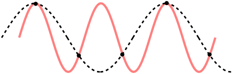
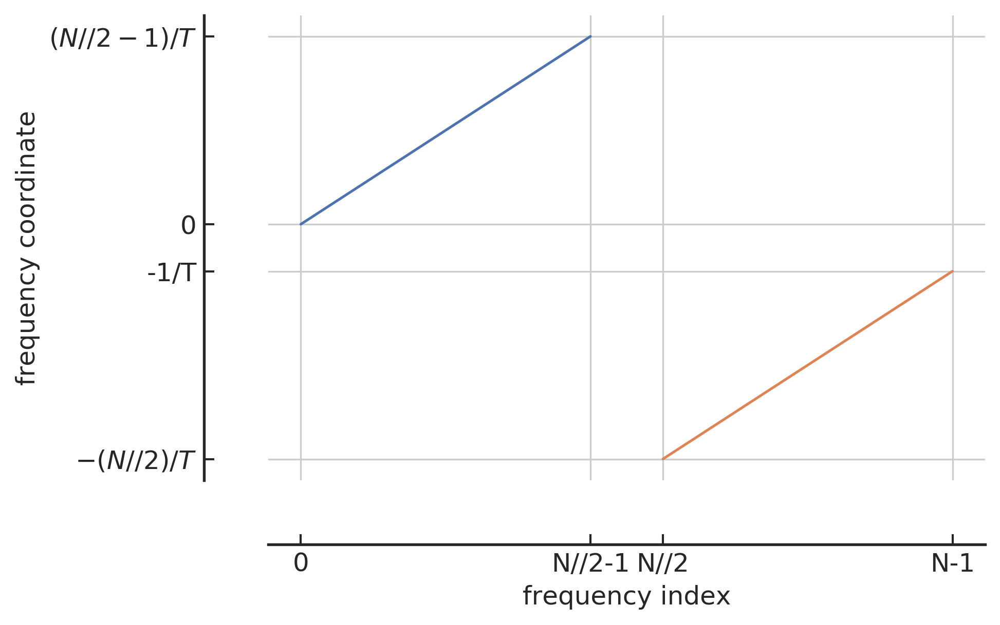

 

[TOC]

 

---

# 附录

 

## A. 采样定理与 Nyquist 频率

 

本附录将会介绍关于引力波数据的采样定理以及其中与引力波数据处理相关的重要概念。首先，我们来介绍采样的过程，即一个时序信号 $x(t)$ 会以每间隔 $\Delta t$ 秒的周期性进行采样，如下方上图所示。因此，时间 $t$ 就可以以采样间隔 $\Delta t$ 为单位表述为：

$$
    t = n\Delta t,n=0,\pm1,\pm2,\pm3,\dots
$$

>(上) 对模拟信号的理想采样过程示意图；(下) 频谱上周期性重复出现高频响应的示意图
{: style="zoom:20%"}
{: style="zoom:20%"}

显然，如果直接把采样后的离散样本点视作时序信号的话，就相当于是粗暴的把原始连续信号 $x(t)$ 切碎了，这样就会带来两个问题：1. 为了确保采样后的离散信号是无损的，应该取更小的采样间隔 $\Delta t$，那该如何选择呢？2. 采样会在频谱上会引起许多失真高频响应分量，并且这些高频频率分量会在频域上周期性的重复出现，如上方下图所示。这个周期可以通过采样率 (sampling rate) 来表示：

$$
    f_s = \frac{1}{\Delta t}
$$

对于采样后信号的重复频率谱来说，如何唯一地确定原始频率究竟是哪一个呢？采样定理 (sampling theorem) 提供了一种量化的答案，其内容是对于某模拟信号 $x(t)$ 通过采样后，得到一个较为准确的离散表征 $x(n\Delta t)$，需要满足两个条件：

1. 模拟信号 $x(t)$ 必须是频谱有限的 (band-limited)。也就是说，其频率谱必须要受限于某最大频率值 [^fmax]，$f_\text{max}$。
2. 采样率 $f_s$ 必须是至少大于两倍于最大频率值 $f_\text{max}$，即 $f_x\le2f_\text{max}$，或者用采样间隔来表示：$\Delta t\le\frac{1}{2f_\text{max}}$。

[^fmax]: 一般是让模拟信号在采样前经过一个预设 $f_{max}$ 的模拟低通滤波器 (lowpass analog filter) 来实现的。

根据采样定理，最小采样率为 $f_s=2f_\text{max}$，这个频率就是 Nyquist rate。对于任意的某 $f_s$ 值来说，$f_s/2$ 称为奈奎斯特频率 (Nyquist frequency)，据此可以定义出 Nyquist frequency interval 的边界\footnote{在信号处理中，区分各种常用的频率单位与相应的 Nyquist intervals 之间的关系是很重要的。举例来说，一个采样后的正弦波可以采用不同的单位来表示：$e^{2\pi if n\Delta t} = e^{2\pi i n(f/f_s)} = e^{i\Omega n\Delta t} = e^{i\omega n}$。}：

$$
    \Big[-\frac{f_s}{2},\frac{f_s}{2}\Big]=\text{Nyquist frequency}
$$

简而言之，采样定理为我们的采样率 $f_s$ 的选取给出了上限：采样率 $f_s$ 无论如何都应该不能大于 $2f_\text{max}$。换句话说，在某一段有限长的时域信号里，最大频率周期(亦对应最小时间周期)范围里的连续信号中，采样点至少得有两个，不然采样后的离散信号是无法表征原连续信号的，如下图所示。

>不合适的采样率会造成离散信号信息混淆现象的示意图
{: style="zoom:80%"}

在引力波数据处理的过程中，我们的信号数据都是离散的，所以就要考虑离散傅里叶变换 (discrete Fourier transform, DFT)和逆离散傅里叶变换 (inverse DFT)：

$$
\begin{align}
    \tilde{x}[k] &= \sum_{n=0}^{N-1} e^{\frac{-2 \pi i}{N} k \cdot n} x[n] \\
    x[n] &= \frac{1}{N} \sum_{k=0}^{N-1} e^{\frac{2 \pi i}{N} k \cdot n} \tilde{x}[k]
\end{align}
$$

其中，信号采样点的数目是 N，并且 $\{k,n\}=0,\dots,N-1$。显然，根据上面的傅里叶变换公式，可以计算出频域里对应的第一个采样点的值，它的物理意义是时域信号所有采样点的平均和：

$$
    \tilde{x}[0]=\sum_{n=0}^{N-1} x[n]
$$

特别要注意的是，基于 Python 编程语言进行数据分析的时候，Python 中各种科学计算库中对傅里叶变换 (fft) 的定义与实际对应的近似连续时域信号和采样离散时域信号是有差别的，它们之间有如下关系(以 `numpy.fft` 为例)：

$$
\begin{align}
\tilde{x}[\omega] 
&= \int_{-\infty}^{+\infty} e^{-i \omega t} x(t) d t
\cong d t\left\{\sum_{n=0}^{N-1} e^{\frac{-2 \pi i}{N} k \cdot n[n]}\right\} 
\\
x[t] 
&=\int_{-\infty}^{+\infty} e^{i \omega t} \tilde{x}(\omega) \frac{d \omega}{2 \pi}
\cong\frac{1}{d t}\left\{\frac{1}{N} \sum_{k=0}^{N-1} e^{\frac{2 \pi i}{N} k \cdot n} \tilde{x}[k]\right\}
\end{align}
$$

这是可以理解的，因为 Python 库所定义的傅里叶变换函数的参数是仅依赖于一个有限采样的时域序列 $x[n]$ 就可以给出结果了，并不一定要知道该序列所代表的总时长 $T$ 或采样率 $df$ 为何，所以如此定义可以使编程代码具有更好的一般普适性，提高编程代码重构的效果。

>频域索引和频域坐标之间的映射关系
{: style="zoom:20%"}

在用 Python 做信号处理时，还需要留意的细节是信号在频域上是如何表示的。上文已经谈到过，根据采样定理，我们可以给出一定时间间隔 T 范围内信号的可能频率范围，即 Nyquist frequency interval。首先，最小频率(绝对值)是 0，然而可能的最小正频对应的是该时长为 T 的信号里周期次数仅为 1，所以最小正频应该是 $1/T$。那么最大正频就应该是该时长为 T 的信号里，在给定采样点数目为 N 的情况下，可以接受的信号周期的最大数目。根据上文讨论过的 Nyquist limit，一般来说，如果有奇数个采样点N，那就最多重构 (N−1)/2 个信号周期，如果是偶数个采样点N，那最多就重构 N/2−1 个信号周期。用 Python 语言来表示会更简单，那就是 `N//2-1` 个信号周期 (`//` 在 Python 中表示向下取整)。关于负频也是同样道理，不过在频域上很容易出错的一点，那就是我们一般并不会真的将负频表示在频域的负数范围里，而是会将其映射在正频的右侧方向上来表征。所以，表示在频域上的序列索引 (frequenct index) 与对应的频率坐标(frequency coordinate)的对应关系，如上图所示，蓝色部分对应的是 0 和 正频，橙色部分对应的是负频。横轴 index 表示在序列中的索引指标，纵轴 coordinate 就是对应的频率值。

综上所示，只要给定某信号的总采样点数目 N 和采样率，我们就总可以在频域上确定是如何采样的 (同 `numpy.ff.fftfreq`)：

$$
    f = [0, 1, \dots, N//2-1,-N//2,\dots,-1]/T
$$

其中，$T=N/f_s$。

 

## B. 关于功率谱密度性质的数学证明

 

为了论文的完整性，在此补充关于功率谱密度的两个重要性质的证明。

>定义：
对于一个稳态随机过程 $x(t)$，可以定义其上的功率谱密度 (power spectral density) 为：
>
$$\label{App:Sn}
    S_{x}(f):=\lim _{T \rightarrow \infty} \frac{2}{T}\left|\int_{-T / 2}^{T / 2} x(t) \mathrm{e}^{-2 \pi i f t} d t\right|^{2}
$$

>性质 1：
对于一个稳态过程来说，其上单边的功率谱密度等价于自相关 (autocorrelation) 函数 $R_x(\tau)=\langle x(t)x(t+\tau) \rangle$ 的傅里叶变换的 2 倍。

从功率谱密度的定义(公式\eqref{App:Sn})出发，

$$
    S_{x}(f)=\lim _{T \rightarrow \infty} \frac{2}{T} \int_{-T / 2}^{T / 2} x(t) \mathrm{e}^{2 \pi i f t} d t \int_{-T / 2}^{T / 2} x\left(t^{\prime}\right) \mathrm{e}^{-2 \pi i f t^{\prime}} d t^{\prime} \,,
$$

通过变量替换 $t=t^{\prime}+\tau$，则有

$$
    S_{x}(f)=2 \int_{-\infty}^{\infty} d \tau \mathrm{e}^{-2 \pi i f \tau}\left[\lim _{T \rightarrow \infty} \frac{1}{T} \int_{-T / 2}^{T / 2} x\left(t^{\prime}\right) x\left(t^{\prime}+\tau\right) d t^{\prime}\right] \,.
$$

上式中，括号内的正是用平均时间来表示的自相关函数，于是有

$$
    S_{x}(f)=2 \int_{-\infty}^{\infty} R_{x}(\tau) \mathrm{e}^{-2 \pi i f \tau} d \tau \,.
$$

>性质 2：
一个稳态随机过程 $x(t)$ 的功率谱密度可以由其在频域上的分量来表示：
>
$$
   \left\langle\tilde{x}^{*}\left(f^{\prime}\right) \tilde{x}(f)\right\rangle=\frac{1}{2} S_{x}(f) \delta\left(f-f^{\prime}\right) \,.
$$

从频域分量上的期望出发，

$$
    \left\langle\tilde{x}^{*}\left(f^{\prime}\right) \tilde{x}(f)\right\rangle=\left\langle\int_{-\infty}^{\infty} x\left(t^{\prime}\right) \mathrm{e}^{2 \pi i f^{\prime} t^{\prime}} d t^{\prime} \int_{-\infty}^{\infty} x(t) \mathrm{e}^{-2 \pi i f t} d t\right\rangle \,,
$$

再通过变量替换 $t=t^{\prime}+\tau$，则有

$$
\begin{align}
    \left\langle\tilde{x}^{*}\left(f^{\prime}\right) \tilde{x}(f)\right\rangle &=\left\langle\int_{-\infty}^{\infty} x\left(t^{\prime}\right) \mathrm{e}^{2 \pi i f^{\prime} t^{\prime}} d t^{\prime} \int_{-\infty}^{\infty} x\left(t^{\prime}+\tau\right) \mathrm{e}^{-2 \pi i f\left(t^{\prime}+\tau\right)} d \tau\right\rangle \\
    &=\int_{-\infty}^{\infty} d t^{\prime} \mathrm{e}^{-2 \pi i\left(f-f^{\prime}\right) t^{\prime}} \int_{-\infty}^{\infty} d \tau \mathrm{e}^{-2 \pi i f \tau}\left\langle x\left(t^{\prime}\right) x\left(t^{\prime}+\tau\right)\right\rangle \,.
\end{align}
$$

上式中的第二个积分正是不依赖于 $t^\prime$ 的 $\frac{1}{2}S_x(f)$，而第一个积分可以写作狄拉克 delta 函数 $\delta(f-f^\prime)$，于是有

$$
    \left\langle\tilde{x}^{*}\left(f^{\prime}\right) \tilde{x}(f)\right\rangle=\frac{1}{2} S_{x}(f) \delta\left(f-f^{\prime}\right)\,.
$$

 

## C. 最大似然估计和交叉熵

 

在本附录中，我们将介绍机器学习优化理论中非常重要的最大似然估计方法。基于最大似然估计准则可以让我们从不同的机器学习模型中，可以得到特定未知函数作为好的估计和优化方向，而不是猜测某些函数可能是好的估计(然后分析其偏差和方差)。

考虑一组含有 N 个样本的数据集 $\mathbf{X}=\{\mathbf{x}^{(1)},\dots,\mathbf{x}^{(N)}\}$，独立地由某未知的真实数据分布  $p_\text{data}(\mathbf{x})$ 生成。令 $p_\text{model}(\mathbf{x};\mathbf{\theta})$ 是一族由 $\theta$ 确定在相同空间上的概率分布。换言之，$p_\text{model}(\mathbf{x};\mathbf{\theta})$ 将任意输入 $\mathbf{x}$ 映射到实数来估计真实概率分布 $p_\text{data}(\mathbf{x})$。

对模型参数 $\mathbf{\theta}$ 的最大似然估计被定义为：

$$
\begin{align}
     \mathbf{\theta}_ \text{ML} 
     &= \arg\max _ \theta p_\text{model}(\mathbf{X};\mathbf{\theta})\\
     &=\arg\max_\theta \prod^N_{i=1}p_\text{model}(\mathbf{x}^{(i)};\mathbf{\theta})
\end{align}
$$

在上式中，多个概率的乘积并不方便计算。为了得到一个便于计算的等价优化问题，我们可以对等式取似然对数同时不会改变其中的 $\arg\max$ ，从而可以将乘积转化成了便于计算的求和形式：

$$
    \mathbf{\theta}_ \text{ML} = \arg\max_\mathbf{\theta}\sum^N_{i=1}\log p_\text{model}(\mathbf{x}^{(i)};\mathbf{\theta})
$$

因为当我们重新缩放代价函数时 $\arg\max$ 也不会改变，所以我们可以乘以 $1/N$ 因子得到和训练数据集 $\mathbf{X}$ 经验分布 $\hat{p}_ \text{data}$ 相关的期望作为估计准则：

$$\label{eqn:argTheta}
    \mathbf{\theta}_ \text{ML} = \arg\max_\mathbf{\theta}\mathbb{E}_ {\mathbf{x}\sim\hat{p}_ \text{data}}\log p_\text{model}(\mathbf{x};\mathbf{\theta})
$$

由此，我们就可以体会到在基于最大似然估计的机器学习任务中，优化的目标是通过不断的更新迭代先验的模型参数 $\mathbf{\theta}$ 使得上面等式右边关于经验分布 $\hat{p}_\text{data}$ 的期望值达到极大值。这里可以看到两个很重要的信息：1. 在经验分布所依赖的训练数据集分布中，从与学习任务相关的真实数据分布采集而来的数据质量会在很大程度上决定了机器学习效果的上限；2. 如何通过定义代价函数来得到一个良好的模型后验概率密度 $p_\text{model}$ 也是非常重要的。下面，我们将从信息论的角度出发，会看到由负对数似然所构成代价函数都可以定义出一个良好的模型后验概率密度。

在信息论中，可以通过某概率分布函数 $p(x),x\in X$ 作为变量，定义一个关于 $p(x)$ 的单调函数 $h(x)$，称其为概率分布 $p(x)$ 的信息量(measure of information)[@2006BishopPatternrecognitionmachine]：

$$
    h(x) \equiv -\log p(x)
$$

使其满足 $h(x, y)=h(x)+h(y)$，其中 $p(x,y)=p(x)p(y)$。进而，就可以定义所有信息量的期望为随机变量 $x$ 的熵 (entropy)：

$$
    H(x) = -\sum_xp(x)\log p(x) = -\mathbb{E}_ {x\sim p}\log p(x)
$$

值得留意的是，对于 0-1 伯努利分布而言，熵可以简化为 $H(x)=-p(x)\log(p(x))-(1-p(x))\log(1-p(x))$。

若同一个随机变量 $x$ 有两个独立的概率分布 $p(x)$ 和 $q(x)$，则可以定义这两个分布的相对熵 (relative entropy)(也常称为 KL 散度 (Kullback-Leibler divergence) 或信息增益 (information gain achieved))来衡量两个分布之间的差异：

$$
\begin{align}
    \text{KL}(p||q) 
    &\equiv -\sum_x p(x)\log q(x) -\Big(-\sum_x p(x)\log p(x)\Big) \\
    &=-\sum_x p(x) \log\Big\{\frac{q(x)}{p(x)}\Big\} \\
    &=-H_p(x) +  H_{(p, q)}(x)
\end{align}
$$

可见 KL 越小，表示 $p(x)$ 和 $q(x)$ 两个分布越接近。上式中，我们已经定义了交叉熵 (cross entropy) 为

$$
    H_{(p,q)}(x)\equiv-\sum_x p(x)\log q(x) = -\mathbb{E}_ {x\sim p}\log q(x)
$$

综上，当对应到机器学习中最大似然估计方法时，训练集上的经验分布 $\hat{p}_ \text{data}$ 和模型分布之间的差异程度可以用 KL 散度度量为：

$$
    \text{KL}(\hat{p}_ \text{data}|p_\text{model}) 
    = -H_{p_\text{data}}(\mathbf{X}) - \mathbb{E}_ {\mathbf{x}\sim \hat{p}_ \text{data}}\log p_\text{model}(\mathbf{x};\mathbf{\theta}) 
$$

由上式可知，等号右边第一项仅涉及数据的生成过程，和机器学习模型无关。这意味着当我们训练机器学习模型最小化 KL 散度时，我们只需要等价优化地最小化等号右边的第二项，即有

$$\label{eqn:argKL}
    \arg\min_\theta \text{KL}(\hat{p}_ \text{data}|p_\text{model} ) = -\arg\min_\mathbf{\theta}\mathbb{E}_ {\mathbf{x}\sim\hat{p}_ \text{data}}\log p_\text{model}(\mathbf{x};\mathbf{\theta})
$$

由此可见，当上式等号右边 $-\arg\min_\mathbf{\theta}=\arg\max_\mathbf{\theta}$ 等价替换后，最小化 KL 散度其实就是在最小化分布之间的交叉熵。并且通过对比公式 \eqref{eqn:argTheta} 和公式 \eqref{eqn:argKL} 可知，对于任何一个由负对数似然组成的代价函数都是定义在训练集上的经验分布和定义在模型上的概率分布之间的交叉熵。

在本文中，我们使用的是 Sigmoid 函数公式 (第三章中的公式 [(7)](C3.md#mjx-eqn-eqsoftmax)) 作为交叉熵的代价函数 (第 [3.2.1.1](C3.md#3211) 节)。在二分类问题中即可约化为 Softmax 函数。下面我们将推导用 Softmax 函数公式 (第三章中的公式 [(10)](C3.md#mjx-eqn-eqnC3_sigmoid)) 来定义为条件概率密度 $p_\text{model}(y|\mathbf{x})$，其中 $y=0,1$ 分别代表某数据样本所对应的标签。从第三章中的公式 [(8)](C3.md#mjx-eqn-eqnC3_logsoftmax) 的负对数似然出发，某样本的代价函数可以表示为

$$
\begin{align}
    J(\mathbf{\theta}) 
    &=-\log p_\text{model}(y | \mathbf{x}) \\
    &=-\log\left[\frac{\exp (y z)}{\sum_{y^{\prime}=0}^{1} \exp \left(y^{\prime} z\right)} \right]\\
    &=  \begin{cases}
            \log(1+e^{z})& \text{ if } y=0 \\ 
            \log(1+e^{-z}) & \text{ if } y=1 
        \end{cases}\\
    &=  \begin{cases}
            -\log(1-\hat{y})& \text{ if } y=0 \\ 
            -\log(\hat{y}) & \text{ if } y=1 
        \end{cases}\\
    &= - y \log \hat{y}-\left(1-y\right) \log \left(1-\hat{y}\right) \label{eqn:binaryloss}
\end{align}
$$

其中，$z$ 表示模型最后输出值，$\hat{y} = \frac{1}{1-e^z}$ 是该数据样本所对应的具有一定概率意义的预测输出结果。在本文中未明确说明的情况下，都是用公式 \eqref{eqn:binaryloss} 来作为二分类学习任务的代价函数。

\bibliography

