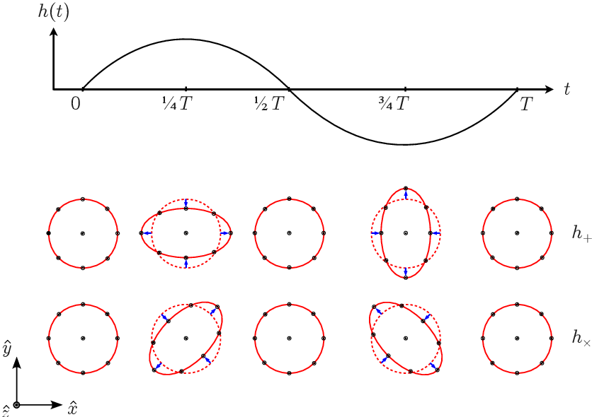
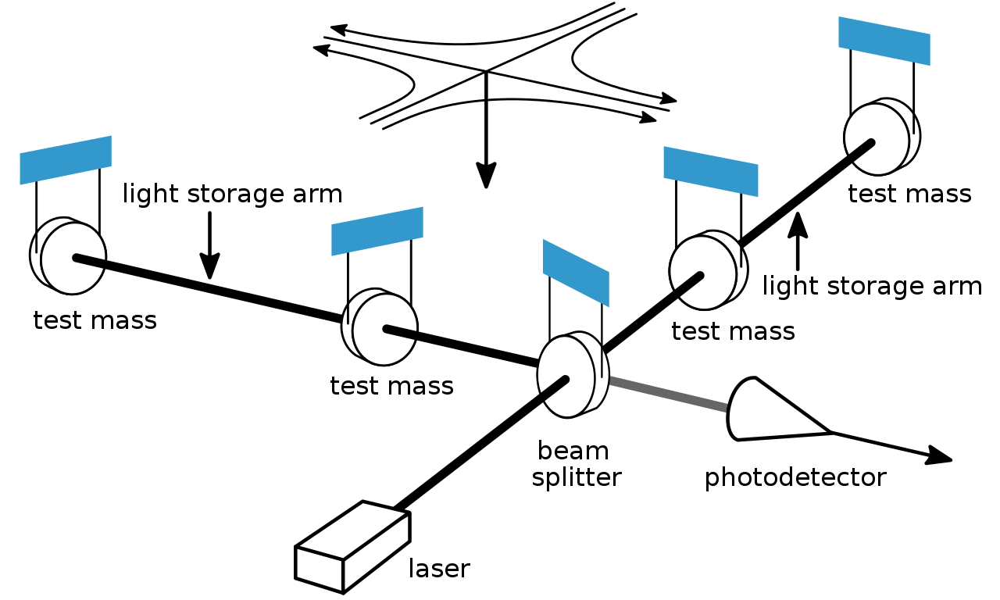
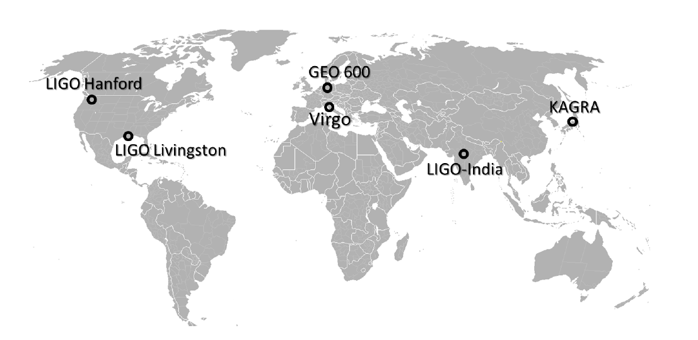
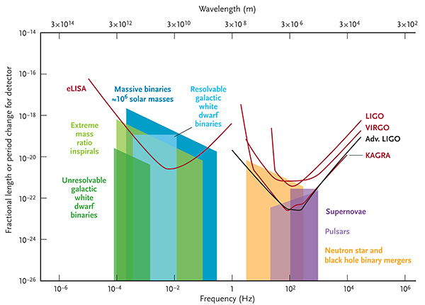
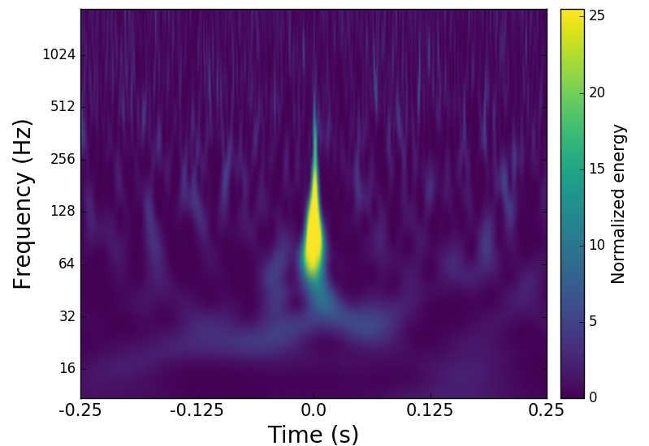
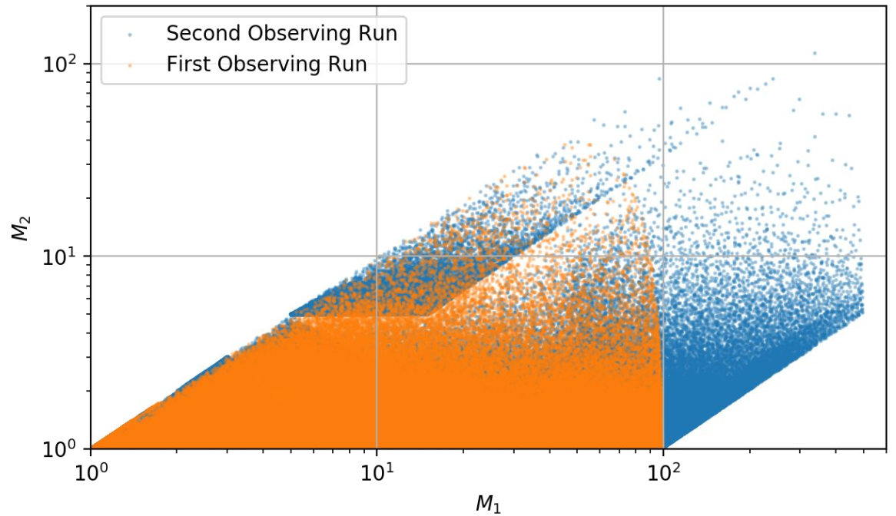
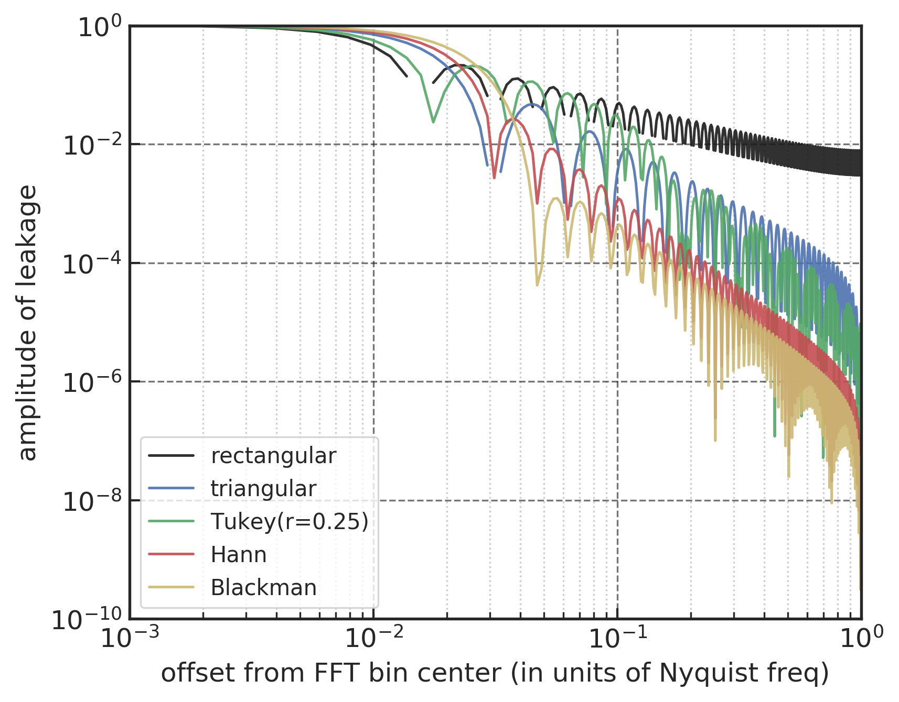

 

[TOC]

 

---

# 第二章 引力波探测和数据分析理论

 

## 2.1 引言

 

阿尔伯特·爱因斯坦 (Albert Einstein) 的广义相对论于 1916 年发表问世以来，就预言了引力波的存在。类似于电磁场的扰动来产生电磁波，引力波则对应地由时空的扰动而产生，并且以光速辐射传播，具有横波的特性。所谓横波，是指引力波对时空中测试粒子运动的影响在与引力波传播方向相互垂直的平面上。所以，引力波可以被看作是在静态时空背景上时空的涟漪，如图下所示 (来源:LIGO/T. Pyle [^C2_gw_cartoon])。
>双黑洞并合系统产生引力波的示意图
{: style="zoom:50%"}

[^C2_gw_cartoon]: [https://www.ligo.caltech.edu/image/ligo20160615f](https://www.ligo.caltech.edu/image/ligo20160615f)

“时空结构决定了物质如何运动，同时物质的分布又在时空上影响了其结构”，这是约翰·惠勒 (John Wheeler) 对广义相对论中的时空结构与物质相互之间制约关系的经典总结，这亦是对爱因斯坦广义相对论关于引力波预言的理论基础。用数学形式表达出来就是爱因斯坦场方程，将爱因斯坦曲率张量 $R_{\mu\nu}$ (描述时空弯曲程度)和物质能动张量 $T_{\mu\nu}$ (描述物质能量密度)建立起了联系，关于度规张量 $g_{\mu\nu}$ 的十个非线性偏微分方程组可以如下表示

$$\label{eqn:C2_EinsEqns}
    R_{\mu\nu}-\frac{1}{2}g_{\mu\nu}R = \frac{8\pi G}{c^4}T_{\mu\nu}
$$

其中，$G$ 是牛顿引力常数，$c$ 代表光速。上式是一个高度非线性的偏微分方程组，求其精确解通常是相当困难的。但是，在某些特定的条件下，可以找到其对应的近似解。那么，最常用的就是在弱场近似下的引力波动解。

在弱场近似 (weak-field approximation) 下，时空度规 $g_{\mu\nu}$ 可以表示为平直时空背景 $\eta_{\mu\nu}$ 上加了一个微小扰动 $|h_{\mu\nu}\ll1|$，

$$\label{eqn:C2_gmunu}
    g_{\mu\nu}=\eta_{\mu\nu} + h_{\mu\nu}
$$

这样的近似假设是有意义的，因为这相当于是观者正处在相对于波源的类光无穷远处。将时空度规 $g_{\mu\nu}$ 表达式 \eqref{eqn:C2_gmunu} 代入到爱因斯坦场方程 \eqref{eqn:C2_EinsEqns} 中，就可以给出时空的度规微扰 $h_{\mu\nu}$ 所满足的动力学方程，度规微扰的演化已被看作是自由传播到无穷远处的时空波动。

在真空弱场近似条件下，去掉微扰高阶项，并取迹反转 (trace-reversed) 度规 $\tilde{h}_{\mu\nu}=h_{\mu\nu}-\frac{1}{2}\eta_{\mu\nu}h$ 后，爱因斯坦场方程可以进一步简化为线性的波动方程：

$$
\left(-\frac{1}{c^{2}} \frac{\partial^{2}}{\partial t^{2}}+\nabla^{2}\right) \tilde{h}_{\mu \nu}=0
$$

该方程的平面波解可以表示为：

$$
    \tilde{h}_{\mu\nu} = A_{\mu\nu} e^{ik_\alpha x^\alpha}
$$ 

其中，$A_{\mu\nu}$ 是一个对称的 $4\times4$ 常系数矩阵，对应了引力波各个分量的振幅，$k_\alpha$ 是一个四维波矢，并满足 $k_{\alpha} x^{\alpha}=-k^{0} t+\vec{k} \cdot \vec{x}$。将该平面波解的形式代回到波动方程后，可以得到波矢的类光性：$k_\mu k^\mu=0$。这说明广义相对论要求引力波必须是以光速来传播。

通过引入协和 (harmonic) 规范条件，$k^\mu A_{\mu\nu}=0$，我们可以消除掉最后的两个规范自由度：$A^\mu_\mu=0$ 和 $A^{0\mu}=0$。第一个方程 ($k^\mu A_{\mu\nu}=0$) 是表示引力波的振动方向与传播方向垂直，即引力波是一个横波；第二个方程 ($A^\mu_\mu=0$) 表示引力波的振幅矩阵是无迹的，因此将这样的规范选择称为横向无迹 (transverse-traceless, TT) 规范。第三个方程 ($A^{0\mu}=0$) 涉及到坐标系的一种选择，其可确保观者的四速 $u$ 与引力波的传播方向是垂直的，即有 $A_{\mu\nu}u^\nu=0$。相关的严格论述可参考 [@1991Liangfoundationmodernphysics]。

我们考虑 z 方向为引力波的传播方向，

$$
    k^{\alpha}=(\omega, 0,0, \omega / c)
$$

根据 $k_3A^{3\nu}=0$ 条件，可知 $A_{3\nu}=0$。由于矩阵 $A_{\mu\nu}$ 是无迹的，因此 $A_{\mu\nu}$ 矩阵的未知独立分量个数从 10 个缩减到只有 2 个，即

$$
A_{\mu v}=\left(\begin{array}{cccc}
0 & 0 & 0 & 0 \\
0 & A_{+} & A_{\times} & 0 \\
0 & A_{\times} & -A_{+} & 0 \\
0 & 0 & 0 & 0
\end{array}\right)
$$

可以看到与电磁波传播有两个偏振模式一样，引力波也有两种偏振模式，分别是加号偏振 (plus polarization) 和交叉偏振 (cross polarization)。因此，真空爱因斯坦场方程沿 $z$ 方向传播的平面波解可以改写为

\begin{align}
    h_{+}(t, z)&=A_{+} \cos \left(w(t-z / c)+\phi_{0}\right)\\
    h_{\times}(t, z)&=A_{\times} \cos \left(w(t-z / c)+\phi_{0}\right)
\end{align}

为了考察引力波是如何与一个自由检验粒子产生影响，我们进一步用度规微扰的两种偏振模式 $h_+$ 和 $h_\times$ 将时空度规解改写为

$$\label{eqn:C2_h+x}
    g_{\mu\nu}=\eta_{\mu\nu}+h_{\alpha \beta}=\left(\begin{array}{cccc}
    {-1} & {0} & {0} & {0} \\
    {0} & {1+h_{+}} & {h_{\times}} & {0} \\
    {0} & {h_{\times}} & {1-h_{+}} & {0} \\
    {0} & {0} & {0} & {1}
    \end{array}\right)
$$

从公式 \eqref{eqn:C2_h+x} 可以看到，引力波 (沿着 $z$ 轴传播) 的 $h_+$ 极化方向对应的是 $x$ 和 $y$ 方向的挤压和拉伸，而 $h_\times$ 极化方向是对 $x$-$y$ 平面上对角方向的挤压和拉伸，如下图所示 [@2017TiecTheoryGravitationalWaves]。

>一束沿 $z$ 方向传播的单色、稳定频率的引力波 (角频率: $\omega=2\pi/T$)
{: style="zoom:60%"}

可见，只需要探测物体之间空间位置的变化，就可以预计引力波的形态，从而判断是否有引力波出现。在过去的几十年里，正是为了精确地探求引力波所带来的微小应变 (strain) 变化，带动了整个引力波探测技术以及引力波天文学的发展和进步。

本章将对引力波探测技术及其数据处理方法进行概述。引力波探测项目可以分为三个较独立的研究领域：引力波波源建模 (第 [2.2.1](C2.md#221) 节)、引力波探测实验 (第 [2.2.2](C2.md#222) 节) 和引力波数据处理 (第 [2.2.3](C2.md#223) 节)。在本章中，我们会以引力波数据的预处理流程为基础，介绍与本文内容密切相关的信号处理概念与数据分析理论 (第 [2.3](C2.md#23) 节)，尤其会对匹配滤波技术 (第 [2.4](C2.md#24) 节) 的统计基础做详细阐述。

 

## 2.2 引力波探测技术

### 2.2.1 引力波波源建模

从上一节的介绍可知，引力波波源的模型构建涉及的是引力波的动力学。具体说来，就是引力波波源建模需要针对宇宙中实际的天体作为研究对象，来求解爱因斯坦场方程。在引力波探测所关心的强引力波辐射之初，系统一般都处于强引力、强非线性、近光速的运动状态。对于这些运动状态，后牛顿展开 (post-Newtonian)、微扰 (perturbation) 等近似方法都会失效。由此，在引力波波源建模问题中，数值计算方法就扮演了非常重要的角色。就是在这样的背景下，数值相对论作为广体相对论一个独立的研究方向蓬勃发展起来。

引力波的波源大体上可以分为四类：

- 致密双星的并合系统。这类波源产生的引力波存在时间短，并且其波源的演化机制相对比较了解。粗略地讲，宇宙中双星的并合系统可以分为超大质量双黑洞系统、恒星级质量双星系统和质量一大一小的双星系统。
- 超新星爆发。这是一个极端剧烈的过程，极大质量的物质偏离对称性的剧烈运动将发生强烈的短时引力波。根据这种引力波的强度和波形特点，会有助于我们了解目前还尚不清楚的超新星爆发机制。
- 旋转的致密星体。偏离轴对称的旋转中子星就属于这一类，中子星偏离轴对称的程度越大或旋转速度越快，就会发射越强烈的引力波。这种长时引力波的波源机制是比较清楚的。
- 随机背景引力辐射。极早期宇宙处于很高的能量标度，所以量子效应很明显，来自真空的量子涨落在经历诸如暴涨等过程后被放大，从而形成原初引力波。由于量子涨落的随机性，这种长时的原初引力波会分布在所有的频段。

双星系统作为引力波探测实验中最有可能探测到的波源之一，其典型的引力波强度约为 $10^{-20}$，其他可能引力波波源 (如旋转中子星、超新星爆发等) 的频段是难以达到 aLIGO 现有的 $10^{-23}$ 的灵敏度。双星系统可以是中子星-中子星、中子星-白矮星、中子星-黑洞、黑洞-黑洞等等。以双黑洞系统为例，在两黑洞间距较大，相互旋绕的速度较低，这种旋进 (spiral) 早期过程用后牛顿展开近似还是适用的。随着两个黑洞的相互旋绕靠近，伴随着引力波的释放，能量被耗散掉，这时进入双黑洞旋进后期。然后很快的，双黑洞迅速进一步靠近，并发生碰撞和融合，形成一个大黑洞。这个过程称为双黑洞并合 (merge) 期。旋进后期和并合期是引力波探测最感兴趣的阶段。在该阶段，目前几乎只有数值相对论才是唯一可行的处理爱因斯坦场方程的手段。振铃 (ringdown) 过程是并合成一个大黑洞之后，会经过一段逐渐变成稳态的单个克尔 (Kerr) 黑洞的振荡衰减过程，这一般是通过微扰理论来描述，如下图所示。

>数值计算所得到的引力波波形模板，对应于 H1 观测站上记录的 GW150914 引力波事件
{: style="zoom:70%"}

数值相对论是对爱因斯坦场方程不做任何近似的数值求解方法。以双黑洞系统为例，描述引力波波源涉及若干个系统参数，如双黑洞系统的黑洞质量、黑洞自旋、轨道偏心率等等。随着引力波探测技术的进步和发展，对引力波的理论建模提出了更高要求，即有更加精确和快速的波形建模方法的需求 [@2014HannamSimpleModelComplete] [@2014PanInspiralmergerringdown] [@2015BlackmanFastAccuratePrediction] [@2017CaoWaveformmodeleccentric]。本论文使用的是带自旋的有效单体数值相对论 (SEOBNR) [@2017CaoWaveformmodeleccentric] [@2019PanAccuracysourcelocalization] 理论模型，通过该模型就可以建立双星系统中的系统参数与对应时空无穷远处的引力波波形之间的映射关系。近些年来，已经开始有研究者尝试通过人工神经网络和机器学习技术对引力波进行建模 [@2019ChuaReducedordermodeling] [@2018RebeiFusingnumericalrelativity] [@2019ChuaLearningBayestheorem] [@2019SetyawatiRegressionmethodswaveform] [@2018HuertaEccentricnonspinninginspiral]，并且取得了值得注目的研究成果。可见，基于数据驱动的引力波理论建模是一个很值得期待的研究方向。

### 2.2.2 引力波探测实验

粗略地讲，引力波波源建模涉及的是引力波的动力学，而引力波探测实验涉及的就是引力波的运动学。在上一节中的波形图像结果告诉我们双黑洞并合时的引力波强度约为 $4\times10^{-22}$ 米。这比原子核的直径 $10^{-15}$ 米还要小好几个数量级！为了探测到如此微弱的引力波对物质的影响，目前引力波探测器主要通过激光干涉测量试探物体间的距离变化来实现引力波观测的目的。

目前，位于美国的激光干涉引力波天文台 (Laser Interferometer Gravitational-Wave Observatory, LIGO) [@1992AbramoviciLIGOLaserinterferometer] 是地面最大的引力波探测器，其原理是利用与迈克尔逊干涉仪相类似的激光干涉原理。LIGO 有两条很长且相互垂直的延伸臂，臂的镜头上安装着探测器，来自两个探测器的信号最终被中间仪器接受并形成干涉。利用干涉仪进行探测的基本原理就在于，比较激光在 其相互垂直的两臂中传播时所用的时间，如下图所示 (来自 Wikimedia Commons[^LIGO_schematic])。在理论上，如果有振幅强度较大的引力波经过时，由于其独特的极化性质，干涉仪两个臂的长度做相反的变化，即一臂伸长时而另一臂会相应的缩短，从而使得两束相干光有了新的光程差，破坏了相干减弱的初始条件，进而会有一定数量的激光进入光探测器，获得信号输出，而该信号的大小就正比于引力波的无量纲振幅 $h$，探测到这个信号即可表明探测到引力波。可以理解，干涉仪的臂长越长，探测器对引力波的响应也就越强。
[^LIGO_schematic]: [https://commons.wikimedia.org/wiki/File:LIGO_schematic_(multilang).svg](https://commons.wikimedia.org/wiki/File:LIGO_schematic_(multilang).svg)

>激光干涉仪的原理示意图
{: style="zoom:40%"}

美国的 LIGO 有两个干涉仪，分别是位于美国西海岸的汉福德(Handford, H1)和南海岸的利文斯顿 (Livingston, L1)，都有成一对 L 型的臂，且臂长都为 4 千米。随着探测实验技术的不断提高，LIGO 已经上线了第二代地面激光干涉实验装置，提高了探测灵敏度，对应为 aLIGO (Advanced LIGO) [@2010HarryAdvancedLIGOnext]。除 aLIGO 以外，还有其他的大型地面引力波探测器：位于意大利的 Virgo 项目 [@2005AcerneseStatusVirgo] (臂长 3 千米，现已升级为 aVirgo (Advanced Virgo) [@2015AcerneseAdvancedVirgosecond])、德国的 GEO600 项目 [@2002WillkeGEO600gravitational] (臂长 600 米)等。同时，日本已正式上线运行一个臂长 3 千米的地下神岗引力波望远镜 (KAGRA) [@2014HiroseUpdatedevelopmentcryogenic] [@2020AkutsustatusKAGRAunderground]，该项目以前叫大尺度低温引力波望远镜 (LCGT)。目前印度正在规划的 LIGO-India [@2013UnnikrishnanIndIGOLIGOIndia] 也是一个地面引力波探测器。如下图 [@2013ChassandeMottinDataanalysischallenges] 显示了全球主要地面引力波探测器的位置分布。

>全球主要的地面引力波天文台分布图
{: style="zoom:40%"}

目前，aLIGO 的第一次探测运行 (The first observing run, O1) 从 2015 年 9 月 12 日至 2016 年 1 月 19 日，只有美国的两个引力波观测站(H1/L1)在线运行。第二次探测运行 (The second observing run, O2) 是从 2016 年 11 月 30 日至 2017 年 8 月 1 日，在此期间 aVirgo 于 2017 年 8 月底开始组网，实现了三个观测站同时运行(H1/L1/V1)。第三次探测运行 (O3) 始于 2019 年 4 月 1 日，位于日本 KAGRA 观测站将计划于 2020 年 2 月底 并网参与到全球引力波的探测网络中。受疫情 (CONVID-19) 的影响，O3 提前原定计划近一个月于 2020 年 3 月 27 日终止观测运行。

>不同引力波波源的应变强度和引力波探测器的灵敏度曲线 [^C2_sensitivity_detector]
{: style="zoom:90%"}

[^C2_sensitivity_detector]: [http://gwplotter.com](http://gwplotter.com)

aLIGO 探测器的最敏感的频率约为 150 Hz，如上图 [@2015MooreGravitationalwavesensitivity] 所示。在地球上很难探测到低于 1 Hz 的引力波，因为在该频段地球的引力成为了主要噪音源。因此，为了探测到更丰富的波源系统所发出的低频引力波 (<10Hz)，就需要避免地表噪声的影响，把激光干涉仪放入外太空中，这就是空间引力波探测器。目前，较为成熟的是美宇航局与欧航局合作的 eLISA (evolved Laser Interferometer Space Antenna) 计划，已被列入欧空局的 L3 计划，检验 eLISA 实验技术的卫星 LISA Pathfinder 运行非常成功 [@2016GibneySuccessfultestdrive]。日本科学家提出了 DECIGO 计划，拟开展空间引力波探测。中国也在积极探讨和发展空间引力波探测计划，目前中国有两大空间引力波探测项目，一个是中国科学院的“空间太极计划” [@2011Gongscientificcasestudy] [@2017HuTaijiProgramSpace]，已于2019年8月31日将我国首颗空间引力波探测技术实验卫星“太极一号”发射上天，成功实现“三步走”第一步任务目标。有最新研究表明 LISA-Taiji 的合作联网 [@2020RuanLisataijiNetwork] 会将使引力波的探测效率提高数个量级。另一个是中山大学的“天琴计划” [@2016LuoTianQinspaceborne]，在2019年12月20日“天琴一号”的正式入轨意味着天琴空间引力波探测计划正式进入“太空试验”阶段。这两个项目目前还都处在预研阶段，已被列入中国科学院的空间 2050 年规划和国家重大“十二五”规划建设的探索预研计划中，主要科学目标是观测双黑洞并合和极大质量比天体并合时产生的低频引力波辐射。关于中国的地面引力波探测计划，还有中科院高能物理研究所主导的“阿里计划” [@2017LiTibetsAliNew] [@2018LiTibetsWindowPrimordial] 探测原初引力波和国家天文台主持的贵州的 500 米口径球面射电望远镜 FAST 项目 [@2011RENDONGFivehundredmeter] 通过脉冲星计时阵探测引力波，此外中科院武汉物数所也正式公布了沼山长基线原子干涉引力天线 (ZAIGA) 科学计划 [@2019ZhanZaigaZhaoshanLong] 通过原子干涉仪探测引力波。在上述所有的引力波探测计划中，不论是引力波源的理论模型，还是引力波信号提取和数据处理，都扮演着重要甚至是不可或缺的角色。

### 2.2.3 引力波数据处理

随着引力波探测器精度的不断提高和技术的发展，对引力波探测数据结果的正确分析和解释是越来越重要的。实际上，引力波数据处理的必要性之一，就是要在收集了大量的强噪声背景数据中辨别出真实的引力波信号。对于地面引力波探测器(如LIGO)，埋在复杂且非稳态的噪声中的引力波信号是极其微弱的。在引力波探测实验的数据分析中，一般会采用匹配滤波技术提高探测的信噪比，通过预先数值模拟出引力波源产生的理论波形，把该预言的波形作为模板进行数据分析 [@2005JaranowskiGravitationalWaveData]。匹配滤波技术可以在既定硬件灵敏度的基础上提高引力波探测能力约 100 倍，付出的代价是大大增加数值分析的参数空间。为了确认一个引力波信号的存在性，我们都需要非常仔细的数据分析和数据处理流程，来确保在并行搜索的每个引力波探测器中能同时找到它，并且还与探测器背景噪声相比有着统计意义上的显著性，达到引力波探测实验所需要的置信度。引力波数据处理的另一个重要目的就是为了通过对引力波所携带的信息，分析出波源的一些物理性质，包括波源的物理参数以及其演化的一些信息，从而为其他研究者提供研究依据。

在数据分析的过程中，由于引力波探测仪器的故障或其他外界干扰的存在，一般会在数据上留下一些短周期的脉冲数据流，这也是说引力波数据是非稳态 (可见本章的第 [2.3.1](C2.md#231) 节) 的主要缘故之一。由于匹配滤波时的波形模板也都是短周期的，这就会使得出现其与脉冲噪声信号匹配的几率较大，从而导致很高的引力波探测误报率。在多数情况下，这种短时的脉冲噪声都可以反映在探测器相关的辅助监测设施上。所以，在整个数据分析的过程中，会首先在每段数据上对数据的品质 (data quality) 特征类型做标记，为数据中任意一秒内的数据质量分级。

- 第一类数据品质 (CAT1) 是最差的一级数据，它们不能用来数据分析。这些数据会直接被排除截取掉。    
- 第二类数据品质 (CAT2) 是指已知环境噪声来源或有仪器干扰时段的数据片段。例如：某强烈的地震活动等。
- 第三类数据品质 (CAT3) 是指某时段的数据片段，其引力波信号所经通道与外界环境有一些不明的统计相关性。

引力波数据上对数据品质的标记是逐级递进的，即某段数据被标记了 CAT1，则说明该段数据没有通过 CAT1 的数据品质要求，那么更高级别的数据品质也是一定没有通过的。在真实的引力波数据中，除了已知的各种环境和探测仪器会带来噪声的贡献以外 (如下方左图 [@2012HildSecondGenerationLaser] 所示)，还存在一些短时且不清楚来源的反常噪声类型，一般我们称之为 glitch，如图下方右图 [@2019ColganEfficientGravitationalwave] 所示。Glitch 在引力波数据噪声背景中对数据分析的影响非常大，它们不仅可能会在不同的探测器上出现，目前也找不到与任何探测器环境之间的相关性。GravitySpy [@2016ZevinGravitySpyIntegrating] 就是一个为了对目前所发现的 glitches 进行人工标记分类的项目，希望通过对 glitch 进行数据分析来最终能消除其带来的影响。

>(左) 在 Advanced LIGO 中各种已知噪声来源的振幅-频谱图；(右) glitch 的时频图(blip)
{: style="zoom:65%"}{: style="zoom:45%"}

随着引力波天文学的兴起，目前 LIGO 科学合作组织已经在 GWOSC (Gravitational-Wave Open Science Center) [@2015VallisneriLIGOOpenScience] 在线平台上将引力波的数据公开发布。引力波时序数据以大概一个小时 (4096 秒) 为单位打包成方便的数据块 (bluk data)，不仅详细记录了对应的 GPS 时间，还明确标注了每段数据的品质等级。公开的数据所涵盖的信息非常丰富和全面，从 2005 年起的科学测试运行到 O1 和 O2 的完整数据都可以根据科研的需要打包下载，极大地方便了引力波天文学相关的科研工作者。据悉 O3 的前六个月的数据将于 2021 年 4 月份公开发布 [@2019CollaborationGuideLIGOVirgo]。本文所实验的所有引力波数据皆来源于 GWOSC [^GWOSC]。

[^GWOSC]: [https://gw-openscience.org](https://gw-openscience.org)

引力波的数据处理包括基于模板和非模板的两种处理和分析方式 [@2019CollaborationGWTC1Gravitational]。本章 [2.4](C2.md#24) 节介绍的匹配滤波方法就是典型的基于模板的处理方法。两种方法都是可以提取相应的波源信息，但基于模板的数据处理方法具有更强的引力波探测能力，并且在提取引力波波源信息方面更具有系统性。下图所示的是 LIGO 分别在 O1 和 O2 两次正式运行期间所使用的波形模板库 [^O1] [^O2]。cWB [@2008KlimenkoCoherentmethoddetection] 是基于非模板处理方式的主要流水线之一。cWB 主要是通过在多探测器中寻找耦合，且显著的时频特征，来确定没有波形模板的引力波波源。PyCBC [@2020NitzgwastropycbcPyCBCRelease] 和 gstLAL [^gstLAL] [@2017MessickAnalysisFrameworkPrompt] 等数据处理流水线是基于精确的引力波波形模板的。它们是整个 LIGO 引力波数据分析中最重要的处理方式，主要靠基于模板的数据分析方法来确定每个引力波疑似事件的置信度和波源参数估计等。由此，我们再一次看到了引力波波源理论建模的重要性，其为引力波天文学实现波源信息的提取提供了理论基础。

[^O1]: O1 template banks: [https://github.com/ligo-cbc/pycbc-config/tree/master/O1/bank](https://github.com/ligo-cbc/pycbc-config/tree/master/O1/bank)
[^O2]: O2 template banks: [https://github.com/ligo-cbc/pycbc-config/tree/master/O2/bank](https://github.com/ligo-cbc/pycbc-config/tree/master/O2/bank)
[^gstLAL]: gstLAL: [https://lscsoft.docs.ligo.org/gstlal/index.html](https://lscsoft.docs.ligo.org/gstlal/index.html)

>第一次(O1)和第二次(O2)运行期间 PyCBC 离线流水线中所使用的引力波波形模板分布
{: style="zoom:50%"}

引力波探测的意义不仅是诸如对包括经典广义相对论在内时空理论的直接验证，更在于其提供了对观测浩瀚宇宙的全新途径。这就如同观测天文学是从可见光天文学扩展到全波段天文学一样，能够极大地扩展人类的视野。另外，传统的观测天文学是完全依靠对电磁辐射的探测，而引力波天文学的兴起，则是标志着人类对宇宙观测手段已经开始超越电磁相互作用力的范畴。随着引力波观测技术的不断发展，已经引入了基于协同观测的全新研究范式——多信使天文学——的探索，未来也将进一步揭示更多关于恒星、星系以及宇宙中更多前所未有的信息。

 

## 2.3 信号处理与数据分析方法

 

在本节中，我们将会概述与引力波的信号处理和数据分析所相关的重要概念及其处理方法。首先，先简要地回顾一下模拟信号系统理论中与本论文相关的专题、记号和约定。考虑一个模拟信号 (或时序信号) 可以用一个关于时间的函数来描述，即 $x(t)$。关于 $x(t)$  的傅里叶变换 (Fourier transform) 至频域上 $\tilde{x}(f)$ 就是该模拟信号的频谱 (frequency spectrum)

$$
    \tilde{x}(f) =\int^\infty_{-\infty}x(t)e^{-i\Omega t}dt = \int^\infty_{-\infty}x(t)e^{-2\pi ift}dt
$$

其中 $\Omega$ 是弧度频率 [^omega] (radian frequency)，单位是 [radians/second]。那么通常的频率 $f$ 与 $\Omega$ 之间的关系是 $\Omega=2\pi f$。$\tilde{x}(f)$ 的物理意义可以从其逆傅里叶变换 (inverse Fourier transform) 中观察到，即任意一个时序信号 $x(t)$ 都可以通过不同频率的正弦波 (sinusoids) 进行线性叠加得到：

[^omega]: 这里是用 $\Omega$ 来代表用 [radians/sec] 为单位的物理频率(physical frequency)；而 $\omega$ 代表用 [radians/sample] 为单位的数字频率(digital frequency)。

$$
    x(t)=\int^\infty_{-\infty}\tilde{x}(f)e^{i\Omega t}\frac{d\Omega}{2\pi} =\int^\infty_{-\infty}\tilde{x}(f)e^{2\pi ift}df
$$

在引力波数据处理的过程当中，可操作的是离散的引力波数据序列，那么引力波探测器是如何对连续模拟数据进行采样，同时又能确保离散采样的数据信息是无损的呢？这主要是基于数字信号处理理论中的采样定理来保证的，我们将关于引力波数据的采样原理，以及其中会涉及到数据处理相关的重要概念总结在附录 [A](Appendix.md#a_nyquist) 中。对于数字信号而言，考虑时序信号 $x(t)$ 采样后为 $x[n]$，第 $n$ 个采样发生在时间 $t=n/f_s$，其中 $f_s$ 是采样率，因此可以给出离散傅里叶变换 (discrete Fourier transform, DFT)和逆离散傅里叶变换 (inverse DFT)：

$$
\begin{align}
    \tilde{x}[k] &= \sum_{n=0}^{N-1} e^{\frac{-2 \pi i}{N} k \cdot n} x[n] \\
    x[n] &= \frac{1}{N} \sum_{k=0}^{N-1} e^{\frac{2 \pi i}{N} k \cdot n} \tilde{x}[k]
\end{align}
$$

其中，信号采样点的数目是 N，并且 $\{k,n\}=0,\dots,N-1$。

### 2.3.1 稳态性与高斯性

从本节开始，我们将针对引力波探测器的噪声特点和弱引力波信号的提取过程，介绍本论文中会涉及到的重要数据分析概念和数据处理方法，最终逐步地构建关于引力波数据的理想探测统计量，基于匹配滤波方法实现低信噪比引力波信号的探测识别。关于引力波数据分析方法更详细的论述可参阅 [@2009JaranowskiAnalysisGravitationalWave]。

一个随机过程 (random process) 是由一串随机变量所构成的。引力波探测器中的噪声就是一个随机过程的例子，可以用一个时序序列 $x(t)$ 来表示。通常对于这样的一个时序序列，我们总是愿意关心其在时域上的统计性质。假定在某任意时刻 $t$ 处，时序序列某取值 $x(t)$ 的概率密度函数为 $p_x$，则期望值为

$$
    \langle x\rangle :=\int xp_x(t)dt
$$

如果一个随机过程的统计性质不会随着时间而改变，那么我们就称其为一个稳态的 (stationary) 随机过程。这里提到的统计性质，指的是某采样后的随机序列 $\{x_{t_1},\dots,x_{t_k}\}$的联合概率分布，其等价于对于任意 $\tau,k$ 而言 $\{x_{t_{1}+\tau}, \ldots, x_{t_{k}+\tau}\}$ 的联合概率分布。特别地，某二维随机变量 $(x_t,x_s)$ 的联合概率分布仅是时域间隔 $|t-s|$ 的函数，不依赖 $t$ 或 $s$。若不那么严格的考虑，通常在引力波数据分析意义下的弱稳态 (weak stationarity) 或二次稳态性 (second-order stationarity) 会要求随机过程的平均值和方差是常数，并且自协方差 (auto-covariance) $cov(x_t,x_{t+τ})$ 仅是 $\tau$ 的函数。若时序序列 $x(t)$ 是稳态的，则其期望值也可以改写为 

$$
    \langle x\rangle:=\lim_{T\rightarrow\infty}\frac{1}{T}\int^{T/2}_{-T/2}x(t)dx
$$

在引力波数据处理中，我们对服从高斯分布的随机过程尤为感兴趣，即高斯 (Gaussian) 随机过程，显然它也是稳态的。在引力波探测器所收集的真实数据中，背景噪声的特点往往是非高斯、非稳态的。由此可见，在引力波数据分析的过程中，对非高斯非稳态噪声的辨别并将其与引力波信号相区别是一个重要的课题。关于稳态性和高斯性的严格定义和实验验证，可以参考 [@2017RomanoDetectionmethodsstochastic] 的附录 C 中的描述。

### 2.3.2 功率谱密度

从统计意义上来说，某随机的时序信号会由它们的期望值和功率谱 (power spectrum) 来表征。简单起见，先考虑一段时长为 $T$ 且平均值为 0 的连续信号 $x(t)$，有 $\langle x\rangle=0$。于是，我们就可以定义该段信号的功率 (power) 为 $x^2(t)$ 在时间 $T$ 上的积分再除以该段时间 $T$，用以体现出“平均单位时间上某信号中的能量”。如果该段信号 $x(t)$ 还是稳态的，只要时长 $T$ 足够长，那么此段信号 $x^2(t)$ 的平均值就与其上的期望值 $\langle x^2\rangle$ 是等价的：

$$
    \langle x^2\rangle=\lim_{T\rightarrow\infty}\frac{1}{T}\int^{T/2}_{-T/2}x^2(t)dt
$$

如果，我们进一步定义这是一段带窗的有限信号 $x_T(t)$ 的话，即

$$
\begin{align}
    x_T(t) = \left\{\begin{matrix}
    x(t) & -T/2<t<T/2 \,, \\ 
    0 & \text{其他}
    \end{matrix}\right.
\end{align}
$$

于是，就有

$$
\begin{align}
    \langle x^2\rangle 
     &=\lim_{T\rightarrow\infty}\frac{1}{T}\int^\infty_{-\infty}x_T^2(t)dt \\ 
     &=\lim_{T\rightarrow\infty}\frac{1}{T}\int^\infty_{-\infty}|\tilde{x}_T(f)|^2df \\ 
     &=\lim_{T\rightarrow\infty}\frac{2}{T}\int^\infty_0|\tilde{x}_T(f)|^2df \\
     &=\int^\infty_0S_x(f)df
\end{align}
$$

其中 $S_x(f)$ 就是信号 $x(t)$ 的功率谱密度 (power spectral density, PSD)。上面推导中的第二个等号中我们使用了帕塞瓦尔定理 (Parseval\'s theorem)， $\int^\infty_{-\infty}|x_T(t)|^2dt=\int^\infty_{-\infty}|\tilde{x}_T(f)|^2df$；第三个等号中我们使用了频域的对称性，即 $\tilde{x}_T(-f)=\tilde{x}_T^*(f)$。

从上面的推导中，我们已经定义出了引力波数据处理中最重要的概念之一：某稳态的时序序列 $x(t)$ 的功率谱密度为

$$
    S_x(f):=\lim_{T\rightarrow\infty}\frac{2}{T}\Big|\int_{-T/2}^{T/2}x(t)e^{-2\pi ift}dt\Big|^2=\lim_{T\rightarrow\infty}\frac{2}{T}\Big|\tilde{x}(f)\Big|^2 \,。
$$

其中，根据位于分母的 $T$ 可知我们将 “能量” (energy) 换算为了 “功率” (power) 来表示其物理意义，上式也意味着给定某个频率后的功率谱密度是不依赖于时间 $T$ 的，只依赖于频率 $f$。另外，式子中的因子 2 可以解释为：我们只考虑了正频部分，因为正负频的信息是对称一致的，所以上式的定义通常也称为单边的功率谱密度 (one-sided power spectral density)。

经过采样后，对于一个离散时间序列 $x[n], n=0,\dots,N-1$ 来说，采样率为 $f_s=1/\Delta t = N/T$，于是离散的单边功率谱密度就可以表示为：

$$
    S[k] = \frac{2}{Ndt}\Big|dt\sum^{N-1}_{n=0}e^{-2\pi i\frac{kn}{N}}x[n]\Big|^2=\frac{2dt}{N}\Big|\tilde{x}[k]\Big|^2
$$

其中，单边 PSD 的正频范围 $k=0,1,\dots,\lfloor\frac{N}{2}\rfloor$，其与附录 [A](Appendix.md#a_nyquist) 中的定义是一致的，即对应于 $f=[0,1,\dots,N//2-1]/T$。

另外值得一提的是，功率谱密度的量纲是 $[S[k]] = [dt^2/T]\frac{1}{Hz}$。也就是说，PSD 的单位是 $[x(t)\text{的单位}]\cdot[\frac{1}{Hz}]$。此外，另一个常用于表征一段时序信号的统计概念是振幅谱密度 (Amplitude spectral density, ASD)，其与 PSD 之间的关系是 $[ASD] = \sqrt{[PSD]}$。在上一节中曾谈到服从高斯分布的随机噪声是稳态的，在本章的第 [2.4](C2.md#24) 节中可以证明其功率谱密度是一个不依赖于频率的常数。所以，我们将功率谱密度在频域上为常数值的随机噪声称为白噪声 (wihte noise)，功率谱密度不为常数值的随机噪声称为有色噪声 (coloured noise)。

为了章节的完整性和后文的需要，这里还需要介绍功率谱密度的两个重要性质：

1. 对于一个稳态过程来说，单边的功率谱密度等价于自相关 (autocorrelation) 函数 $R_x(\tau)$ 的傅里叶变换的 2 倍，

    $$
    \label{eqn:psd_propert1}
        S_x(f) = 2\int_{-\infty}^{\infty}R_x(\tau)e^{-2\pi i f\tau}d\tau
    $$

    其中，$R_x(\tau) = \langle x(t)x(t+\tau)\rangle$。证明可见附录 [B](Appendix.md#b) 。值得注意的是，稳态过程中随机变量的自相关函数是一个只依赖于时间平移$\tau$，不依赖于时间 $t$ 的函数。

2. 功率谱密度可以由对应频域分量的期望值来表示，即有：

    $$
    \label{eqn:psd_propert2}
        \langle \tilde{x}^\star(f')\tilde{x}(f)\rangle=\frac{1}{2}S_x(f)\delta(f-f')
    $$

    证明可见附录 [B](Appendix.md#b)。

根据上述的两个功率谱密度性质，在后文中我们会据此不仅实现了匹配滤波算法的推导，还会为我们开发 MFCNN 模型算法带来灵感和启发。

### 2.3.3 能谱泄露与白化

在本小节中，我们将介绍引力波信号处理中常规的两个数据标准化预处理过程：加窗和白化。在前文中，我们曾谈到关于引力波数据的处理总是会放在频域中来考察，然而并不能直接对有限的时序数据直接做傅里叶变换，因为这存在 “能谱泄露” (spectral leakage) 的问题。在通常的傅里叶变换计算中，实际上是做了周期性延拓，因为数据处理都是在有限时间段或采样点内完成的，而数学上的傅里叶变换所要求的是时间从负无穷到正无穷的积分，因此就不得不需要做延拓。但是周期性的延拓会造成时域中的突变点，从而会对频谱产生明显的影响，即所谓能谱泄露。该影响大小依赖于有限时域信号边界上的不连续程度，所以通常用加窗 (windowing) 的办法来将这种不连续最小化，以实现在时域上局域化的傅里叶变换。

在数学上，最简单的窗函数是矩形窗 (Rectangle window)

$$
\label{eqn:C2_Rectangle}
    w(t) \equiv\left\{\begin{array}{ll}
    1 & 0 \leq t \leq T \\
    0 & \text { 其他 }
    \end{array}\right.
$$

可以看到，其无非是将 $[0,T]$ 区间之外的信号都设为 0。在引力波数据处理中，其他常用的窗函数还有：

- 三角窗 (Triangular window)

    $$
        w(t)\equiv1-|2t/T-1|
    $$

- 汉宁窗 (Hann window)
    
    $$
    \label{eqn:C2_Hann}
        w(t)\equiv \frac{1}{2}(1-\cos(2\pi t/T))
    $$

- 图基窗 (Tukey window)

    $$
    \label{eqn:C2_tukey}
        w(t) \equiv\left\{\begin{array}{ll}
        {\frac{1}{2}\left[1-\cos \left(\frac{2 \pi}{r} \frac{t}{T}\right)\right],} & {0 \leq \frac{t}{T} \leq \frac{r}{2}} \\
        {1,} & {\frac{r}{2} \leq \frac{t}{T} \leq 1-\frac{r}{2}} \\
        {\frac{1}{2}\left[1+\cos \left(\frac{2 \pi}{r}\left[\frac{t}{T}-\left(1-\frac{r}{2}\right)\right]\right)\right],} & {1-\frac{r}{2} \leq \frac{t}{T} \leq 1}
        \end{array}\right.
    $$

- 布拉克曼窗 (Blackman window)
    
    $$
        w(t)=0.42-0.5 \cos (2 \pi t / T)+0.08 \cos (4 \pi t / T)
    $$

上述所有窗函数都会将信号区间两端的采样数值压缩为 0，如下方左图所示。图基窗公式 \eqref{eqn:C2_tukey} 中的参数 $r=0$ 时会退化为矩形窗式 \eqref{eqn:C2_Rectangle}，$r=1$ 时会退化为汉宁窗 \eqref{eqn:C2_Hann}。在数字信号处理中，关于其他常见的窗函数及其讨论可参阅 [@1999OppenheimDiscretetimesignal] [@1992TeukolskyNumericalrecipesC]。

>(左图) 不同窗函数的时域图像 (右图) 以 Nyquist frequency 为单位频域，不同窗函数能谱泄露的幅度
{: style="zoom:20%"}{: style="zoom:20%"}

>??? note "上图的源代码 (source code)"
    ??? abstract "左图"
        
    ??? abstract "右图"
        

对于一个给定的时序序列 $x(t)$ 和某窗函数 $w(t)$，我们可以定义加窗后的 (windowed) 时序序列 $x_w(t)$ 为

$$
    x_w(t)\equiv w(t)x(t)
$$

在上式中，窗函数与时序信号在时域上的乘积，等价于窗函数和信号傅里叶变换后在频域上的卷积操作

$$
    \tilde{x}_{w}(f)=\int_{-\infty}^{\infty} d f^{\prime} \tilde{x}\left(f-f^{\prime}\right) \tilde{w}\left(f^{\prime}\right)
$$

由于窗函数 $w(t)$ 在时域上是紧支撑的 (compact support)，所以频域上 $\tilde{w}(f)$ 是非紧的 (infinite support)。这意味着任何窗函数作用下的时序信号在频域上总会有能谱泄露现象。能谱泄露的影响对于不同的窗函数也有所差异，如上方右图所示的不同窗函数在 Nyquist frequency $f_N \equiv 1/(2\Delta t)$ 频域上归一化的能谱泄露幅度 ($|\tilde{w}(f)| /|\tilde{w}(0)|$)。可以看到，所有窗函数中能谱泄露最严重的是矩形窗，而汉宁窗和布拉克曼窗在高频区域的能谱表现最好。一般来说，需要在时域信号的信息损失与频域上的能谱泄露问题之间找到合适的平衡。图基窗可以通过参数的调节，给出时域信息损失最少，且频域上也对随机引力波数据背景表现良好的平衡点。对于随机引力波背景 LIGO 数据而言，实现能谱泄露少且时域信息损失小的办法是可以使用相互重叠 50% 的汉宁窗 [@2004LazzariniUseoverlappingwindows]。

在引力波信号处理中，对探测器噪声的估计和数据处理是最重要的环节。在实际的引力波数据环境中，引力波噪声的功率谱密度是关于时间和频率的函数，即是非稳态和非高斯的，亦是有色的噪声。所以为了对探测器噪声进行估计和消除，就非常有必要对数据进行“去色”处理，即所谓白化 (whitening) [@2001Cuocolinepowerspectra] [@2001CuocoNoiseparametricidentification] [@2018TsukadaApplicationZerolatency]。

白化过程的处理目标是要去掉所有与探测器噪声的相关性，最终得到一个稳态且高斯的白噪声功率谱。除了对噪声进行估计分析外，白化还对后续的匹配滤波是非常重要的，因为在一个信噪比非常低的噪声环境中进行模板匹配时，背景噪声是白噪声才能让匹配滤波算法发挥真正的作用。

在频域上，白化过程可以如下表示：

$$
    \hat{\tilde{x}}_w(f) = \frac{1}{\sqrt{S_x(f)}} \cdot\tilde{x}_w(f)
$$

值得注意的是，任何时序序列在经过一个白化滤波器之前，都需要先经过加窗的过程，以抑制序列边界的不连续性所带来的能谱泄露。

在实际意义上，实现一个理想的白化滤波器是很困难的。这主要是由于噪声的非高斯、非稳态等特点所带来的复杂性，从而造成对 PSD 的估计偏差，最终会影响对引力波数据白化操作的效果。由此可见，对数据的噪声估计是非常具有挑战性的，因为在引力波探测器噪声中，可能会长达数十秒以上的数据都是非稳态的，所以很难从局部数据上概括引力波探测器噪声能谱的一般特征。目前，关于开发 PSD 的估计算法已经产生了很多有价值的工作 [@2010AbadieSearchGravitationalWaves] [@2013AasiParameterestimationcompact] [@2015VeitchParameterestimationcompact] [@2000Finngravitationalwavedetection] [@2008KlimenkoCoherentmethoddetection]，尤其是引起我们注意的是 BayesLine 算法 [@2015LittenbergBayesianinferencespectral]，这是一个基于贝叶斯推断，对能谱进行参数化拟合的算法模型。据悉由于该算法具有较为良好的噪声估计和白化滤波表现 [@2019ChatziioannouNoisespectralestimation]，已经成为诸多 LIGO 数据处理流水线的主流的 PSD 估计算法。

### 2.3.4 时域信号平移

对引力波数据的噪声分析，通常需要花费很大的时间和精力，从而为了尽可能的降低事件误报率，提高引力波探测的置信度。除了白化这种为了扣除背景噪声影响的方法以外，另一种只为了得到单纯噪声信息的数据处理方法就是时域信号平移 (time-slides 或 time-shifted) 方法 (可参考 Paul Thomas Baker 的博士论文 [@2013BakerDistinguishingsignalnoise] 中的 4.3 节)。

Time-slides 方法是充分利用了真实引力波事件信号在不同的引力波探测器中是唯一可信的信号偶合事件，通过不断时域平移后可获得附近各类偶合噪声的统计显著性，进而可以估计引力波事件信号的误报率。经过对不同探测器的时域平移后，使得各个探测器的数据在 GPS 时域上是错位的，如下图所示 [@2013BakerDistinguishingsignalnoise]。我们会通过把数据的首尾相互连接成为环状，用以确保每次时域平移后的数据都包含了相等的长度。假设噪声源是完全独立的，那么对于身处异地的不同探测器来说，时域平移就可以提供很好的偶合噪声事件估计。如此偶合在一起的多频道探测数据上再进行引力波事件搜寻，就可以说找到的引力波事件全都是噪声引起的，亦所谓的纯噪声 (pure noise) 数据。此外，时域平移方法也是扩展数据量的一种有效手段，通过扩充疑似事件附近数几天的数据到数几年的数据后，根据背景噪声偶合事件数目来估计引力波疑似事件的误报率和置信度。

>时域信号平移技术的示意图
{: style="zoom:40%"}

不过时域平移技术也一定的有局限性 [@2010Wasbackgroundestimationtime] [@2010WasLimitationstimeslide] [@2015CoughlinProspectssearcheslong]。随着 time-slides 的数目增多，误报率估计的误差会趋于饱和。再者，基于匹配滤波的数据处理流水线为了达到 $5\sigma$ 的背景噪声估计，对一个疑似信号至少要将 time-slides 数目在 1744278 次偶合以上才能确保达到足够的置信度。可见，这对计算的需求也是很大的。

 

## 2.4 匹配滤波技术

 

在本节中，我们将介绍引力波数据处理中非常重要的匹配滤波技术 [@2011CreightonGravitationalwavephysics]，它是一种依赖于精确理论模板提供的信号搜寻技术。这也是目前地面引力波探测器搜索原始振幅远低于背景噪声平均振幅的引力波信号搜寻方法。我们将会在上一节介绍的信号数据处理方法的基础上，从引力波信号探测为动机出发，进而从信号与噪声的概率密度分布引向理想探测统计量的定义，再从合理假设下的探测统计量给出匹配滤波信噪比的含义。

假定引力波探测器给出的时序数据流 (data flow) 用 $d(t)$ 来表示，并且它是由加性的 (additive) 探测器噪声 $n(t)$ 和某引力波时域信号 $h(t)$ 组合而成：

$$
    d(t) = n(t) + h(t)
$$

在引力波探测器所给定的灵敏度下，可被探测到的引力波频段在时域上会被背景噪声所淹没的，即有 $|h(t)|\ll|n(t)|$。而匹配滤波的数据处理方法是将微弱的信号从强噪声中挖掘出来的强有力手段，由此成为了引力波探测技术中非常重要的理想滤波 (optimal filtering) 信号处理手段 2017Romano-Detectionmethodsstochastic}，其目的是：

1. 在一定的误报率下，要最大化引力波信号的探测概率；
2. 基于统计分析方法，要最大化信号与噪声之比；
3. 探测统计量应有方差极小值，并且是无偏估计的。

在本小节中，我们将会从稳态噪声的统计特性出发，根据贝叶斯定理，给出匹配滤波技术中合适的探测统计量，并由此将低信噪比信号从噪声中挖掘出来。

### 2.4.1 匹配滤波内积

首先，我们直接来谈理想情况下的信噪比(signal-to-noise ratio, SNR)，即给出最佳的匹配滤波信噪比 (optimal matched-filtering SNR) 的推导 [@2015HoakGravitationalWaveAstrophysics]。根据本章的第 [2.3.2](C2.md#232) 节中所介绍的，我们可以给出某段时序数据 $d(t)$ 的双边的功率谱密度 (亦维纳一辛钦定理，Wiener-Khinchin theorem) 为

$$
    G_d(f) = \int_{-\infty}^{\infty}R_d(\tau)e^{-2\pi i f\tau}d\tau
$$

其中，自相关函数是 

$$
    R_d(\tau) = \langle d(t)d(t+\tau)\rangle=\lim_{T\rightarrow\infty}\frac{1}{T}\int^T_0d(t)d(t-\tau)dt
$$

可以留意到，自相关函数 $R_d(\tau)$ 与自卷积操作的联系非常密切，我们将会在第[六](C6.md)章中充分利用这一点给出基于卷积神经单元定义的功率谱密度。

对于纯信号的功率谱，根据 Parseval 定理并令维纳一辛钦定理(Wiener–Khinchin theorem)中的 $\tau = 0$，我们就可以得到一个更简单的定义来表示其双边的功率谱密度(见第 [2.3.2](C2.md#232) 节)：

$$
    G_d(f) = \lim_{T\rightarrow\infty}\frac{1}{T}\langle|\tilde{h}(f)|^2\rangle
$$

其中，$\tilde{h}(f)$ 是信号经过傅里叶变换后在频域上的分量，而 $\langle|\tilde{h}(f)|^2\rangle$ 表示的是 $\tilde{h}(f)$ 上每个频域分量模平方的期望值，$1/T$ 体现的是信号频率的“分辨率”。换句话说，功率谱密度可以成为信号在单位频率域上信号能量的一种量度。另外，正如在第 [2.3.2](C2.md#232) 节中所介绍的，我们通常使用单边的功率谱密度 $S(f)$ 来表示：

$$
    S(f) = 2G(f), f>0
$$

为了比较信号与噪声相互之间的强度差异，即信噪比 $\rho$，我们考虑一个纯信号的功率谱密度 $G_d(f)$ 与某纯噪声的功率谱密度 $G_n(f)$ 之比并在频域上积分后的无量纲数值，以此定义最佳信噪比 (optimal SNR)：

$$
\label{equ:C2_opt_SNR}
    \rho_{opt}^2=\int^\infty_{-\infty}\frac{G_d(f)}{G_n(f)}df=2\int^\infty_0\frac{G_d(f)}{G_n(f)}df=2\int^\infty_0\frac{\tilde{h}^*(f)\tilde{h}(f)}{G_n(f)}df=4\int^\infty_0\frac{|\tilde{h}(f)|^2}{S_n(f)}df
$$

由于上式中 $\rho_{opt}^2$ 正比于 PSDs 之比，所以信噪比 $\rho_{opt}$ 就正比于 ASDs 之比。这也就意味着对于某频段信号的信噪比，可以通过观察信号在某一频段上与探测器噪声的 ASD 之比的 $\sqrt{2}$ 倍即可快速估算出来。

受公式 \eqref{equ:C2_opt_SNR} 的启发，我们可以如下定义关于两个任意时序序列 $a(t)$ 和 $b(t)$ 的内积：

$$
\begin{align}
    \langle a|b\rangle 
    :=& 4\Re\int^{\infty}_0\frac{\tilde{a}(f)\tilde{b}^*(f)}{S_n(f)}df \\
    =& 2 \int^{\infty}_{-\infty}\frac{\tilde{a}(f)\tilde{b}^*(f)}{S_n(|f|)}df \\
    =& \int^{\infty}_{-\infty}\frac{\tilde{a}(f)\tilde{b}^*(f)+\tilde{a}^*(f)\tilde{b}(f)}{S_n(|f|)}df
\end{align}
$$

在上式中，位于分母的 $S_n$ 相当于是对两个时序序列分别在频域上做了噪声加权 (noise-weighted)，或者说先在频域上进行白化操作。在第[六](C6.md)章中，我们会把这个内积运算进一步拆解为两个步骤分布完成，并且分别用卷积神经单元来表示。

到此，我们就启发式地引出最佳匹配滤波信噪比的定义 $\rho_\text{opt}=\sqrt{\langle h|h \rangle}$。在后文中我们会进一步地看到，在稳态背景噪声下内积 $\langle d|h\rangle$ 就是一个理想的探测统计量。并且可以自然地推导出最佳匹配滤波信噪比在统计意义下的物理图像。

### 2.4.2 稳态噪声的概率分布

首先，我们考虑噪声 $n(t)$ 是一个均值为 0 且高斯的稳态随机过程 (stochastic process)，即一段时长为 T，时间间隔为 $\Delta t$，采样后的噪声信号是 $n[j],j=0,1,\dots,N-1$，总采样点数目为 $N=T/\Delta t$，其对应的随机样本点的概率分布函数是

$$
    p_n(n[j])=\Big(\frac{1}{\sqrt{2\pi}\sigma}\Big)^N\exp\Big\{-\frac{1}{2\sigma^2}\sum^{N-1}_{j=0}n[j]^2\Big\}
$$

其中，$\sigma$ 为方差。正如本章的第 [2.3.2](C2.md#232) 节中所谈到的，在稳态噪声中，随机变量的自相关函数是仅依赖于时间平移的，即有 $R_x(\tau)=\langle x(t)x(t+\tau)\rangle\propto\delta$。根据该常数正比的关系，我们就可以给出离散稳态高斯随机过程的自相关函数是 $R_{jk}=\langle n[j] n[k]\rangle=\sigma^{2} \delta_{j k}$。由此，根据功率谱密度的性质 \eqref{eqn:psd_propert1}，我们就可以给出高斯噪声的功率谱密度为

$$
    S_n(f) = 2\int^\infty_{-\infty}R_n(\tau)e^{-2\pi i f\tau}d\tau=\lim_{\Delta t\rightarrow 0}2\sigma^2\Delta t
$$

在上式中，我们考虑了连续积分的近似极限 $\Delta t\rightarrow0$ 有 

$$
    \lim _{\Delta t \rightarrow 0} \sum_{j=0}^{N-1} x[j]^{2} \Delta t=\int_{0}^{T} x^{2}(t) d t \approx \int_{-\infty}^{\infty}|\tilde{x}(f)|^{2} d f
$$

我们还注意到，当 $\Delta t\rightarrow0$ 时，白噪声的功率谱密度确实是一个常数值。因此我们之后将该噪声功率谱 $S_n(f)$ 写作 $S_n$。

下面我们考察高斯白噪声的概率密度函数。由于在极限 $\Delta t\rightarrow0$ 下，白噪声的功率谱 $\sigma^2\Delta t$ 在任何一段频谱带宽 $\Delta f$ 中都是常数值(换句话说，离散采样的时序序列的方差是只依赖于采样间隔的)，我们有

$$
\begin{align}
    p_n(n[j])
    &\propto\lim _{\Delta t \rightarrow 0} \exp \left\{-\frac{1}{2 \sigma^{2}} \sum_{j=0}^{N-1} n[j]^{2}\right\} \\
    &=\lim _{\Delta t \rightarrow 0} \exp \left\{-\frac{1}{2 \sigma^{2} \Delta t} \sum_{j=0}^{N-1} n[j]^{2} \Delta t\right\} \\
    &=\exp \left\{-\frac{1}{S_{n}} \int_{0}^{T} n(t)^{2} d t\right\} \\
    & \approx \exp \left\{-\int_{-\infty}^{\infty} \frac{|\tilde{n}(f)|^{2}}{S_{n}} d f\right\} \\
    &=\exp \left\{-\frac{1}{2} 4 \int_{0}^{\infty} \frac{|\tilde{n}(f)|^{2}}{S_{n}} d f\right\}
\end{align}
$$

又由于有色噪声 $n_c(t)$ 与白噪声 $n(t)$ 之间有关系：$\tilde{n_c}(f)=K(f)\tilde{n}(f)$ 和 $S_c(f)=|K(f)|^2S_n(f)$。因此，我们得到了(无论是白还是有色)稳态噪声 $n(t)$ 的概率分布函数与噪声的自内积之间的关系：

$$
    p_n(n)\propto e^{-\langle n | n\rangle/2}
$$

由此可见，稳态随机噪声的概率分布密度是一个仅依赖于噪声内积的函数。

### 2.4.3 理想探测统计量

下面我们来讨论，当噪声的统计特性已知晓且某信号的波形也确切清楚的情况下，通过量化某段数据中包含有某信号的概率似然 [@2011CreightonGravitationalwavephysics]，构建一个理想的探测统计量 (optimal detection statistic)。

我们可以将该问题放在贝叶斯统计的框架下考虑。假定我们要区分如下的两个事件假设：

$$
\begin{align}
    \mathcal{H}_{0}:& \quad d(t)=n(t)\\
    \mathcal{H}_{1}:& \quad d(t)=n(t) + h(t)
\end{align}
$$

其中，$n(t)$ 对应的是引力波探测器所记录下的随机噪声，$h(t)$ 是某已知的引力波波形，$d(t)$ 就是某段引力波数据。所以，我们的目标是要考察给定 $d(t)$ 的条件下，事件 $\mathcal{H}_{1}$ 发生的概率，即 $P(\mathcal{H}_{1}|d)$。

根据贝叶斯定理和全概率公式，有

$$
\begin{align}
    P(\mathcal{H}_{1}|d) 
    &= \frac{P(\mathcal{H}_{1})P(d|\mathcal{H}_{1})}{P(d)} \\
    &= \frac{P(\mathcal{H}_{1})P(d|\mathcal{H}_{1})}{P(d|\mathcal{H}_{1})P(\mathcal{H}_{1}) + P(d|\mathcal{H}_{2})P(\mathcal{H}_{2})} \\
    &= \frac{\Lambda(\mathcal{H}_{1}|d)}{\Lambda(\mathcal{H}_{1}|d)+P(\mathcal{H}_{2})/P(\mathcal{H}_{1})} \\
    &= \frac{O(\mathcal{H}_{1}|d)}{O(\mathcal{H}_{1}|d)+1}
\end{align}
$$

其中，分别定义了似然率(likelihood ratio) $\Lambda(\mathcal{H}_{1}|d)$ 和比值比(odds ratio) $O(\mathcal{H}_{1}|d)$:

$$
\begin{align}
    \Lambda(\mathcal{H}_{1}|d)
    &:= \frac{P(d|\mathcal{H}_{1})}{P(d|\mathcal{H}_{0})} \\
    O(\mathcal{H}_{1}|d)
    &:= \frac{P(\mathcal{H}_{1})}{P(\mathcal{H}_{0})} \Lambda(\mathcal{H}_{1}|d)
\end{align}
$$

可见当考虑给定数据 $d(t)$ 时的事件假设 $\mathcal{H}_{1}$ 会发生的概率，可以等价的考察其比值比 $O(\mathcal{H}_{1}|d)$ 即可。又因为比值比 $O(\mathcal{H}_{1}|d)$ 与似然率 $\Lambda(\mathcal{H}_{1}|d)$ 之间关于先验比值比 $P(\mathcal{H}_{1})/P(\mathcal{H}_{0})$ 是呈正比的，并且其并不依赖于给定的数据 $d(t)$。所以我们可以通过考察似然率 $\Lambda(\mathcal{H}_{1}|d)$ 来确定事件概率 $P(\mathcal{H}_{1}|d)$ 。

假设噪声 $n(t)$ 是稳态的，我们就可以分别计算得到事件假设 $\mathcal{H}_{0}$ (其中 $n(t) = d(t)$) 和 $\mathcal{H}_{1}$ (其中$n(t)=d(t)- h(t)$) 上的概率分布密度：

$$
\begin{align}
    p(d|\mathcal{H}_{0}) 
    &= p_n[d(t)]\propto e^{-\langle d|d\rangle/2} \\
    p(d|\mathcal{H}_{1}) 
    &= p_n[d(t)-h(t)]\propto e^{-\langle d-h|d-h\rangle/2}
\end{align}
$$

由此，我们可以计算似然比 $\Lambda(\mathcal{H_1}|d)$，即含有信号的数据 $\mathcal{H_1}$ 中噪声部分的概率分布密度与不含有信号 $\mathcal{H_0}$ 的噪声中概率分布密度之比：

$$
    \Lambda(\mathcal{H_1}|d) 
    = \frac{p(d|\mathcal{H_1})}{p(d|\mathcal{H_0})}
    =\frac{ p_n[d(t) - h(t)] }{ p_n[d(t)] } 
    = \frac{ e^{-\langle d-h|d-h\rangle/2} }{ e^{-\langle d|d\rangle/2} } 
    =e^{\langle d|h\rangle}e^{-\langle h|h\rangle/2}
$$

从上式可知，对于某波形信号 $h(t)$ 而言，似然比是一个只依赖于给定数据 $d(t)$ 的统计指标。并且似然比(以及比值比)关于内积 $\langle d|h\rangle$ 都是单调递增的。由此，我们得知内积

$$
    \langle d|h\rangle = 4\Re\int^\infty_0\frac{\tilde{d}(f)\tilde{h}^*(f)}{S_n(f)}df
$$

是一个理想的信号探测统计量(optimal detection statistic)，称之为匹配滤波 (matched filter)。只要给内积 $\langle d|h\rangle$ 设定某一阈值，就可以对噪声中是否含有某理想的匹配信号假设为真的程度给出定量的衡量。

### 2.4.4 振幅未知的模板匹配滤波

若我们已知某模板波形 $g(t)$，对于假设 $\mathcal{H_A}$ 来说，数据 $d(t)$ 中埋有某未知幅度大小 $A$ 的信号 $h(t;A)=Ag(t)$，可以给出其对数似然比为

$$
\begin{align}
    \ln \Lambda(\mathcal{H_A}|d) 
    &= \ln \left({p\left(d | \mathcal{H}_A\right)}/{p\left(d | \mathcal{H}_{0}\right)} \right) \\
    &= \langle d| h(A)\rangle -\frac{1}{2}\langle h(A)| h(A)\rangle \\
    &= A\langle d| g\rangle -\frac{1}{2} A^{2}\langle g| g\rangle
\end{align}
$$

显然，最大化该似然比的振幅 $A_{\max}$ ，可以通过对该振幅参数求导取极值即可给出：

$$\label{eqn:C6_maxlikehoodratio_amp}
    A_{\max }=\frac{\langle d| g\rangle}{\langle g| g\rangle}
$$

由此，我们就可以得知模板波形信号在未知振幅时，最大对数似然率的探测统计：

$$
\label{eqn:C6_maxlikehoodratio}
    \ln \Lambda(\mathcal{H}_{A_{\max }} | d)=\frac{1}{2} \frac{\langle d| g\rangle^{2}}{\langle g| g\rangle}
$$

在上述例子当中，某引力波信号 $h(t;A)=Ag(t)$ 有着确定已知的波形 $g(t)$ 但是未知其振幅大小 $A$，最大对数似然率公式 \eqref{eqn:C6_maxlikehoodratio} 所对应的最可能的振幅由公式 \eqref{eqn:C6_maxlikehoodratio_amp} 所确定。我们通常将 $g(t)$ 称为引力波波形的模板 (tempalte)，其与待探测的信号 $h(t)$ 是呈正比的，并且内积 $\langle d|g\rangle$ 与 $\langle d|h\rangle$ 之间只相差一个常数因子。下面我们来讨论内积 $u=\langle d|g\rangle$ 的统计特点，进而给出最佳匹配滤波信噪比的定义。

假设在一段纯噪声的引力波数据中，即 $d(t)=n(t)$，我们考察 $u^2$ 的期望(假设$\langle u\rangle$=0)：

$$
\begin{align}
    \left\langle u^{2}\right\rangle
    &=\left\langle\left(2 \int_{-\infty}^{\infty} \frac{\tilde{n}(f) \tilde{g}^{*}(f)}{S_{n}(|f|)} d f\right)\left(2 \int_{-\infty}^{\infty} \frac{\tilde{n}^{*}\left(f^{\prime}\right) \tilde{g}\left(f^{\prime}\right)}{S_{n}\left(\left|f^{\prime}\right|\right)} d f^{\prime}\right)\right\rangle \\
    & =4 \int_{-\infty}^{\infty} d f \int_{-\infty}^{\infty} d f^{\prime} \frac{\left\langle\tilde{n}^{*}\left(f^{\prime}\right) \tilde{n}(f)\right\rangle \tilde{g}^{*}(f) \tilde{g}\left(f^{\prime}\right)}{S_{n}(|f|) S_{n}\left(\left|f^{\prime}\right|\right)} \\
    & =4 \int_{-\infty}^{\infty} d f \int_{-\infty}^{\infty} d f^{\prime} \frac{\frac{1}{2} S_{n}(|f|) \delta\left(f-f^{\prime}\right) \tilde{g}^{*}(f) \tilde{g}\left(f^{\prime}\right)}{S_{n}(|f|) S_{n}\left(\left|f^{\prime}\right|\right)} \\
    & =2 \int_{-\infty}^{\infty} \frac{|\tilde{g}(f)|^{2}}{S_{n}(|f|)} d f \\
    &= \langle g|g\rangle
\end{align}
$$

其中，使用了功率谱密度性质 \eqref{eqn:psd_propert2}。从上式中可以看到，模板匹配滤波 $u=\langle d|g\rangle$ 的方差 $\sigma_n^2=\text{Var}(u)=\langle g|g\rangle$。换言之，在没有引力波信号的纯噪声环境下，探测统计量 $u$ 服从零均值且方差为 $\sigma_n^2=\langle g|g\rangle$ 的高斯随机分布。

类似的，若引力波数据中存在引力波信号时，即 $d(t)=n(t)+h(t;A)=n(t)+Ag(t)$，由模板匹配滤波所表达的探测统计量 $u$ 的均值和方差是

$$
\begin{align}
    \langle u\rangle
    &=\langle\langle d| g\rangle\rangle=\langle\langle n, g\rangle\rangle+\langle h| g\rangle=A\langle g| g\rangle=A \sigma_n^{2} \\
    \langle u^2\rangle
    &=\langle \langle d|g \rangle^2 \rangle
    = \langle [\langle n|g\rangle +\langle h|g\rangle]^2 \rangle \\
    &=\langle\langle n|g\rangle^2\rangle + 2\langle h|g \rangle\langle\langle n|g\rangle\rangle +\langle h|g\rangle^2 \\
    &=\sigma_n^2+A^2\sigma_n^4 \\
    \text{Var}(u) 
    &= \langle u^2\rangle -\langle u\rangle^2 = (\sigma_n^2+A^2\sigma_n^4)-(A\sigma_n^2)^2 = \sigma_n^2
\end{align}
$$

从上式中可以看到，引力波数据中含有对应波形信号时，模板的探测统计量 $u=\langle d|g\rangle$ 服从的是均值为 $A\sigma_n^2$ 且方差为 $\sigma_n^2$ 的高斯随机分布。如此一来，就可以理解上述波形幅度的最大似然 $A_{\max}=\langle d|g\rangle/\langle g|g\rangle$ 的期望是 $\langle A_{\max}\rangle=A$。

到此我们就可以自然地定义匹配滤波的信号与噪声之比(matched filtering signal-to-noise ratio)为 

$$\label{eqn:mfsnr_mf}
    \rho := \frac{u}{\sigma_n} = \frac{\langle d|g\rangle}{\sqrt{\langle g|g\rangle}}
$$

可以看到，$\rho$ 是一个归一化的匹配滤波探测统计量。当引力波数据是不含信号的纯高斯噪声时，信噪比 $\rho$ 服从均值为0 ($\langle\rho\rangle=0$) 且方差为 1 ($\text{Var}(\rho)=1$) 的高斯随机分布。当数据中含有一个信号 $h(t)=Ag(t)$ 时，信噪比 $\rho$ 的均值期望为 $\rho_\text{opt}=\langle\rho\rangle=A\sigma_n=\sqrt{\langle h|h\rangle}$。由此可见，在本章的第 [2.4.1](C2.md#241) 节中，我们基于信号与噪声的能谱之比所定义的最佳匹配滤波信噪比 $\rho_\text{opt}$，正对应于匹配滤波信噪比 $\rho$ 作为探测统计量的期望值。在本文中，未特别说明的情况下，我们都会基于 $\rho_\text{opt}$ 的信噪比定义来混合引力波模板波形和噪声数据。为了以示区别，用符号 $\rho_\text{mf}$ 来表示由公式 \eqref{eqn:mfsnr_mf} 所定义的匹配滤波信噪比。在第[五](C5.md)章中，我们将会对这两种不同信噪比定义与模板波形幅度之间的关系会进一步相关研究。

### 2.4.5 到达时间未知的模板匹配滤波

假设引力波数据中含有一个已知波形模板 $g(t)$，但未知振幅 $A$ 和未知到达时间 $t_0$ 的信号$h(t)=Ag(t-t_0)$，该信号的傅里叶变换为

$$
    \tilde{h}(f)=A\tilde{g}(f)e^{-2\pi ift_0}
$$

由此，我们可以计算其探测统计量(即匹配滤波内积)

$$
    \langle d|h\rangle = 2A\int^\infty_{-\infty}\frac{ \tilde{d}(f)\tilde{g}^* (f) }{S_n(|f|)}e^{2\pi ift_0}df=A\langle d|g \rangle(t_0)
$$

上式中，我们已经定义了一个含时的内积：

$$\label{eqn:C2_innerprod_t}
    \langle d|h \rangle(t) := 2\int^\infty_{-\infty}\frac{ \tilde{d}(f)\tilde{h}^* (f) }{S_n(|f|)}e^{2\pi ift}df
$$

它可以表示为在各种可能的到达时间 $t$ 下匹配滤波内积的时间序列。所以，我们就可以进一步将信噪比的定义推广到含时的匹配滤波信噪比 $\rho_\text{mf}(t)$：

$$\label{eqn:snr_mf_time}
    \rho_{\text{mf}}(t)  := \frac{ |\langle d|h\rangle(t)|  }{ \sqrt{\langle h|h\rangle} }
$$

由此可见，最大似然探测统计对应于在给定时间区间上 $\rho_{\text{mf}}$ 的最大值。到达时间的估计也就对应于该最大值所对应的时间 $t_{\text{peak}}=t_0$，而波形幅度即为相应的最大似然估计 $A_{\max}=\rho(t_{\text{peak}})$。通过卷积定理，我们会进一步推广含时的匹配滤波信噪比公式 \eqref{eqn:snr_mf_time} 用时域卷积的方式来表达，进而通过构造卷积神经单元来实现匹配滤波机制。为了确保内容的一致性，我们对相关理论的介绍和推导，放在第[六](C6.md)章中再讨论。

关于匹配滤波技术，还有很多内容和技术细节可以讨论，诸如不同波形模板下的最大似然匹配、模板的参数估计、$\chi^2$估计等等。由于相关的讨论与本论文的研究课题交叉甚少，所以不在此进一步展开和概述，详细可参阅 [@2005JaranowskiGravitationalWaveData] [@2011CreightonGravitationalwavephysics]。

 

## 2.5 总结与结论

 

在本章，我们主要概述了引力波探测技术以及引力波数据分析理论的重要概念。在引言中，我们从真空弱场近似下的广义相对论中引力波的数学描述，得出需要探测到引力波的两种振荡模式以其对应的时空应变规律。在第二部分中，我们对引力波探测计划中的三个重要领域：波源建模、探测实验和数据处理三个部分做了较详细的介绍，阐述了在引力波探测计划中各个环节的研究背景、现状和价值。其中，引力波数据分析方面是本论文所涉及的主要研究领域。在第三部分中，我们着重介绍与本文密切相关的信号处理概念和基本数据处理方法，以有助于读者理解相关的数据处理流程和引力波数据的特点。在第四部分中，我们详细的介绍了基于模板波形的匹配滤波技术，从引力波噪声背景的统计特点出发，基于贝叶斯理论构建了合适的统计探测量，以此来定义最终的匹配滤波信噪比。

近年来，引力波探测技术已经得到了长足的发展，尤其是深度学习技术的引入为引力波理论建模和数据分析等方面开辟了全新的思考途径。随着越来越多的研究成果出现，基于机器学习、深度学习的引力波信号处理和算法建模等相关领域的交叉和综合会越来越多。相信未来深度学习系统在引力波天文学领域会取得更大的进展和更多的突破。

\bibliography