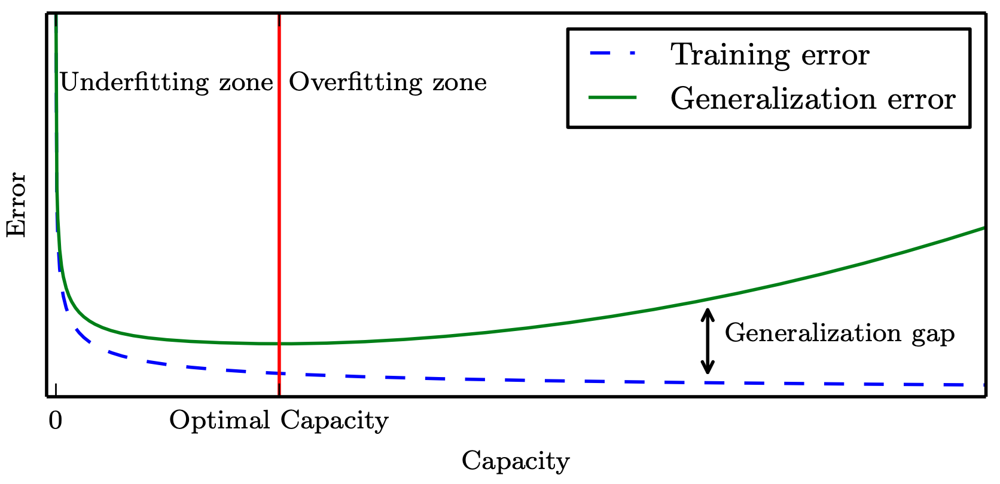
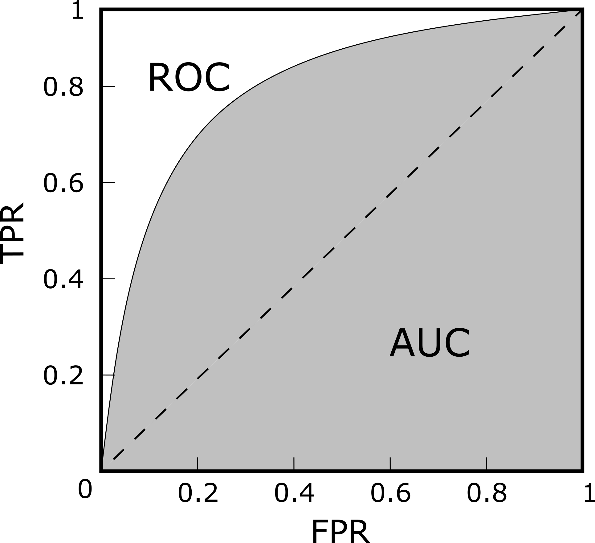
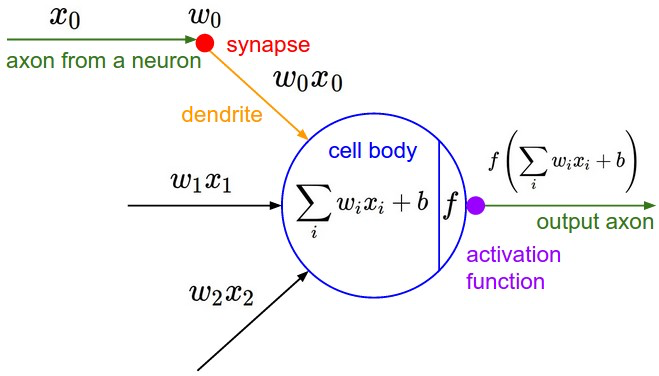
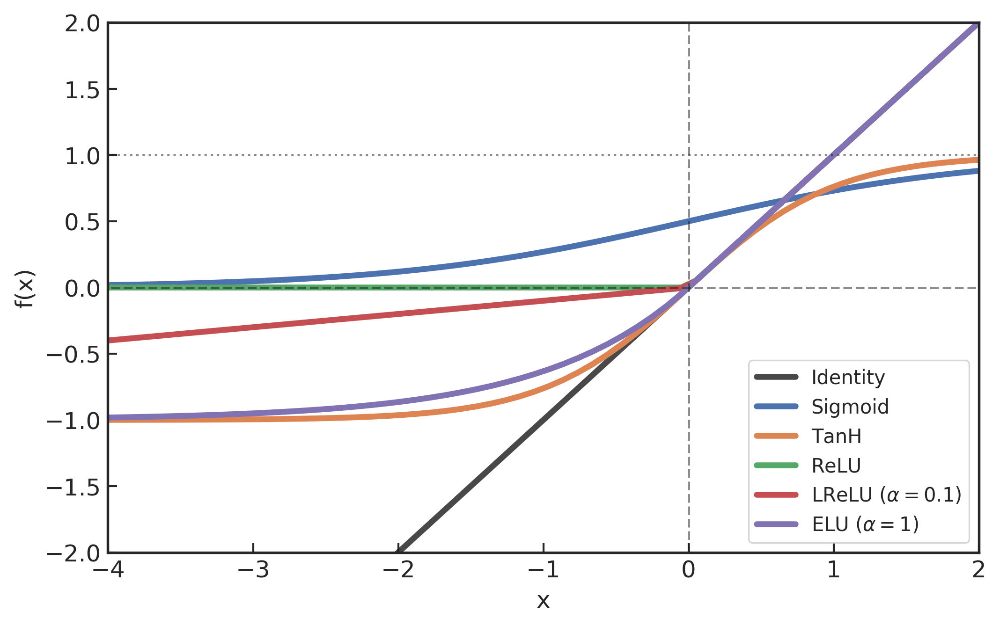
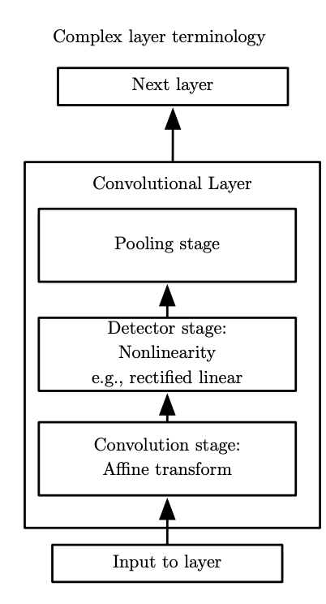
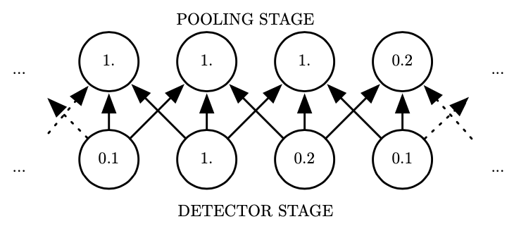

 

[TOC]

 

---

# 第三章 深度学习的理论基础

 

## 3.1 引言

 

在本章，我们将会对深度学习的主要概念做一个简要的概述，这包含机器学习方法、人工神经网络和卷积神经网络等内容。

绝大多数的算法在其设计之初都是用来实现某一特定任务的。若想将其重用在其他任务目标的话，都会需要非常庞大繁杂的代码修改和理论完善工作，使得可以与目标任务相匹配。然而，机器学习就是一类很特殊的算法，它们可以从大量的数据样本中学习 (learn) 并解决一些新的问题，即使没有被显式编程过。这使得在依据不同的数据背景上，可以训练相同的算法模型应用在不同的应用领域上 [@2016GoodfellowDeepLearning]。 更重要的是，有些机器学习算法能够处理人类可以凭直觉就可以解决但是却很难显式编程或定义的任务，因此，人们会经常称之为“人工智能” [@2016GoodfellowDeepLearning]。

机器学习有两个很重要的分类：监督学习和非监督学习。在监督学习中，算法会从已被正确标注的数据中学习，然而非监督学习算法是不得不从非结构化且未被标注的数据中学习模式 [@2015SchmidhuberDeeplearningneural]。本文的研究目标将会关注在监督学习的应用上，其中被标注的数据来自于数值模拟的结果，由此训练机器学习模型将埋在噪声中的引力波信号探测出来，并且在统计意义上对预测结果进行评估。

尽管传统的机器学习算法已经在诸多领域中获得巨大的成功，但是其潜能很受限于待训练的原始数据本身。通常数据总是不得不经过人工地简化和整理，用以适应某一特定表征的任务。选取特定的表征或特征是非常困难和花费人力的，通常需要该领域的专家付出数十年的努力，可见这严重的限制了这些机器学习算法的应用性 [@2016GoodfellowDeepLearning]。表征学习 (Representation learning) 是机器学习的一个子领域，其目标就是要解决这个问题。表征学习会让算法自己从原始数据中学习到有用的表征，并自动地提取出与特定任务相关的特征 [@2013BengioRepresentationLearningReview]。

深度学习是机器学习中一个发展非常快的子领域，目标就是要解决这个棘手的算法特征工程 (feature engineering) 问题。深度学习会自动地通过从原始数据中为特定的任务提取不同层级的有用的相关特征。深度学习技术的得以实现，归功于通过深层相互连接的“人工神经元”所构造的计算模型，以及非常高效的学习(优化)算法 [@2015LeCunDeeplearning] [@2016GoodfellowDeepLearning]。这些深度人工神经网络 (deep artificial neural networks, DNNs) 可以捕获到数据中复杂的非线性关联，这正是借助自动学习过程中，学习到了复合的层状内禀特征才实现的。最深的神经元层可以学到高度抽象的信息来解决上述提到的近似人类智能的任务，并且还可以达到最佳的表现 [@2015SchmidhuberDeeplearningneural]。

深度学习的潜力在诸多的科学技术领域中得到了广泛的应用，如搜索引擎 (Google，Bing)、智能手机中的语音识别、个人助手 (Siri，Cortana，Google assitant)、摄像头的实时人脸识别、面部识别 (Facebook)、语言翻译 (Google Translate)、基于文字的语音合成 [@2016OordWaveNetGenerativeModel]、亚马逊的推荐系统和 YouTube 的自动视频字幕生成，如此略举几例 [@2015NajafabadiDeeplearningapplications]。尤其引人注目的是深度学习与强化学习 (reinforcement learning) [@1998SuttonIntroductionReinforcementLearning] 的结合。在 2016 年，基于该技术所构建的名为 AlphaGo [@2016SilverMasteringgameGo] 的围棋程序成功击败了世界上排名第一的围棋选手。此外，另一项近期让人印象深刻的成功应用是唇语解读领域，该算法已经实现远超过人类自己对唇语的准确理解能力 [@2016ChungLipReadingSentences] 。深度学习也是已全球风靡的自动驾驶领域中的核心技术之一。

在本章中，我们首先简要概述机器学习的基础理论 (第 [3.2](C3.md#32) 节)，通过对参数化的算法模型的优化原理和性能评估方法的介绍，对基于数据驱动实现算法优化的过程有一个的宏观认识。随后，我们会以深度神经网络算法作为基本模型 (第 [3.3](C3.md#33) 节)，通过直观的矩阵表述阐明人工神经网络的基本构成和本文会涉及到的深度学习方法。最后，我们会着重对一类特定的深度神经网络——卷积神经网络——中的构成要素和性能特点进行介绍 (第 [3.4](C3.md#34) 节)。通过深入理解和掌握深度学习技术的基本原理和常见操作方法，为本论文后续构建和开发深度神经网络模型提供有效的理论思考和论据基础。

 

## 3.2 机器学习理论

 

要想充分理解深度学习，必须要对机器学习的基本原理有一定的理解。在本节，我们会简要介绍机器学习算法的基本概念和主要方法。针对与文中所涉及的机器学习技术，我们会以不同的主题形式对相关的重要概念和方法由浅入深的逐一介绍。

笼统地说，机器学习算法是一种能够从数据中学习经验的算法。所谓的“学习”是一个被抽象化的概念，不能简单地与通常意义下我们人类的“学习”行为相提并论。Tom M. Mitchell [@1997MitchellMachinelearning1997] 为此提供了一个简洁的定义 [^Learning]：“对于某任务 T 和性能度量 P，一个计算机程序被认为可以从经验 E 中学习，是指通过经验 E 改进后，它在任务 T 上由性能度量 P 衡量的性能有所提升。”显然，任务 T 和性能度量 P 的定义是非常宽泛的。对于我们引力波探测来说，上述定义中的“任务”和“性能度量”就可以分别代表为：“在一组部分含有引力波信号的数据中，如何将含有引力波信号的数据区分出来”和“将引力波信号正确分类的概率(准确率)”。在本文的第[四](C4.md)、[五](C5.md)和[六](C6.md)章中，我们都是基于上述的性能度量指标完成相应的学习任务。

[^Learning]: "A computer program is said to learn from experience E with respect to some class of tasks T and performance measure P, if its performance at tasks in T, as measured by P, improves with experience E."

通常机器学习任务定义为机器学习算法应该如何处理样本 (example)。所谓样本是指针对特定的对象或任务中收集到的已经量化的特征 (feature) 的集合。样本可以表示为一个向量 $\mathbf{x}\in\mathbb{R}^n$，其中向量的每一个元素 $x_i$ 是一个特征。例如，当某一段引力波时域数据就是一个样本时，每个采样点上的值对应地就是一个特征。所有 $N$ 个样本构成的集合就成为数据集 (dataset)：

$$
    \mathbf{X} = \{\mathbf{x}^{(i)} | i=0,1,2,\cdots, N-1\}
$$

如果用带有参数 $\theta$  的函数 $f$ 来表示机器学习算法模型，以数据集中的每一个样本作为算法的输入数据，则 $f(\mathbf{X})$ 就是经过算法模型映射后的输出数据。简单来说，一个机器学习任务就是要基于给定的数据环境和任务目标找到一个符合要求的映射 $f$。

通常，我们会非常关注机器学习算法在未观测数据上的性能如何，所以会使用测试集 (test set) 数据来评估系统的性能，并要将其与机器学习系统的训练集 (training set) 数据区分开来。性能度量的选择看似简单且客观，但其实选择一个与系统理想表现对应的性能度量通常是很困难的。我们将在第 [3.2.3](C3.md#323_roc_auc) 节中介绍分类问题中常用的 ROC 和 AUC 性能指标，并且在随后的各章中基于引力波数据给出进一步的讨论。

根据学习过程中的不同经验，机器学习可以大致地分为有监督学习和非监督学习两种。它们可以被理解为在整个数据集上获取经验。

- 有监督学习算法 (Supervised learning algorithm)

    训练含有很多特征的数据集，并且每个数据集中的样本都有一个标签 (label) 或目标 (target) 向量 $\mathbf{y}$。例如，某段真实引力波时域数据中，其中是否 (Yes/No) 含有引力波信号就是该样本的标签 $y_i = (0, 1)$。
    
- 无监督学习算法 (Unsupervised learning algorithm)

    训练含有很多特征的数据集，然后学习该数据集上有价值的结构性质，其数据集中的样本是没有标签的。在深度学习中，我们通常要学习如何生成数据集的整体概率分布。

有些机器学习算法并不是训练在一个固定的数据集上，如强化学习 (reinforcement learning) 算法，描述和解决智能体 (agent) 在与环境的交互过程中通过学习策略以达成回报最大化或实现特定目标的问题，详情可参考 [@1998SuttonIntroductionReinforcementLearning] [@1996BertsekasNeurodynamicprogramming] 及其上的深度学习方法 [@2013MnihPlayingAtariDeep]。

在本论文中，对很多关于统计学、机器学习和数据挖掘的术语和专有名词是不详细加以区分的，需要留意诸如：模型/算法/网络、训练/优化/学习/拟合、预测/推断、泛化/测试数据、样本/实例、变量/采样值/特征、样本标签/学习目标等这些相近含义的概念将会无差别的交替使用。更多相关术语和语言的对应关系，可参考 [@2013WassermanzAllstatisticsconcise]。

### 3.2.1 基于梯度的优化方法

几乎所有的深度学习算法都可以被描述为特定的数据集、代价函数、优化过程和模型这四部分所组成。本小节将着重介绍使用基于梯度的优化方法，通过优化交叉熵代价函数从而预测二值型变量 $y_i$ 的监督学习分类问题。这类问题在引力波数据处理中，对引力波信号的预报是尤为密切相关的。

#### 3.2.1.1 代价函数

由上一节可知，监督学习算法通过研究数据集，学习如何根据特征与标签之间的内禀关系将数据中的样本进行二分类划分。该学习任务就是要训练学习到如下的映射关系：

$$
\begin{align}
    \mathbf{X} \longrightarrow & \mathbf{\hat{Y}}= f(\mathbf{X}, \mathbf{Y};\theta) \\
    \mathbf{x} \longmapsto & \hat{\mathbf{y}}=f(\mathbf{x}, \mathbf{y};\theta)
\end{align}
$$

其中，$\mathbf{Y}=\{ \mathbf{y}^{(i)} | i=1,2,\cdots, N\}$ 和 $\mathbf{\hat{Y}}=\{\mathbf{\hat{y}}^{(i)}|i=1,2,\cdots,N\}$ 分别代表标签和预测结果的集合。每个样本 $\mathbf{x}^{(i)}$ 都会配有对应的一个标签向量 $\mathbf{y}^{(i)}$，它们共同作为带有参数 $\theta$ 的模型 $f$ 的输入数据给出一个预测结果 $\hat{\mathbf{y}}=f(\mathbf{x}, \mathbf{y}; \theta)$。那么，我们训练模型的目标就是要让 $\mathbf{y}$ 和 $\mathbf{\hat{y}}$ 在逻辑上对应起来。例如对回归问题来说，优化的目标可以是最小化均方误差 (mean squared error) $\frac{1}{N}||\mathbf{\hat{y}} - \mathbf{y}||^2$ 来实现。我们一般称要最小化的目标函数为代价函数 (cost function)、损失函数 (cost function) 或误差函数 (error function)。

就本论文所关心的分类问题来说，尤其是在大多数现代的神经网络中，一般都会使用最大似然 (maximum likelihood) 构造代价函数进而训练模型中的参数，这也就意味着代价函数应该有负对数似然的形式，它与训练数据集的经验分布和模型预测分布之间的交叉熵 (cross entropy) 表示是等价的(可见附录 [C](Appendix.md#c) 查看到相关的定义和详细推导过程)。

考虑一族含有 N 个样本的数据集，独立地由未知的真实数据分布 $p_\text{data}(\mathbf{x})$ 所生成。令 $p_\text{model}(\mathbf{x};\theta)$ 是一族由 $\theta$ 确定的在相同空间上的概率分布，换句话说，$p_\text{model}(\mathbf{x};\theta)$ 将任意输入 $\mathbf{x}$ 映射到一个实数来估计其真实数据的概率分布 $p_\text{data}(\mathbf{x})$。我们使用最大似然构造代价函数 $J(\mathbf{\theta})$ 从而学习条件分布，这可以表示为

$$
\begin{align}
    J(\theta)&=-\mathbb{E}_{\mathbf{x}, \mathbf{y} \sim \hat{p}_{\text {data }}} \log p_{\text {model }}(\mathbf{y} | \mathbf{x} ; \theta)\\
    \mathbf{\theta}_{\mathrm{ML}}&=\arg\min _{\theta} J(\theta)
\end{align}
$$

其中，$\hat{p}_\text{data}$ 泛指训练数据下的经验分布。

对模型参数 $\mathbf{\theta}$ 的(条件)最大似然估计可以等价的描述为 (可见附录 [C](Appendix.md#c) 查看到详细推导过程)：

$$
    \mathbf{\theta}_\text{ML}=\arg\max_\mathbf{\theta}\sum^N_{i=1}\log p_\text{model}(\mathbf{y}^{(i)}|\mathbf{x}^{(i)};\mathbf{\theta})
$$

使用最大似然来导出代价函数的方法的一个优势就是，减轻了为不同模型设计代价函数的负担，只需要明确一个模型的 $p(\mathbf{y}|\mathbf{x})$ 就可以把优化的目标函数定下来。在本论文中，涉及到所有基于分类问题的网络模型里，我们都是用 softmax 函数作为模型最终输出数据时的非线性计算单元，其函数形式为：

$$\label{eq:softmax}
    \text{softmax}(\mathbf{\hat{y}})_k = \frac{\exp(\hat{y}_k)}{\sum_j\exp(\hat{y}_j)}
$$

由于该函数的输出元素都介于 0 和 1 之间，且向量之和为 1，这使得其可以作为一个有效的概率分布 $p_\text{model}(y=k|\mathbf{x}^{(i)})$ \footnote{$(i)$ 表示的是第 $i$ 个样本，下标的 $j, k$ 对应的是不同的分类类别。}。由此，我们使用最大化条件对数似然输出某样本的目标分类 $y$ 时，即等价于对下式最大化，

$$
\begin{align} \label{eqn:C3_logsoftmax}
    \log p_\text{model}(y=k|\hat{\mathbf{y}}) 
    &= \log \text{softmax}(\hat{\mathbf{y}})_ k \\
    &=\hat{y}_k - \log\sum^N_j\exp(\hat{y}_j)
\end{align}
$$

上式中的第一项表示模型的直接输出结果 $\hat{y}_ k$，对优化目标有着直接的贡献。在最大化对数似然时，当然是第一项越大越好，而第二项是鼓励越小越好。根据 $\log\sum^N_j\exp(\hat{y}_ j)\sim\max_j\hat{y}_ j$ 近似关系，可以发现负对数似然代价函数总是强烈的想要惩罚最活跃的不正确预测。对于已经正确的预测分类，前后两项就会相互抵消。从总体上可见，代价函数 $J(\theta)$ 主要是由其他未被正确分类的样本产生贡献。

对于二值型的分类学习任务，softmax 函数会退化到 sigmoid 函数：

$$\label{eqn:C3_sigmoid}
    \text{sigmoid}(s) = \frac{1}{1+e^{-s}}
$$

由此可以证明 (见附录 [C](Appendix.md#c))，代价函数可以表示为

$$\label{eqn:C3_binaryloss}
    J(\theta) = -\sum^N_{i=1} y^{(i)}\log\hat{y}^{(i)} + (1-y^{(i)})\log(1-\hat{y}^{(i)})
$$

其中，某样本 $x$ 的预测输出 $\hat{y}=\text{sigmoid}(f(x))$ 为正和负的概率分别是 $\hat{y}=p_\text{model}(y=1|x)$ 和 $1-\hat{y}=p_\text{model}(y=0|x)$。在本文中，我们将会使用公式 \eqref{eqn:C3_binaryloss} 所表示的二分类代价函数作为深度学习模型的优化目标。

#### 3.2.1.2 随机梯度下降算法

在上一节中，我们谈到了模型学习或者训练的目标是要最小化代价函数，即 $\min_\theta J(\theta)$。为了实现该优化问题，几乎所有的深度学习算法都会用到一个非常重要的算法来解决：随机梯度下降 (stochastic gradient descent, SGD)。

机器学习算法中的代价函数通常都可以分解为每个样本的代价函数之总和。若用 $L(\mathbf{x},\mathbf{y}, \mathbf{\theta})=-\log p_\text{model}(\mathbf{y}|\mathbf{x},\mathbf{\theta})$ 来表示每个样本的损失，则一个训练数据集上负条件对数似然可以写成：

$$
    J(\mathbf{\theta}) = \mathbb{E}_ {\mathbf{x},\mathbf{y}\sim\tilde{p}_ \text{data}}L(\mathbf{x},\mathbf{y},\mathbf{\theta})=\frac{1}{N}\sum^N_{i=1}L(\mathbf{x}^{(i)},\mathbf{y}^{(i)},\mathbf{\theta})
$$

对于这些代价函数，我们需要计算每个样本关于模型参数的梯度

$$
    \nabla_\theta J(\theta) = \frac{1}{N}\sum^N_{i=1}  \nabla_\theta L(\mathbf{x}^{(i)},\mathbf{y}^{(i)},\mathbf{\theta})
$$

为了使得代价函数总向着减小的方向变化，考虑在负梯度方向上迭代和更新模型的参数 $\theta$，这被称为梯度下降 (gradient descent) 法。但这个优化方法的计算代价是 $O(N)$，所以每一次梯度迭代都会消耗相当长时间。

随机梯度下降的核心：梯度是期望。期望可以是用小样本近似估计的，所以每一次迭代都从训练集中均匀抽取一小批量 (minibatch) 样本来进行训练。小批量的数目 (batch size) 一般会取 $2^n<N$，这是因为 GPU 硬件内存中对 2 的幂次数目存入的数据可以发挥更佳的运算性能。由此，代价函数的梯度估计可以表示成

$$
    J(\theta) = \frac{1}{N'}\nabla_\theta\sum^{N'}_ {i=1}L(\mathbf{x}^{(i)},\mathbf{y}^{(i)},\theta), \,\,\,\,\,N'=2^n<N
$$

我们可以使用如下的参数优化算法来更新模型参数：

$$
    \theta\leftarrow\theta-\epsilon J(\theta)
$$

其中，$\epsilon$ 是学习率 (learning rate)。

学习率和 batch-size 都是会显著地影响模型的优化效率和泛化性能的超参数。在本论文中，我们都使用学习率自适应的 Adam 改进优化算法 [@2014KingmaAdamMethodStochastic] 实现模型参数的迭代更新。另有研究表明 [@2017GoyalAccurateLargeMinibatch] [@2016KeskarLargeBatchTraining]，较大的 batch-size 收敛更快、稳定性更好，但泛化性能会降低，不过可以通过增加迭代次数，用更长的训练时间来弥补 [@2017HofferTrainlongergeneralize]。因此，本文中所构建的深度学习模型都默认取 batch-size 为 64，并且训练到最终泛化收敛为止。

### 3.2.2 模型的泛化能力，过拟合与欠拟合

在本节中，我们会简要介绍在统计学习理论中对数据集的基本假设，以及在训练机器学习模型时，如何判断算法模型的学习效果。

所有的机器学习任务都必须能够在先前未观测的新输入上表现良好，而不仅是在训练集上表现良好，这种能力就被称为泛化 (generalization)。与训练误差 (training error) 相对应的，我们也希望对测试集上的泛化误差 (generalization error) (也称为测试误差 (test error))也进行优化。

为了在只能观测到训练集的情况下，模型的训练也能影响到其在测试集上的性能。统计学习理论对训练集和测试集的收集方式做出了一系列假设，统称为独立同分布 (independent identically distributed, i.i.d) 假设 [@2016GoodfellowDeepLearning] [@2016ZhouMachineLearning]。该假设是说，每个数据集中的样本都是相互独立的 (indenpendent)，并且训练集和测试集是同分布的 (identically distributed)，即采样自相同的真实数据分布。在上一节中，训练集上的经验分布 $\hat{p}_ \text{data}$ 和真实数据上的分布 $p_\text{data}$ 就假设为相同的分布。

在使用机器学习算法训练的过程中，测试误差期望会大于或等于训练误差期望。所以我们认定机器学习算法效果是否很好，就是要考察以下两个学习目标：

1. 降低训练误差。
2. 缩小训练误差和测试误差的差距。

这两个目标分别对应了机器学习的两个重要挑战，即欠拟合 (underfitting) 和过拟合 (overfitting) 问题。欠拟合是指模型不能在训练集上获得足够低的误差，而过拟合是指训练误差与测试误差之间的差距过大。

为了控制模型的拟合表现，我们一般会需要调整模型的容量 (capacity)。笼统的说，模型的容量是指其拟合各种函数的能力，一般也可以代表模型的复杂程度。显然，容量低的模型会欠拟合，容量高的模型会过拟合，因为将不适用于测试集的训练集性质也学习到了。

机器学习算法的容量也要适合所要执行的学习任务的复杂度和训练数据的规模，才能让算法效果更佳。容量不足不能解决复杂任务，容量高于任务所需时，就有可能会过拟合。虽然更简单的函数会带来更可能的泛化效果(训练误差和测试误差的差距小)，但仍需要一个足够复杂的模型来达到够低的训练误差。通常，随着模型容量的提高，训练误差会单调下降，而泛化误差会接近一个关于模型容量的 U 型曲线函数 [^Ucurve]。如下图所示 [@2016GoodfellowDeepLearning]。

[^Ucurve]: 有最新研究 [@2019NakkiranDeepDoubleDescent] [@2020YangRethinkingBiasVariance] 发现，对于一大批超级大、超级复杂的模型和在超大数据规模下，模型复杂度与误差之间会呈现非典型的双波谷等关系。

>机器模型的容量与误差之间的 U 型关系
{: style="zoom:30%"}

在本文的实际训练过程中，我们会观察模型在每一次迭代更新的过程中测试误差的表现。当测试误差没有在实现指定的迭代次数内有进一步改善，达到泛化误差的收敛一致性 [^consistency] (uniform convergence)  时，会要求算法停止训练，这种策略被称为提前终止 (early stopping)。随后，我们会把迭代历史中在测试集上表现最好的模型参数，视作处于最佳容量 (optimal capacity) 处的模型，将其作为当前数据集性质下的一个训练好的模型 (trained model) 保存下来。

[^consistency]: 有最新研究 [@2019NagarajanUniformconvergencemay] 对此提出质疑，认为收敛一致性可能解释不了深度学习中的泛化现象。此论文获得 NeurIPS 2019 杰出新方向论文奖。

### 3.2.3 性能度量指标：ROC 与 AUC

对机器学习模型的泛化性能进行评估，不仅有上述介绍到的误差估计方法，还需要有衡量模型泛化能力的评价标准，这就是性能度量 (performance measure)。

在模型的训练过程中，一般会用错误率 (error rate) 和准确率 (accuracy) 来定量衡量分类模型的性能。准确率是指该模型输出分类正确的样本数占样本总数的比例，而错误率是其补集，表示模型分类错误的样本数占的样本总数的比例。在引力波数据处理中，我们通常考虑的是在某一段数据中，引力波信号是否存在的二分类问题。所以，我们会更加关心是“引力波信号中有多少比例可以被探测到”，或者“预报的信号中有多少比例是真实引力波信号”。那么错误率和准确率就不够用了，这时会使用其他性能度量。

对于二分类问题，本文中所涉及的机器学习模型都会对测试样本给出一个实数或概率值 (如本章的第 [3.2.1](C3.md#321) 节中 softmax 函数的输出结果)，在这个 $[0,1]$ 之间的概率值中取阈值 (threshold) 从而判断该样本究竟是正类 (1)，还是反类 (0)。直觉上，0.5 看似是一个合理的分类阈值，但从 softmax 函数所描述的代价函数上看，这个 0.5 阈值仅代表最大梯度更新的极值点，并没有理论上明确的理想分类阈值。不过对于一个训练好的分类模型而言，分类阈值的选取会直接影响模型的泛化考量。所以，我们可以将所有可能的阈值选取都考虑到，综合考量它们就可以给出模型关于阈值的“期望泛化性能”。受试者工作特征 (Receiver Operating Characteristic, ROC) 曲线就是从这个角度出发的度量指标。在每一种阈值的选取下，我们可以构建分类结果的混淆矩阵 (confusion matrix)，如下表所示，将所有样本划分为真正例 (true positive, TP)、假正例 (false positive, FP)、真反例 (true negative, TN)、假反例 (false negative, FN) 四种情形。

>二分类预测结果的混淆矩阵表

| 真实情况 	| 预测结果      	| 预测结果      	|
|----------	|---------------	|---------------	|
|          	| 正例          	| 反例          	|
| 正例     	| $TP$ (真正例) 	| $FN$ (假反例) 	|
| 反例     	| $FP$ (假正例) 	| $TN$ (真反例) 	|

以此，我们可以计算出真正例率 (True Positive Rate, TPR) 和假正例率 (False Positive Rate, FPR) 

$$
\begin{align}
    \text{TPR} &= \frac{\text{TP}}{\text{TP}+\text{FN}} \\
    \text{FPR} &= \frac{\text{TP}}{\text{TN}+\text{FP}}
\end{align}
$$

在引力波数据处理中，上述的 TPR 和 FPR 可以分别与引力波信号预警模型在引力波数据上的探测灵敏度 (sensitivity) 和误报率 (false alarm rate, FAR) 相对应。

在不同的阈值选取下，我们分别以 TPR 和 FPR 为纵、横轴作图，就得到了 ROC 曲线，如下图所示。图上的每一点，都对应于一种阈值选取可能。对角线对应于“随机猜测”模型，而过点 $(0,1)$ 的曲线就是预测最佳的“理想模型”。阈值越大，对应的是向 ROC 的左下角方向，阈值越小，对应于 ROC 右上角的方向。

>ROC 曲线与 AUC 示意图
{: style="zoom:20%"}

对不同的机器学习模型进行比较时，若某模型的 ROC 曲线可以“包住”另一个模型的曲线，则可断言前者的性能优于后者。为了能避免曲线交叉会带来的含糊，一个定量的合理判据就是比较 ROC 曲线下的面积，即 AUC (Area Under ROC Curve)，如上图所示。

 

## 3.3 深度神经网络

 

人工神经网络 (Artificial neural networks, ANN)，作为深度学习网络 (Deep Neural Networks, DNN) 的构成元素，起初是从生物意义上的神经网络中得到启发，通过建立一个神经网络状的计算模型进而从数据中学习模式 [@2015NielsenNeuralnetworksdeep]。神经网络的基本构成要素就是人工神经元 (loosely modeled after real neurons [@2013DanielPrinciplesArtificialNeural])，其构造是基于早期 Rosenblatt 在 1957 [@1958Rosenblattperceptronprobabilisticmodel] 年提出的感知器 (perceptrons)。一个感知器即是一个输入向量 $(\vec{x})$ 计算得出一个参数化输出结果，再带上一个偏置项。可以通过公式 $f(\vec{x}) = \vec{w}\cdot\vec{x}+b$ 来构造，其中参数 $(\vec{w})$ 和偏置 $(b)$ 会在训练过程中学习到。

Minsky 和 Papert 发现单一的感知器 (也称为 M-P 神经元模型) 有很多局限性 [@2017MinskyPerceptronsIntroductionComputational]。然而，不久后发现这些局限性是可以通过内禀连接的多层感知器 (Multilayer Perceptron, MLP) 来得以克服的 [@2015SchmidhuberDeeplearningneural]。严格的数学语言已表明神经网络的普遍性定理 [@1990HornikUniversalapproximationunknown]，证明了三层结构的 MLP (只有一个隐层)是可以对任意一个连续函数来建模实现的。

多层感知器也被称为前馈神经网络，这是因为数据信息是从输入层直接传播到输出层，而没有内部循环机制(即反馈循环机制) [@2016GoodfellowDeepLearning]。然而，很多潜力巨大的循环结构，如循环神经网络 (Recurrent Neural Networks, RNN)，被构造出来。不过这类网络通常在训练阶段会有过大的计算开销，因此，在本文中将只考虑前馈神经网络。

一个 ANN 通常都会有一个输入层、一个或多个隐藏层、以及一个输出层。在每一个隐藏层的输出处会有一个非线性“激活” (activation) 函数。如果没有这个非线性操作，那么多层结构就是冗余的，多层结构不过是输入数据的线性组合。最常用的非线性激活函数有逻辑斯蒂 sigmoid，双曲的 $\tan$ 和线性整流单元(rectified linear unit，通常称为 ReLU 或 ramp)等等。有实验表明 ReLU 函数在大多数应用中都有着最好的表现 [@2009JarrettWhatisbest]。这个函数的数学表达是 $\max(0, x)$。

能够让 ANNs 高效工作的关键要素是学习算法。现今几乎所有的神经网络都是通过反向传播算法 (back-propagation algorithm) 及其各类变种再结合梯度下降方法 (第 [3.2.1](C3.md#321) 节) 从而实现训练优化的 [@2015SchmidhuberDeeplearningneural]。其核心思想是将每一次数据输入到神经网络后，输出的误差反向逐层地传播回到输入层，这样就可以针对某个监督学习任务而言，调节每个神经元的权重以使得全局误差降低 [@2012LeCunEfficientBackProp]。ANNs 的权重参数通常都会先做一个小随机数的初始化，然后在整个数据集上反向传播多轮，通常称为 epochs，直到误差达到极小值。小批量的随机梯度下降方法 (Stochastic gradient descent with mini-batches) [@2016Ruderoverviewgradientdescent] 已经成为学习训练过程的惯用操作方式。这个技术是要求神经网络在训练数据集的一个子集上 (代表一次迭代 (iteration)) 估计误差的梯度，并据此来调节 ANNs 的权重参数。这些调节改变的幅度可以通过学习率 (learning rate) 来表征。有些带有自适应学习参量的新学习优化算法，如 ADAM (Adaptive Momentum Estimation) 等，正在越来越流行。在实践过程中，这些新的优化算法在很多应用领域上给出了更高效和更优异的表现 [@2014KingmaAdamMethodStochastic]。

关于神经网络 (neural networks) 的研究发展已经发生了天翻地覆的变化，现今其已是一个应用相当广泛，多学科交叉融合的研究领域。关于神经网络使用最广泛的定义 [@1988Kohonenintroductionneuralcomputing] [@2016ZhouMachineLearning] 是：“神经网络是由具有适应性的简单单元组成的广泛并行互连的网络，它的组织能够模拟生物神经系统对真实世界物体所作出的交互反应”。值得留意的是，虽然最初的神经网络算法是受到生物神经网络系统的启发，但现代深度神经网络的研究早已与之分道扬镳。我们在机器学习系统中所谈论的神经网络，指的是机器学习与人工神经网络这两个学科领域所交叉的部分。

在这一节中，基于上一节所介绍的机器学习框架，我们将会概述神经网络模型相关的重要概念和基本组件，并且说明它们是如何在引力波数据处理中发挥作用的。

### 3.3.1 神经元

神经网络中最基本的简单单元是神经元 (neuron) 模型(也称为 M-P 神经元模型 [@2017MinskyPerceptronsIntroductionComputational])。在这个模型中，一个带有权重参数 $\{w_i,i=1,2,\cdots,D\}$ 的神经元接收一个样本 $\mathbf{x}$ 发来的特征数据 $\{\mathbf{x}_ i,i=1,2,\cdots,D\}$，经过线性组合，然后通过激活函数 $f$ 的非线性操作后，最终以一个数 (scalar) 作为该神经元的输出。如下图所示 [^neural]，图中的偏置 $b$ 也是神经元内的一个参数。

[^neural]: [http://cs231n.github.io/neural-networks-1/](http://cs231n.github.io/neural-networks-1/)

>M-P 神经元模型
{: style="zoom:60%"}

用矩阵形式来表达神经元内部的线性组合会更加清楚。从图中的数学模型可知，线性组合的代数表达式是 $\sum_iw_ix_i+b = w_1x_1+\cdots+w_{D}x_{D}+b$，其矩阵表达式为

$$
    \underbrace{\begin{bmatrix}
     \sum_iw_ix_i+b  
    \end{bmatrix}}_{1\times 1}
    =
    \underbrace{\begin{bmatrix}
    \cdots & x_i & \cdots
    \end{bmatrix}}_{1\times D}
    \cdot
    \underbrace{\begin{bmatrix}
    \vdots  \\ 
      w_i   \\ 
    \vdots   
    \end{bmatrix}}_{D\times 1}
    +
    \underbrace{\begin{bmatrix}
     b 
    \end{bmatrix}}_{1\times 1}
$$

在上式中，一个样本由 $D$ 个特征组成的行向量与神经元中权重所组成的列向量做矩阵乘法，然后再加上偏置项，就完成了一个神经元内部的线性计算。如果是 $N$ 个样本同时经过一个神经元内部进行线性计算，会得到 $N$ 个对应于样本的数作为输出结果，则矩阵表达式可以扩展为：

$$
    \underbrace{\begin{bmatrix}
     \sum_jw_jx_{ij}+b_j  \\
     \vdots
    \end{bmatrix}}_{N\times1 }
    =
    \underbrace{\begin{bmatrix}
    \cdots & x_{ij} & \cdots \\
    & \vdots &
    \end{bmatrix}}_{N\times D}
    \cdot
    \underbrace{\begin{bmatrix}
    \vdots  \\ 
      w_j   \\ 
    \vdots   
    \end{bmatrix}}_{D\times 1}
    +
    \underbrace{\begin{bmatrix}
     \vdots \\
     b_j\\
     \vdots
    \end{bmatrix}}_{N\times 1}
$$

其中，$N$ 个样本数据组成的 $N\times D$ 矩阵输入到一个神经元中，就意味着要与一个 $D\times1$ 的矩阵做矩阵乘法，然后在每个样本上加上偏置项 $b$。在引力波数据处理中，我们会将引力波的时序数据采样并整理成 $N\times D$ 矩阵，其中的 $N$ 就对应了不同的时序采样窗口，而 $D$ 对应的是每个时序数据的 $D$ 个采样点信息。

线性矩阵操作之后，会经过激活函数使得神经元“非线性化”。常用的非线性激活函数是 ReLU 函数，即 $f(x) = \max(0,x)$。我们会在第 [3.4.2](C3.md#342) 节中介绍其他的激活函数及其特性。综上，在单个神经元的内部，一个样本的输出结果是：

$$
    \hat{x}_i=f\left(\sum_iw_ix_i+b\right)=\max\left(0,\sum_iw_ix_i+b\right)
$$

### 3.3.2 全连接的神经网络

>单层的神经网络示意图
{: style="zoom:12%"}

把许多个 M-P 神经元按一定的层次结构连接起来，就可以构建层状的神经网络，如上图所示。对于一个组成单层结构的神经元来说，在这一层神经元内部的每个神经元会同时所有的权重参数进行相同的线性操作和非线性处理。考虑 $M$ 个神经元组成的单层神经元，某一个样本在该层内部会进行如下的线性矩阵运算：

$$
    \underbrace{\begin{bmatrix}
     \sum_iw_{ij}x_i+b &  \cdots & 
    \end{bmatrix}}_{1\times M} = 
    \underbrace{\begin{bmatrix}
    \cdots & x_i & \cdots
    \end{bmatrix}}_{1\times D}
    \cdot
    \underbrace{\begin{bmatrix}
    \vdots & &  \\ 
      \cdots & w_{ij} & \cdots \\ 
    \vdots &  & 
    \end{bmatrix}}_{D\times M}
    +
    \underbrace{\begin{bmatrix}
     b &\cdots & 
    \end{bmatrix}}_{\underset{\text{Broadcasting}}{1\times M}}
$$

其中，偏置项 $b$ 会广播 (broadcasting) 复制成一个 $1\times M$ 的行向量。于是，一个样本的数据经过 $M$ 个神经元组成的单层神经元层，就会得到 $M$ 个数组成的行向量作为数据输出。推广到 $N$ 个样本来说，经过单层神经元内部的输出结果可推广为

$$
    \underbrace{\begin{bmatrix}
     &  \vdots& \\ 
     \cdots& \hat{x}_{ik} &\cdots \\ 
     &  \vdots& 
    \end{bmatrix}}_{N\times M}
    =
    f\left(
    \underbrace{\begin{bmatrix}
     &  \vdots& \\ 
     \cdots& x_{ij} &\cdots \\ 
     & \vdots & 
    \end{bmatrix}}_{N\times D}
    \cdot
    \underbrace{\begin{bmatrix}
     &  \vdots& \\ 
     \cdots& w_{jk} & \cdots\\ 
     & \vdots & 
    \end{bmatrix}}_{D\times M}
    +
    \underbrace{\begin{bmatrix}
     & \vdots & \\ 
     \cdots &  b_i & \cdots\\ 
     & \vdots & 
    \end{bmatrix}}_{\underset{\text{Broadcasting}}{N\times M}}
    \right)
$$

上式中，单层神经元输出的结果 $\{\hat{x}_{jk}\}$ 对应为每个样本由 $M$ 个数构成新的特征矩阵，其可以作为下一层神经元的输入数据，如此反复迭代就可以构成多层级结构的神经网络。某层的神经元权重参数是由矩阵 $\{w_{ij}\}$ 和偏置项 $\{b_i\}$ 构成，其中 $i=1,2,\cdots,D,j=1,2,\cdots,M$。这些参数是机器学习算法优化过程中的可学习 (learnable) 参数，其中神经元权重矩阵的列数 $M$ 表示该神经元层中神经元的个数，这是在模型训练优化之前就需要确定下来的参数，我们将这种参数称为模型的超参数 (hyperparameters)。

>多层的神经网络示意图
{: style="zoom:10%"}

一般来说，常见的神经网络都是多层级结构，如上图所示，每层神经元都会与下一层神经元全互连，神经元之间不存在同层连接，也不存在跨层连接。这样由全连接层 (fully-connected layer，FCN) 构造的神经网络结构通常称为多层前馈神经网络 (multi-layer feedforward neural networks)，或者是多层感知器 (multi-layer perceptron, MLP)。

### 3.3.3 反向传播算法

在上一节，我们看到了如何使用梯度下降算法从而学习模型自身的参数。对于神经网络而言，计算代价函数的梯度就会变得很简单，而计算这个梯度的快速算法，就是反向传播 (back propagation) 算法 [@1986RumelhartLearningrepresentationsback] [@2015NielsenNeuralnetworksdeep]：

1. 输入：$\mathbf{x}=\mathbf{a}^1$ (看作第一层的输出)

2. 前向传播：在第 $l\in\{2,3,\dots,L\}$ 层神经元中，可计算得到线性操作的输出 $\mathbf{z}^{l}$ 和非线性激活的输出 $\mathbf{a}^{l}$

    $$
    \begin{align}
        \underbrace{\begin{bmatrix}
        \cdots & \mathbf{z}^l & \cdots
        \end{bmatrix}}_{1\times D^{(l)}}
        &=
        \underbrace{\begin{bmatrix}
        \cdots & \mathbf{a}^{l-1} & \cdots\\ 
        \end{bmatrix}}_{1\times D^{(l-1)}}
        \cdot
        \underbrace{\begin{bmatrix}
         & \vdots & \\ 
         \cdots& \mathbf{w}^l & \cdots\\ 
         & \vdots& 
        \end{bmatrix}}_{D^{(l-1)}\times D^{(l)}}
        +
        \underbrace{\begin{bmatrix}
        \cdots & \mathbf{b}^l & \cdots
        \end{bmatrix}}_{\underset{\text{Broadcasting}}{1\times D^{(l)}}} 
        \\
        \underbrace{\begin{bmatrix}
        \cdots& \mathbf{a}^l & \cdots
        \end{bmatrix}}_{1\times D^{(l)}}
        &=
        \sigma\left(\underbrace{\begin{bmatrix}
        \cdots& \mathbf{z}^l & \cdots
    \end{bmatrix}}_{1\times D^{(l)}}\right)
    \end{align}
    $$
    
3. 输出层的误差：在第 $L$ 层神经元中，(以二分类为例)输出的误差 $\mathbf{\delta}^L$ 可表示为

    $$
        \underbrace{\begin{bmatrix}
        &\delta^L_0 & \delta^L_1&
        \end{bmatrix}}_{1\times 2}
        =
        \underbrace{\begin{bmatrix}
        & \frac{\partial J}{a^L_0}& \frac{\partial J}{a^L_1} &
        \end{bmatrix}}_{1\times 2}
        \odot
        \underbrace{\begin{bmatrix}
        & \frac{\partial \sigma}{z^L_0}& \frac{\partial \sigma}{z^L_1} &
        \end{bmatrix}}_{1\times 2}
    $$  
    
4. 反向传播各层的误差：第 $l\in\{L-1,L-2,\dots,2\}$ 层神经元中的误差

    $$
        \underbrace{\begin{bmatrix}
         \cdots & \mathbf{\delta}^l & \cdots
        \end{bmatrix}}_{1\times D^{(l)}}
        =
        \underbrace{\begin{bmatrix}
        \cdots & \mathbf{\delta}^{l+1} & \cdots \\ 
        \end{bmatrix}}_{1\times D^{(l+1)}}
        \cdot
        \underbrace{\begin{bmatrix}
         &  \vdots& \\ 
         \cdots& \left(\mathbf{w}^{l+1}\right)^T &\cdots \\ 
         &  \vdots& 
        \end{bmatrix}}_{D^{(l+1)}\times D^{(l)}}
        \odot
        \underbrace{\begin{bmatrix}
        \cdots & \frac{\partial\sigma}{\partial\mathbf{z}^l} & \cdots
        \end{bmatrix}}_{1\times D^{(l)}}
    $$
    
5. 输出结果：计算得到代价函数 $J$ 关于第 $l\in\{2,3,\dots,L\}$ 层神经元中参数 $\mathbf{w}^l,\mathbf{b}^l$ 的梯度

    $$
    \begin{align}
        \underbrace{\begin{bmatrix}
        &  \vdots& \\ 
       \cdots &\frac{\partial J}{\mathbf{w}^l} & \cdots \\
       &  \vdots&
        \end{bmatrix}}_{D^{(l-1)}\times D^{(l)}}
        &=
        \underbrace{\begin{bmatrix}
        \vdots \\
        \left(\mathbf{a}^{l-1}\right)^T \\ 
        \vdots \\
        \end{bmatrix}}_{D^{(l-1)}\times 1}
        \cdot
        \underbrace{\begin{bmatrix}
         \cdots& \mathbf{\delta}^l & \cdots
        \end{bmatrix}}_{1\times D^{(l)}} 
        \\
        \underbrace{\begin{bmatrix}
         \cdots &\frac{\partial J}{\mathbf{b}^l} &  \cdots
        \end{bmatrix}}_{1\times D^{(l)}}
        &=
        \underbrace{\begin{bmatrix}
         \cdots & \mathbf{\delta}^l & \cdots
        \end{bmatrix}}_{1\times D^{(l)}}        
    \end{align}
    $$

在上述的反向传播算法描述中，$\odot$ 表示矩阵的哈达玛乘积 (Hadamard product)，即矩阵的对应元素相乘。为了表达简洁，采用了矢量形式替代矩阵的分量形式。

反向传播算法的核心是对代价函数 $J(\theta)$ 关于多层神经网络中任意权重 $w$ (及其偏置 $b$)的偏导数 $\partial J/\partial w$ 的表达。通过上述的表达式就可以告诉我们在某次迭代中改变权重和偏置时，相应的代价函数变化的快慢。多层神经网络在数学本质上就是非线性的复合函数层层嵌套，所以根据多元微积分中求导的链式法则，在计算各层神经元上的权重参数时，都会从输出层到第一层反向逐层地计算各层上复合函数的导数，详细可参考 [@2016ZhouMachineLearning] [@2016GoodfellowDeepLearning] [@2015NielsenNeuralnetworksdeep]。

基于反向传播算法的神经网络有着强大的表示能力，已有严格的数学证明 [@1990HornikUniversalapproximationunknown] 指出只需一个包含足够多神经元的隐层，多层前馈神经网络就能以任意精度逼近任意复杂度的连续函数。

### 3.3.4 Dropout 方法

近年来，在引力波数据处理的研究中，已有不少研究者 [@2018GabbardMatchingMatchedFiltering] 都使用了随机失活 (dropout) 方法 [@2012HintonImprovingneuralnetworks] [@2012KrizhevskyImageNetClassificationDeep] [@2019LabachSurveyDropoutMethods] 构建神经网络模型。所谓 dropout 方法，就是神经网络在训练过程中所使用的一种随机性算法，其是在每一次迭代训练开始之前，随机地将中间层的部分神经元临时删除，然后继续前向传播计算代价函数，最后反向传播来确定“激活的”神经元对梯度的贡献，如下图所示 [@2019LabachSurveyDropoutMethods]。大部分实验表明，这样不断地随机反复重置的方法，可以有效地防止过拟合问题的发生。

>随机失活 dropout 方法的示意图
{: style="zoom:10%"}

关于 dropout 方法为模型性能的提升，其背后的机制还未得到定论。有研究者 [@2012KrizhevskyImageNetClassificationDeep] 认为该技术可以减少复杂互适应的神经元，从而强制要学习在神经元的不同随机子集中更加健壮的特征。另一种更广泛接受的解释 [@2016GoodfellowDeepLearning] 是 dropout 相当于对大量不同网络子模型的性能做了近似平均，不同的子网络会以不同的方式过度拟合，模型集成后就会减轻过度拟合的效果。

 

## 3.4 卷积神经网络

 

卷积神经网络 (Convolutional neural networks, CNNs) [@1995LeCunConvolutionalnetworksimages] 的结构是受到哺乳动物的视神经大脑皮层的研究启发而开发的 [@2016GoodfellowDeepLearning]，作为前馈神经网络的一种特例，最早是由 Fukushima 的神经认知机 (Neocognitron) [@1980FukushimaNeocognitronselforganizing] 上发展而来，随后由 LeCun [@1995LeCunConvolutionalnetworksimages] 在 1980 年代成功地与反向传播算法相结合，开发了一个准确率非常高的用于识别手写数字的算法。基于 CNNs 的结构特点，Alex Krizhevsky 设计并构建的卷积神经网络 [@2012KrizhevskyImageNetClassificationDeep] 在 2012 年赢下了图像分类识别领域的 ImageNet 竞赛，并且模型的性能表现远远胜过其他参赛者的传统模型。这次竞赛之后，计算机视觉领域对神经网络产生了浓厚的兴趣，并带来了深远的影响。在诸多关于图像和视频处理任务中，CNNs 已经达到非常优秀的性能表现，有些甚至超过人类识别的准确率，如手写字识别，目标识别，视频移动目标识别等等 [@2012KrizhevskyImageNetClassificationDeep] [@2015LeCunDeeplearning]。

卷积层 (convolution layer) 是卷积神经网络中最核心的组成部分，它是由可以互相共享权重参数的神经元所构成。多层排布的卷积层在深度学习领域中是非常常见的，每个卷积层的共享权重参数在训练过程中都会实现迭代更新和优化学习。“卷积”这个名称来源于其对数据的线性操作是等价于信号处理中的线性卷积滤波器，或者可称为互相关 (cross-correlation) 操作 [@2016GoodfellowDeepLearning]，都是需要指定一个固定大小的卷积核来实现。一个卷积层通常也会被视为由一层相同的神经元组成的，每个神经元都会关注输入数据中一小块有重叠的区域，该区域通常叫做感受野 (receptive field)。

与 ANNs 相比，运用卷积层的主要优势是通过共享的权重参数和卷积核，可以实现计算开销的大大缩减，进而有助于构建更深层的网络结构和提高训练与测试的计算速度。由于权重参数的共享，CNNs 也就自然地具有空间平移性 (需要略微改良 [@2015LeCunDeeplearning]) 以及处理转动或尺度缩放过的数据信号。在实际情况下，一个卷积层对应于一个计算模块，它按数据流正向传播的方向将卷积运算层和池化(下采样)层相结合，并在最后经过一个非线性激活层的处理。池化 (pooling) 层通过下采样的方式可以有效地限制 DNN 的规模，从而进一步地缩减计算开销。这样还可以使得网络模型对数据噪声有更好的鲁棒性，从而在新数据样本分布下表现出更好的泛化能力 [@2015LeCunDeeplearning]。空洞卷积 (Dilated convolutions) [@2015YuMultiScaleContext] 是近期发展起来的新卷积技术，它让同层的感受野之间存在间隙，从而实现数据流信息的快速聚合，感受到更宽泛的输入数据范围。

卷积神经网络 [@1989LecunGeneralizationnetworkdesign] 作为一种特殊类型的神经网络，专门适用于处理类似标准网格结构的数据类型，例如时间序列数据和图像数据等。严格意义上说 [@2016GoodfellowDeepLearning]，卷积神经网络是指那些至少在网络的一层中使用卷积运算来替代一般的矩阵乘法运算的神经网络 [^CNN]。卷积神经网络已经在各种竞赛基准和应用领域上表现出了当前最优的 (state-of-art) 结果。近年来，在引力波数据分析的领域中，已有不少研究者基于卷积神经网络构建算法模型，已经在引力波信号探测识别 [@2018GeorgeDeepLearningReal] [@2018GeorgeDeepNeuralNetworks] [@2018GabbardMatchingMatchedFiltering] [@2019GebhardConvolutionalneuralnetworks]、参数估计 [@2019GabbardBayesianparameterestimation] 和降噪 [@2016TorresForneDenoisinggravitationalwave] [@2017ShenDenoisingGravitationalWaves] 等诸多方面展开研究。在本文中，我们将主要研究卷积神经网络在引力波数据中是如何实现快速地推断结果以及在波源参数上良好的泛化表现 (第[四](C4.md)章)，并通过建立对卷积运算的深刻理解，我们会对卷积神经网络的结构进行改进和优化 (第[五](C5.md)章)，最终开发出基于卷积神经网络的全新模型架构 (第[六](C6.md)章) 实现真实引力波信号的探测识别。

[^CNN]: Convolutional networks are simply neural networks that use convolution in place of general matrix multiplication in at least one of their layers.

在本小节中，我们将会介绍卷积运算的基本原理，以及在神经网络中使用卷积运算的动机。然后我们介绍卷积神经网络中其他常用的结构组件和技术细节，如池化、激活函数、空洞卷积和感受野等。通过对卷积神经网络作用的理解与认识，为本论文的研究和讨论提供理论支撑和论证依据。

### 3.4.1 卷积

卷积作为两个实变函数的一种数学运算，从信号处理的角度给出卷积的定义和描述，将会更有助于我们理解卷积神经网络。在数字信号处理中，时域卷积运算对应的是一种有限长单位冲激响应 (Finite Impulse Response, FIR) 滤波器，这是一种基于线性性 (linearity) 和时间平移不变性 (time invariance) 的滤波系统。考虑输入时域信号 $x(t)$，用 $w(t)$ 表示滤波器内的一个加权函数，则该滤波器的输出信号可以表示为：

$$
    s(t) = \int x(\tau)w(t-\tau)d\tau =: (x* w)(t)
$$

这种运算就叫做卷积 (convolution)，卷积运算通常用星号 ($*$) 表示，且满足

$$
\begin{align}
    (a_1x_2 +a_1x_2) * w &= a_1(x_1* w)+a_2(x_2* w)\\
    (x* w)(t-T) &= x(t-T)* w(t)
\end{align}
$$

其中，$a_1,a_2,T$ 都是常实数。上两式分别对应的是线性性和时间平移不变性。

卷积运算是可交换的。然而在卷积神经网络的术语中，卷积的第一个参数 (函数 $x$) 通常叫做输入 (input)，第二个参数 (weight) 叫做卷积核 (kernel) 函数。卷积的输出一般都会叫作特征映射或特征图 (feature map)。在第[六](C6.md)章的第 [6.3](C6.md#63) 节中，我们将据此改进为深度学习框架下的卷积神经单元。

当我们用计算机处理引力波数据时，信号数据在时间上是离散化采样的。根据附录 [A](Appendix.md#a_nyquist) 中所介绍的采样定理确定采样率，考虑一段有限的时序信号 $x[n], n=0,1,\dots,D-1$，采样后的核函数 $w[n],n=0,1,\dots,M-1$，则可以定义完整的离散形式的卷积运算 [@1995OrfanidisIntroductionSignalProcessing]：

$$\label{eqn:C3_conv_dist}
    s[n]  = \sum^{\min(n,M)}_ {m=\max(0,n-D)} x[m]w[n-m],n=0,1,\dots,D+M
$$

在机器学习技术中，输入 $x$ 通常是某多维数组的数据，而核 $w$ 对应的就是机器学习算法经过优化更新得到的多维数组参数。为了与第 [3.3.1](C3.md#331) 节中介绍的神经元概念对应，我们可以将卷积运算公式 \eqref{eqn:C3_conv_dist} 改写为矩阵形式：

$$
    \mathbf{s}=\mathbf{x}\cdot\mathbf{w}
$$

其中，输入 $\mathbf{x}$ 和输出 $\mathbf{s}$ 分别对应的是 $1\times D$ 和 $1\times (D+M-1)$ 的行向量，由此权重矩阵 $\mathbf{w}$ 是一个 $D\times (D+M-1)$ 的矩阵。例如，考虑 $D=5,M=4$ 的卷积矩阵运算：

$$\label{eqn:C3_conv_matrix}
    \mathbf{s}=\begin{bmatrix}
    s_0 & s_1  &\cdots& s_7
    \end{bmatrix}
    =
    \begin{bmatrix}
    x_0 & x_1 & \cdots & x_4
    \end{bmatrix}
    \cdot
    \begin{bmatrix}
    w_0 & w_1&  w_2&  w_3&  0&  0&  0& 0 \\ 
     0&  w_0&  w_1&  w_2&  w_3&  0&  0&  0\\ 
     0&  0&  w_0&  w_1&  w_2&  w_3&  0&  0\\ 
     0&  0&  0&  w_0&  w_1&  w_2&  w_3&  0\\ 
     0&  0&  0&  0&  w_0&  w_1&  w_2& w_3
    \end{bmatrix}
    =
    \mathbf{x}\cdot\mathbf{w}
$$

从上式可以看到，线性的卷积运算实际上是神经网络中单层神经元线性部分的一个特例。在这个例子中，权重矩阵 $\mathbf{w}$ 的行数 $D$ 对应于某样本中的特征总数，其列数 $D+M-1$ 与该神经元层的神经元个数相对应。由此，我们将这样的一次卷积矩阵计算的过程，称为一个卷积过程 (convolution stage)，同时也间接地证明了在线性卷积过程中，各神经元一定是稀疏连接 (sparse connectivity) 和权重参数共享 (parameter sharing) 的。

与全连接的神经元层相比，卷积过程的稀疏性不仅可以大大减少权重参数的数量，从而降低机器学习模型的存储需求，同时也会显著地提高其计算效率。卷积运算中的参数共享保证了每个卷积核只需要学习一个参数子集合，而不是对权重矩阵的每个元素都学习一个单独的参数集合。不同的参数子集合就构成了某卷积层中不同的卷积核函数。由此可见在卷积层中，确定线性卷积过程的超参数实质上就是对权重矩阵 $\mathbf{w}$ 描述和约束的不同方式，比如卷积核函数的个数 (对应于取多少种 $\mathbf{w}$；也称为频道 (channel))、卷积核函数的大小($M$)、零填充 (padding) 的大小(对应于 $\mathbf{w}$ 的列数，如公式 \eqref{eqn:C3_conv_matrix} 中 padding=3) 和步长 (stride) 的大小(对应于 $\mathbf{w}$ 中部分列全设为 0，如公式 \eqref{eqn:C3_conv_matrix} 中 stride=1)。

### 3.4.2 非线性激活

>常见的非线性激活函数图像
{: style="zoom:20%"}

>??? note "上图的源代码 (source code)"
    

卷积神经网络作为非线性神经网络模型的特例，其非线性性也是通过激活函数 (activition function) 来体现的。非线性激活函数会逐元素地作用在线性卷积运算的输出结果上，映射到 $[0,1]$ 或 $[-1,1]$ 区间内。引入非线性激活函数的目的，不仅是为了实现模型有效的学习经验，也是为了让模型能够获得更快更理想的模型性能。常用的非线性函数 [@2017RamachandranSearchingActivationFunctions] 主要包括 TanH 函数、Sigmoid 函数、ReLU 及其变体 Leaky ReLU、Parameteric ReLU、ELU 等等，如上图所示。下表是它们与线性恒等 (identity) 映射之间的函数及其导函数的映射关系。

>常见的非线性激活函数及其导函数

$$
\begin{array}{c|c|c}
\hline \text { Name } & \text { Equation } & \text { Derivative } \\
\hline \text { Identity } & f(x)=x & f^{\prime}(x)=1 \\
\hline \text { Sigmoid } & f(x)=\frac{1}{1+e^{-x}} & f^{\prime}(x)=f(x)(1-f(x)) \\
\hline \text { TanH } & f(x)=\tanh (x)=\frac{2}{1+e^{-2 x}}-1 & f^{\prime}(x)=1-f(x)^{2} \\
\hline \text { Recitified Linear Unit }\\ \text{(ReLU)} & f(x) = 
\left\{\begin{matrix}
0 & \text{for }x<0 \\ 
x & \text{for } x\ge0
\end{matrix}\right. &
  f^{\prime}(x)=\left\{\begin{array}{ll}
0 & \text { for } x<0 \\
1 & \text { for } x \geq 0
\end{array}\right. \\ 
\hline \text { Leaky ReLU }\\ \text{Parameteric ReLU}& f(x) = 
\left\{\begin{matrix}
\alpha x & \text{for }x<0\\ 
x & \text{for } x\ge0
\end{matrix}\right. &
  f^{\prime}(x)=\left\{\begin{array}{lll}
\alpha & \text { for } & x<0 \\
1 & \text { for } & x \geq 0
\end{array}\right. \\
\hline \text { Exponential Linear Unit }\\\text{(ELU)} & f(x) = 
\left\{\begin{matrix}
\alpha(e^x-1) & \text{for }x<0 \\ 
x & \text{for } x\ge0
\end{matrix}\right. &
  f^{\prime}(x)=\left\{\begin{matrix}
f(x)+\alpha & \text { for } x<0 \\
1 & \text { for } x \geq 0
\end{matrix}\right. \\
\hline
\end{array}
$$

在本章的第 [3.2.1](C3.md#321) 节中曾谈到，Sigmoid 激活函数在二分类问题中经常被用在模型的最后输出层，但在通常的神经网络中间层中很少使用，不仅是因为在大多数应用中表现不佳，也由于在较大数输入到 Sigmoid 函数时会出现的梯度消失问题 (vanishing gradient problem)，这在较深层的神经网络中尤为明显。同样，饱和的 TanH 激活函数虽然也存在类似的问题，不过输入函数在 0 附近可以获得更大的梯度，训练收敛速度更快，并且在对称的 0 均值输出范围内可以提高反向传播的训练效率 [@2012LeCunEfficientBackProp]。ReLU 是目前最流行的非线性激活函数 [@2017RamachandranSearchingActivationFunctions]，它不仅解决了梯度消失问题，由于其所带来的额外稀疏性，使得计算速度和训练收敛速度会更快。然而，ReLU 并不是 0 均值的，而且在训练过程中某些神经元可能永远都不会被激活。为了解决神经元会“死掉”的问题，人们对负输入部分从不同的参数化角度，提出了各类 ReLU 变种激活函数。比方说，Leaky ReLU [@2013MaasRectifiernonlinearitiesimprove] 是引入较小斜率参数 $\alpha$ (如0.1等) 使得负值信息不会全部丢失。PReLU [@2015HeDelvingDeepRectifiers] 是将 Leaky ReLU 中的斜率 $\alpha$ 作为可自适应的学习参数，据称可以有更好的性能表现 [@2015XuEmpiricalevaluationrectified]。在引力波数据处理中，Gabbard 等人 [@2018GabbardMatchingMatchedFiltering] 使用 ELU [@2015ClevertFastaccuratedeep] 作为卷积神经网络的非线性激活函数，在与匹配滤波算法的对比实验中取得了很不错的性能表现。

在本论文的第[四](C4.md)章中，我们将会以不同的非线性激活函数作为超参数，通过对卷积神经网络结构微调的方式，在引力波信号探测的机器学习任务下得到泛化性能相对最优异的改进版卷积神经网络模型。我们会发现 PReLU 非线性激活函数在卷积神经网络中有着更为良好的性能表现。

### 3.4.3 池化

>一个典型卷积层的结构图
{: style="zoom:60%"}

在卷积神经网络中，一个典型的卷积层 (convolutional layer) 包含三级，如上图所示 [@2016GoodfellowDeepLearning]。第一级是第 [3.4.1](C3.md#341) 节中所介绍的线性卷积过程，使得输入的样本数据经过一组线性矩阵运算后输出给下一级。在第二级中，非线性激活函数会作用到输入的多维数组中每一个元素后再输出给下一级，可见第 [3.4.2](C3.md#342) 节。在本节所介绍的第三级中，我们使用池化函数 (pooling function) 进一步调整多维数组的结构，提取和聚合在不同位置上特征的变化与响应。

池化函数使用某一位置处相邻的总体统计特征来代替原该位置的输出。平均池化 (average pooling) 和最大池化 (max pooling) [@1988ZhouComputationopticalflow] 函数是两个最广泛使用的池化操作类型。从信号处理角度来说，池化相当于对信号作向下采样 (down sampling) 操作。例如，最大池化函数是提取相邻时序窗口区域内的最大值，作为该段局部信息的输出数据。如下图所示 [@2016GoodfellowDeepLearning]，图中的下一行是非线性激活函数的输出数据，上一行是最大池化后的输出结果。每相邻三个结果会给到上一行的一个输出结果。除了最大值，也可以取平均值，$L^2$ 范数以及基于距中心距离的加权平均函数等等。

>最大池化的示意图
{: style="zoom:60%"}

不管采用什么样类型的池化函数，池化都能够使得输入的特征保持局部平移不变性 (invariance to local translation) [@2016GoodfellowDeepLearning]，这对我们关心某个特征是否出现，而不关心其出现的具体位置时尤为有用。池化的使用可以看作是增加了一个无限强的先验：这一层所学得的函数必须具有对少量平移的不变性。当这个假设成立时，池化可以极大地提高网络的统计效率。池化可以对空间区域产生平移不变性，而在对卷积过程输出的特征进行池化时，就可以明确对什么样的特征变化具有不变性。所以，在引力波数据的训练过程中，研究者们都会对训练集的各类引力波波形在时域上作随机平移，以使得卷积神经网络能够学习到信号波形特征在时域上的平移不变性。

我们也可以用线性的矩阵运算来实现池化。比方说，考虑某个样本经过线性卷积和非线性激活后的输出数据 $\mathbf{x}$ 的大小为 5，卷积核的大小为 4，零填充为2，步长为1，则平均池化操作可以用与权重矩阵 $\mathbf{P}_\text{avg}$ 的乘积运算如下表示：

$$
    \mathbf{s}=\begin{bmatrix}
    s_0 & s_1  &\cdots& s_5
    \end{bmatrix}
    =
    \begin{bmatrix}
    x_0 & x_1 & \cdots & x_4
    \end{bmatrix}
    \cdot
    \begin{bmatrix}
     1/4& 1/4&  1/4&  0&  0 &0 \\ 
    1/4& 1/4&  1/4&  1/4&  0 &0\\ 
     0& 1/4&  1/4&  1/4&  1/4&0\\ 
     0& 0&  1/4&  1/4&  1/4 &1/4\\ 
    0& 0&  0&  1/4&  1/4 &1/4
    \end{bmatrix}
    =
    \mathbf{x}\cdot\mathbf{P}_ \text{avg}
$$

可以看到，池化也可以看作是一种特殊的单层神经元或卷积运算，不过唯一的差别是池化层中并没有可学习的权重参数。但也是有一系列超参数(池化类型、卷积核的大小、零填充、步长等)需要在模型训练之前确定下来。

### 3.4.4 空洞卷积与感受野

基于上述由线性卷积过程、非线性激活函数和池化操作所构成的卷积层，就可以构建符合学习任务需求的深度卷积神经网络。在设计多层卷积网络时，明确每个卷积层的输入和输出之间的数据结构发生的变化是尤为重要的，同时这会涉及到卷积神经网络中另一个非常重要的概念——感受野 (receptive field)。

>卷积运算过程的 Flip-and-slide 形式示意图
{: style="zoom:50%"}

在计算机视觉中，卷积神经网络是应用最为广泛的一种网络结构。一般而言，人们都会将卷积过程描述为卷积核在输入数据上的滑动过程。根据我们在第 [3.4.1](C3.md#341) 节中的卷积公式 \eqref{eqn:C3_conv_dist}，我们可以给出其除矩阵乘法之外的另一种翻转平移 (Flip-and-slide) 的表达形式：

$$
    s_n = w_0x_n+w_1x_{n-1}+\cdots+w_{M}x_{n-M}
$$

其中，$0\le n\le D+M$ 并且简写了 $x[n]\rightarrow x_n$，翻转平移的卷积过程可以形象的如上图所示。由此，对于输入数组大小是 $D$，卷积核大小是 $M$，步长为1，零填充为$M$，可知卷积运算的输出数组大小为 $O=D+M-1$。我们推广到一般情况，令 $S$ 和 $P\le M$ 分别代表步长 (Stride)和零填充(padding)的大小，即要求卷积过程的输出数据 $n$ 满足条件：$n \text{  mod  } S = 0, \,\,M-1-P \le n \le D+P+1$。由此，我们就可以得到在卷积运算过程中，输入与输出数据大小之间的映射关系 [@2016Dumoulinguideconvolutionarithmetic]：

$$\label{eqn:conv_dim}
    O = \left\lfloor \frac{D+2P-M}{S}  \right\rfloor +1
$$

其中， $\lfloor\cdot\rfloor$ 表示向下取整。上式同样适用于卷积层中池化操作中的线性卷积运算过程。

近年来，在语音信号识别领域中，发展出有一种效果非常好的卷积过程变种叫做空洞卷积 (dilated convolution) [@2017YuDilatedResidualNetworks]，通过引入新的超参数 $d\ge1$，使得在其他卷积超参数都不变的情况，扩大卷积层对特征提取的范围，使得有效卷积核大小扩大为 $M+(M-1)(d-1)$，从而提高了模型的整体性能。在引力波数据处理中，George 和 Huerta [@2018GeorgeDeepLearningReal] 所构造卷积神经网络中适当的引入空洞卷积技术实现了在真实的 LIGO 引力波数据下实现了信号识别和参数估计，Gebhard 等人 [@2019GebhardConvolutionalneuralnetworks] 通过充分利用空洞卷积的特性，其所构造的全卷积模型在真实引力波事件的识别效果上大大提高。在本文的第[五](C5.md)章中，我们会取空洞卷积参数 $d$ 作为卷积神经网络的超参数之一，通过微调模型的各种组件结构考察算法的泛化能力，最终会给出性能超过 [@2019GebhardConvolutionalneuralnetworks] 的改进版卷积神经网络。

空洞卷积所扩大的特征提取范围就是感受野。严格意义上说，卷积神经网络中某卷积层的一个输出特征，对应于所受其影响的输入数据范围，称为该特征的感受野 [^featuremap]。通过计算不同深度的卷积层输出特征的感受野大小，可以为卷积神经网络的结构设计提供参考。某一卷积层输出特征的感受野是依赖于之前各层的卷积核大小 ($M$) 和步长 ($S$) 等，此外也受限于之前各层输出的感受野大小以及各层相邻特征之间的距离 $j$。所以，对于某卷积层输出的一个特征对应的感受野大小 $r_{out}$ 可以通过如下的公式计算 [@2016Dumoulinguideconvolutionarithmetic]：

[^featuremap]: "The receptive field is defined as the region in the input space that a particular CNN's feature is looking at (i.e. be affected by)."

$$
\begin{align}
    j_{out} &= j_{in} \times S \label{eqn:FM_jout}\\
    r_{out} &= r_{in} + (M-1) \times j_{in} \label{eqn:C3_FM_rout}
\end{align}
$$

其中，输入数据的起始特征感受野是其自身，即有 $r_{in}=1$，特征间距[^featuredistance] 为 $j_{in}=1$ 。从公式 \eqref{eqn:FM_jout} 可以看到，各层的特征间距是依赖于步长 ($S$) 并逐层累积的，进而影响更深一层的感受野大小。由于某层感受野的范围依赖于浅层的卷积结构 (见公式 \eqref{eqn:C3_FM_rout})，则不同的网络结构构造在深层处可以对应于相同的感受野大小。比方说，两层的 $M=3$ 卷积过程与单层 $M=5$ 的卷积过程有着等效的感受野大小 [@2014SimonyanVeryDeepConvolutional]。通常来说，在感受野等效的情况下，卷积神经网络的构造设计都会倾向于在更深层处选用较小卷积核，因为，不仅可以提升网络决策的非线性，还可以减少模型参数的数量，提高训练效率。在本论文的第[五](C5.md)章中，我们会看到在大多数用于引力波数据处理的卷积神经网络也都选择了这样的模型构造策略。

[^featuredistance]: 由规则的空间结构所构造的输入数据，其每个特征之间的间距是相等的，是欧几里得的(Euclidean)数据结构。对于非欧的数据结构来说，就需要借助图卷积神经网络(Graph Convolutional Network, GCN)来发挥作用。

 

## 3.5 总结与结论

 

在本章，我们详细概述了机器学习技术的理论基础以及神经网络相关的重要概念和方法。在引言中，我们概述了以数据驱动为基本方法的机器学习算法，也强调了近些年来深度学习技术的兴起以及在各个领域得到的广泛应用。在第二部分中，通过对机器学习基础理论的数学推导和理解认识，较为详尽的介绍了参数化算法模型的优化原理和性能度量标准，也对常用的各种易混淆的相关概念给出明确的说明。在第三部分中，我们从神经网络的发展脉络出发，有条理地介绍了本论文中会涉及到的人工神经网络细节，并且用非常直观易懂的矩阵形式对全连接的前馈神经网络和反向传播机制进行表述。在第四部分，我们着重关注了卷积神经网络的结构组成。作为深度神经网络的特例，我们从数字信号处理的角度出发对卷积运算的原理和基本性质做了明确的解释，并且也详细介绍非线性激活函数、池化、空洞卷积和感受野等相关重要概念以及其在引力波数据分析研究领域中的作用。

近年来，随着深度学习技术的不断进步以及数据处理能力的不断提升，已经有越来越多的研究者开始在引力波理论建模和数据分析等方面展开研究。相信在未来几年，深度学习系统会在引力波天文学等领域会取得更大的发展和进步，帮助现还处于起步阶段的多信使天文学带来更多革命性的发现。

\bibliography

