 

[TOC]

 

---

# 第四章 引力波探测中关于神经网络的可解释性研究

 

## 4.1 引言

 

引力波是广义相对论中最重要的理论预言之一。对引力波进行探测是史无前例地在强场和强动态时空区域内对广义相对论的实验检验。更重要地是，它将开创探测宇宙的全新窗口——引力波天文学。但引力波探测是极其困难的。在 2015 年 9 月 14 日，LIGO 实现了人类的第一次引力波直接探测，并命名为 GW150914 [@2016AbbottObservationGravitationalWaves]。随后，引力波探测的进展和发展非常迅速。截止到 2019 年底为止，已确认双星系统波源并合产生的引力波探测事件达到 11 例 2019Collaboration-GWTC1Gravitational}，其中包括已确认的双中子星并合引力波探测结果 1 例，GW170817 [@2017AbbottGW170817ObservationGravitational]。对引力波的成功探测还获得了 2017 年度的诺贝尔物理学奖。

影响引力波探测能力的因素包括硬件灵敏度和引力波波源的理论模型。在既定硬件灵敏度的基础上，辅助以好的理论模型可以通过匹配滤波技术把埋在噪声下的引力波信号挖出来 (可见第[二](C2.md)章)。虽然，匹配滤波技术在弱引力波信号的提取和波源信息的反演方面都工作得非常成功，但它具有一个很大的弱点以及一个潜在的隐患。匹配滤波的巨大计算开销会导致数据处理速度很慢，很难为引力波后续的天文观测进行预警。目前引力波后续观测预警使用的是高误报率、低信息量的方式。这会大大地增加了后续观测的难度。

匹配滤波的潜在问题是，完备的理论波形模板是其工作的前提条件。为了构建理论波形模板，首先需要对可能的引力波波源有比较充分的了解，然后再需要较为可靠的理论去描述这些波源，最后是需要有快速准确的方式去求解相关方程得到所需的理论模板 [@2016RongGengravitationalwavemodels] [@2016ZhouJianNumericalrelativitygravitational] [@2017Caigravitationalwavephysics]。广义相对论的正确性已经被无数的实验所证实，它是一个很好的描述引力波波源的基本理论。但时空奇点已经预示了广义相对论在某些时空会失效。于是就有必要回答：广义相对论在描述引力波波源时在什么地方会不适用？它不适用时应该用什么替代理论来描述引力波波源？

如果能够探测到理论预期之外的引力波信号，这样的实验结果将会极大地促进引力波天文学的发展，同时还将为量子引力、极端物理条件下的物态变化等等重大的基本物理学问题提供重要的实验依据。可以相信，到时候引力波探测将不只是排除某些引力理论 [@2017EzquiagaDarkEnergyAfter] [@2017SaksteinImplicationsNeutronStar],[@2017CreminelliDarkEnergyafter] [@2017BakerStrongconstraintscosmological]，而是将人们导向正确的超越广义相对论的引力理论，无疑这将是对引力波数据处理的一个极大挑战。

深度学习 (deep learning) 的发展是源于人工神经网络 (artificial neural networks)，其中含多隐层的全连接网络和卷积神经网络 (convolution neural networks, CNNs) 都是常见的深度学习的网络结构组件 (见第[三](C3.md)章)。深度学习通过组合低层特征形成更加抽象的高层属性类别或表示特征，用以发现原始数据中的分布式特征表示 [@2016GoodfellowDeepLearning]。近几年来深度学习在数据处理，特别是大数据处理中得到飞速地发展。是否有可能把深度学习的优势发挥到引力波的数据处理中，这是一个非常有趣而且重要的科学问题。从 2017 年开始，已有一些研究者开始尝试涉及这个问题 [@2018GeorgeDeepNeuralNetworks] [@2017GeorgeGlitchClassificationClustering] [@2017GeorgeDeepTransferLearning] [@2018GeorgeDeepLearningReal] [@2017GeorgeDeepLearningReal] [@2017ShenDenoisingGravitationalWaves] [@2017LiMethodDetectingGravitational]。它们的结果是令人鼓舞的。这几篇论文的作者们发现，深度学习方法在引力波数据处理速度和准确度两个方面都是可以和传统的匹配滤波方法相比拟的。但深度学习网络作为一类黑箱机器学习模型，哪些因素会影响该方法的引力波数据处理效果、该方法处理引力波数据的置信度如何、如何用深度学习方法寻找理论预期之外的引力波等重要的可解释性问题仍需要系统研究。

本章 [@2018CaoInitialstudyapplication] 以高斯白噪声和无自旋双黑洞并合系统辐射的引力波 [@2017CaoWaveformmodeleccentric] 为研究对象，使用深度学习方法在引力波数据处理问题中对相关的网络结构、训练数据制备、训练优化、对信号识别的泛化能力、对数据的特征图表示以及对引力波数据的波形特征的灵敏度等方面展开了系统性的研究。作为引力波探测中深度学习数据分析的初探研究，在本章中，我们将会充分应用第[二](C2.md)章和第[三](C3.md)章所介绍的引力波数据处理方法和深度学习理论基础，通过构建和优化神经网络模型，实现了对引力波信号的识别。卷积神经网络作为一种黑箱的机器学习模型，我们将通过可视化的方法来了解其结构内部是如何从噪声中辨识出引力波波形信号的。最后，通过研究引力波数据中不同波形在时域上的分布差异以及对引力波信号识别效果的影响，将有助于为研究者在生成训练数据集和优化网络模型时，提供一个具有一定可解释性和指导意义的神经网络模型训练策略。

 

## 4.2 神经网络的结构

 

基于深度学习技术的数据处理方法是通过建立一个神经网络来实现的。神经网络是由结构框架和连接的权重参数两部分构成。网络的结构通常由超参数来表述，因为它是在模型训练之前需要预先给定的。网络结构的好坏会在很大程度上决定深度学习数据处理的成败。

在本章中只考虑卷积神经网络 (Convolutional Neural Network, CNN)。与深度学习中常见的图像分类问题不同的是，构造 CNN 模型的输入数据结构是一维的时序序列，并不是二维的图像像素点阵数组 [@2017LiMethodDetectingGravitational]。我们将会通过修改神经网络模型内部的构造等方式用以适应引力波数据：输入模型中的训练样本都已经经过了规整的采样，其中每个数据样本中，以 8192 个采样点信息看作是图像中单一通道的特征信息，对应于长和宽分别为 1 和 8192 个像素点的灰度图像。

根据深度学习理论 (见第[三](C3.md)章)，卷积神经网络通常分为两部分：卷积特征提取部分和全连接的多层神经元。卷积特征提取部分通常是由多个卷积层相叠的递进结构。每个卷积层有卷积过程 (第 [3.4.1](C3.md#341) 节)、非线性激活函数 (第 [3.4.2](C3.md#342) 节) 和池化 (第 [3.4.3](C3.md#343) 节) 三部分组成。在每层经过特征提取后的输出数据称为该层的特征图 [@2010LeCunConvolutionalnetworksapplications]。越深的卷积层经过学习提取到的特征图就会越抽象，其描绘着隐藏在数据样本中的深层信息。全连接层 (第 [3.3.2](C3.md#332) 节) 是一种前馈人工神经网络结构，其将输入的多频道数据延展开为一维向量输入进网络中。全连接的神经元层会对学习到的特征图进行分类评估，通过代价函数给出的数值结果与样本数据的真实标签之间进行误差比较。在本文的第[三](C3.md)章中，我们已经概述了 CNN 的结构组成，更多细节可参阅文献 [@2010LeCunConvolutionalnetworksapplications] [@1998LecunGradientbasedlearning] [@2016Dumoulinguideconvolutionarithmetic]。

>由三层卷积和两层全连接组成的神经网络结构示意图

在本章中，我们构造了如上图所示的卷积神经网络模型，其中包含了3个卷积层和2个全连接层。 在图中，我们的数据流是以单个样本为例，数据是自下向上在网络模型中进行数据传递的。图上右侧最下方标注的第1个16指的是第一个卷积层有 16 个卷积核，$@$ 后面的数值表示每个卷积核的大小。所有卷积过程都设定步长为 1。由于没有零填充，根据第三章的公式 [(38)](C3.md#mjx-eqn-eqnconv_dim) 可计算得到，在第一个卷积过程和非线性激活操作后，输入和输出的数据特征大小从 8192 变为 8177。然后经过 16 个卷积核大小为 1，步长为 2 的池化操作。可以算得输入和输出的数据特征大小从 8177 变为 4081。对于随后的第二层和第三层的卷积层是类似的。从三个卷积层构造的特征提取部分输出的数据平展开 (flatten)，就使得 64 段大小为 1004 的特征图数据改造为一段长为 64256 的特征数据。全连接部分会逐层的缩短数据流的维度，直到最后为两个数据特征来表征该样本中是否含有引力波信号。随着卷积神经网络层数的深入，其对应的各层特征图在时域输入数据上的感受野(第 [3.4.4](C3.md#344) 节)范围会逐步扩大，这一点对于我们卷积神经网络在架构设计上的性能提升是非常重要的。可以计算得到第三个卷积层的输出特征在输入原始时域数据上的感受野大小是 163。虽然最深层的特征提取部分的特征感受野并没有覆盖全部输入时序信号，但是它已足够覆盖引力波波形的最小特征周期(若数据采样率为 8192 Hz，则最深层特征图的感受野可覆盖 50Hz 以上波形振动)。在本章中，之所以采用了很简单的卷积神经网络模型，是因为复杂度较低容量低的网络结构会有较好的泛化效果 (第 [3.2.2](C3.md#322) 节)。在本章的后文中还会看到，该低容量的卷积神经网络就已经同时具备较好的引力波信号识别和泛化能力。

为了研究最简化的卷积神经网络模型结构对引力波波形时序特征提取的影响，我们的网络模型在构建中并没有使用研究界普遍流行的批量归一化 (batch normalization) [@2015IoffeBatchNormalizationAccelerating] 和随机失活 (dropout) [@2014SrivastavaDropoutsimpleway] 技术。在计算机视觉领域，它们可以显著的优化对模型的训练和提升模型的性能。同时，我们也没有使用空洞卷积技术 (dilated convolutions) 技术 [@2015YuMultiScaleContext] [@2017YuDilatedResidualNetworks]，该技术可以做到在不池化损失信息的情况下，使得感受野大小呈指数级的增加。

 

## 4.3 数据集的制备和优化策略

 

基于数据驱动方法的机器学习模型是可以挖掘真实数据分布背后的潜在信息。显然，训练数据集会直接影响深度学习模型工作的效果。

为了简化研究，下面将本章讨论的问题做出一些假设。首先，取引力波波源的参数空间范围足够小以符合研究的需要。因而我们考虑不带自旋的双黑洞并合系统所辐射的引力波。引力波探测器探测到的引力波信号

$$
    h(t)  = F^+h_+(t) + F^\times h_\times(t)
$$

其中，$h_{+,\times}$ 是引力波的两种偏振模式 (可见第[二](C2.md)章)，$F^{+,\times}$ 分别是探测器对这两种偏振模式的响应函数。假定探测器是理想摆放的，于是有 $F^+=1,F^\times=0$，即只考虑 $+$ 偏振模式的引力波波形。并且使用了有效单体数值相对论 (EOBNR) 模型 [@2017CaoWaveformmodeleccentric] 来生成引力波模拟信号。

对于一个双黑洞系统而言，其作为引力波波源产生的引力波波形涉及若干个系统参数。除了双星系统中各自的黑洞质量外，每个黑洞都会有3个自旋自由度。此外，还有一个描述运动状态的独立自由度是双星系统的轨道偏心率 [@2016RongGengravitationalwavemodels] [@2016ZhouJianNumericalrelativitygravitational] [@2017CaoWaveformmodeleccentric]}。为了简化问题的讨论，我们取双黑洞系统的自旋和轨道偏心率都为零，即此时的双黑洞系统的参数只有两个，它们分别代表两个黑洞各自的质量。同时，针对 LIGO 引力波探测器的进一步要求，我们讨论的双黑洞系统是由对应于总质量为 $10M_\odot\sim150M_\odot$ ($M_\odot$，一个太阳质量) 的两个黑洞形成的。引力波波形也将统一的处理为 LIGO 探测相关的从旋进后期到铃震基本结束的 1 秒时间范围内。如下方左图所示就是以采样率为 8192Hz 的引力波波形实例，从纵轴可以看到波形的微小变化在非常小的数据量级，约 $10^{-21}$。因为，本章只关心 1 秒持续时间的引力波数据样本，所以对应的输入数据特征为 8192 个采样点。

>(左图) $70M_\odot+70M_\odot$ 双黑洞系统并合所辐射的引力波波形
>(右图) 在引力波波源参数空间中，分别用于训练和测试数据的双黑洞质量分布。
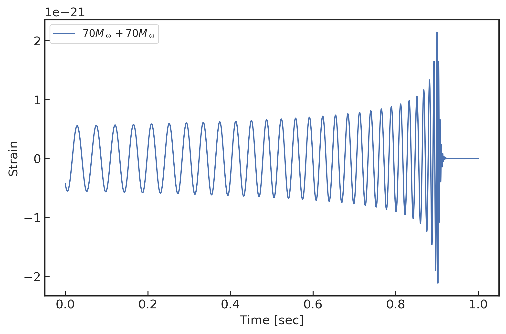{: style="zoom:18%"}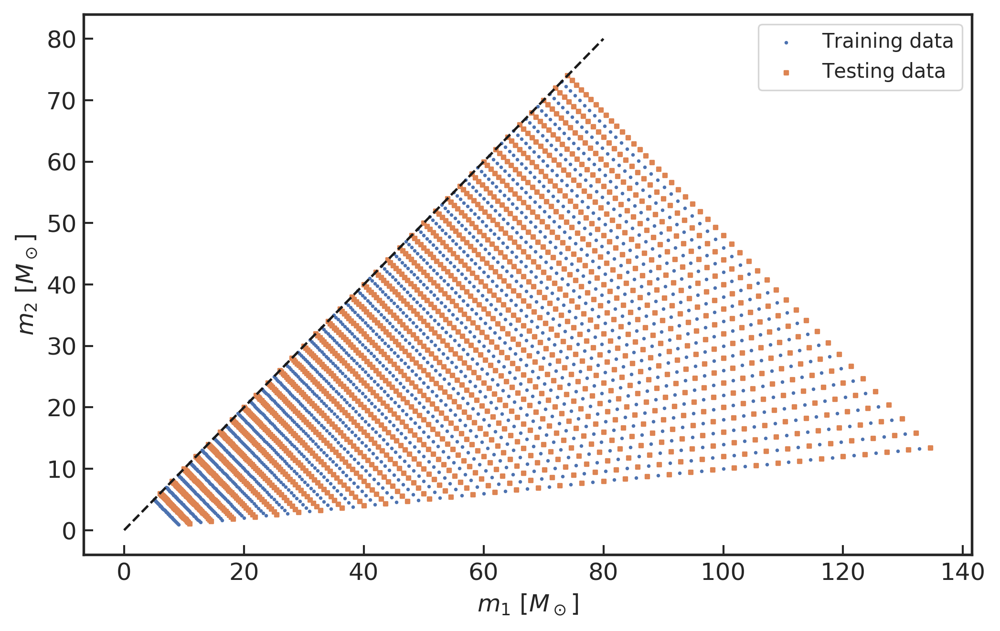{: style="zoom:18%"}

>??? note "上图的源代码 (source code)"
    ??? abstract "左图"
        
    ??? abstract "右图"
        

把每一对质量参数 $m_1,m_2$ 所表征双黑洞系统的引力波波形与模拟的高斯白噪声叠加，经过整理成为有监督标签的数据集。在构造训练数据集的过程中，取双黑洞系统的黑洞总质量 $M=m_1+m_2$ 为 $10M_\odot,12M_\odot, \dots,148M_\odot$；另一个系统参数将根据双黑洞系统的质量比 $q=m_1/m_2$ 从 1 到 10 间隔 0.1 采样，并在 $m_1\ge m_2$ 的要求下取得两个黑洞的质量 $m_1,m_2$，共计产生 $1610$ 个引力波波形模板。类似地，为了构造测试数据集，其黑洞总质量满足 $M=11M_\odot,13M_\odot, \dots,149M_\odot$，也共计产生 1610 个引力波波形。这 3220 个引力波波波形所对应的双黑洞质量参数分布如上方右图所示。然后，我们将会为每一个引力波波形模板乘以一个表征信噪比的因子，并在每一个波形上分别混入模拟高斯白噪声，这样一来就分别得到了 1610 个训练数据和 1610 个测试数据。为了保证训练数据集在训练过程中网络模型可以平衡的学习到样本的标签信息，我们再分别模拟了 1610 和 1610 个不含引力波信号的纯高斯白噪声数据加入到训练集和测试集中。这样一共得到 3220 个训练数据样本和 3220 个测试数据样本。最后，将训练数据中的所有样本的顺序随机打乱。这样就完成并制备好输入到神经网络模型的训练数据集和测试数据集。

>(上图) 模拟白噪声背景下的数据样本 ($70M_\odot+70M_\odot,\,\text{SNR}_\text{amp}=1$)
>(下左图) 在每小批量数据输入模型后的代价函数变化曲线
>(下右图) 模型的引力波识别准确率随着学习过程的演化行为
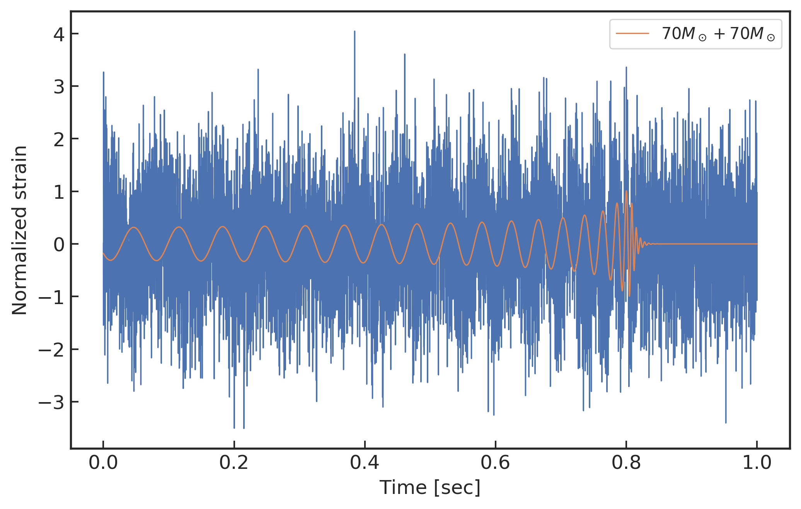{: style="zoom:18%"}
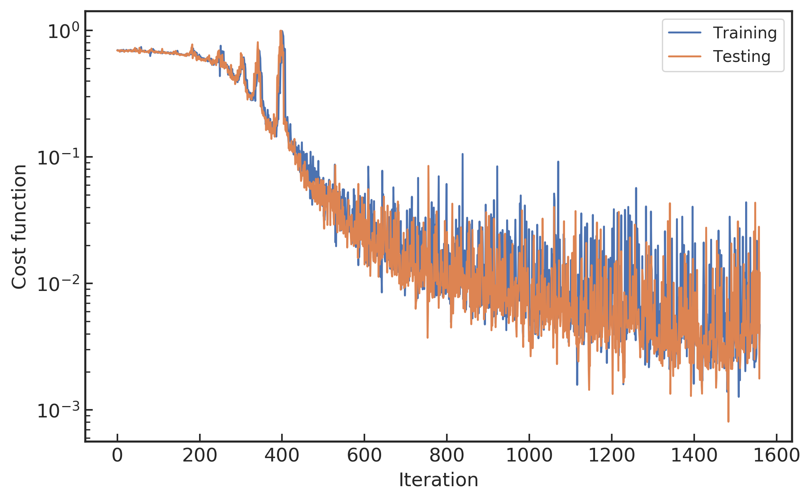{: style="zoom:18%"}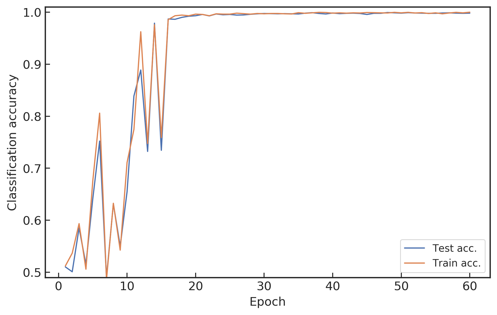{: style="zoom:18%"}

如上方的上图所示就是训练数据集中信噪比 $\text{SNR}_\text{amp}=1$  的样本数据。注意这里信噪比的定义不同于引力波数据处理中匹配滤波信噪比的定义 [@2016RongGengravitationalwavemodels] [@2016ZhouJianNumericalrelativitygravitational] [@2017CaoWaveformmodeleccentric]。本章中所采用的信噪比定义是依据引力波信号 $h$ 的最大振幅强度与背景随机噪声的功率(标准差)之比来衡量，

$$\label{eqn:SNR_amp}
\text{SNR}_\text{amp}=\frac{\max (h)}{\sigma_{\text {noise }}}
$$

其中，$\sigma$ 是高斯背景噪声的标准差。如此定义信噪比不仅很方便做数据预处理，且对于高斯白噪声来说，该信噪比是仅关于引力波信号到达时间处波形幅度的函数。在第[五](C5.md)章中，我们将会对该信噪比的定义与匹配滤波信噪比之间的区别和联系做进一步实验对比和讨论。

在深度学习中，神经网络的训练学习过程就是对大量带标签数据进行有监督学习，通过反向传播算法 (第 [3.3.3](C3.md#333) 节) 学习网络结构中的参数。通常先使用随机高斯分布来初始化网络结构中待学习参数，然后输入数据在已初始化模型参数的卷积神经网络中前向传播，最后会得到一个期望输出。这个期望输出与数据真实类别标签的误差是由代价函数 (第 [3.2.1.1](C3.md#3211) 节) 来描述。在模型迭代的优化过程中，误差会在网络中逐层地反向传播到各层的待学习参数 (第 [3.3.3](C3.md#333) 节)，每层的神经元会根据该误差对网络结构中的参数进行更新，使得模型在每次迭代学习时都使用新的模型权重参数使得误差逐渐收敛到一个极小值。对于本章的卷积神经网络而言，待学习的参数包括卷积核权重参数、全连接层间的连接权重系数以及各层的偏置项等。训练好的模型只需要将所关心数据样本输入模型正向传播一次，就能够计算出输入数据所对应的预测类别，从而完成卷积神经网络的分类识别任务。在本章使用的网络模型中，我们使用小批量的随机梯度下降 (mini-batch SGD) 优化算法，并设置学习率为 0.01。

我们使用开源的 MXNet [@2015ChenMXNetFlexibleEfficient] 深度学习框架中训练卷积神经网络模型，并在 FloydHub 深度学习云 GPU 平台 [^floydhub] 上完成了所有的训练和调参过程。如上方左图所示，在每一次小批量输入数据到模型中学习后，代价函数的输出损失值会向着逐渐减小的方向变化。 上方图的右图中代价函数的震荡波动是由于训练数据是小批量的方式送入网络模型中学习的。如果每次更新学习时都用全部训练样本数据，一次性地交给模型训练，损失值的震荡就会变小，因为每个梯度的更新都是单调地优化整个训练集对应的代价函数 (除非学习率设置得过高) 而不是小批量集所对应的代价函数。所以，跟踪当前模型代价函数的状态可以直观理解不同超参数设置下的效果，进而可以修改模型超参数以获得更高效的学习过程。

[^floydhub]: [https://www.floydhub.com](https://www.floydhub.com)

在训练模型的过程中，对比模型在训练数据集和测试数据集上准确率表现可以知道模型过拟合的程度。把训练数据集小批量的方式送入网络，直到把所有训练数据集送完，称之为一个周期(epoch)。接下来将重复地再把训练数据集小批量的方式送入网络中学习。如上方的下右图所示，横轴对应的每个点衡量了在训练中每个样本数据都被观察过一次后的期望一个周期，这意味着每个样本数据都被观察过了一次。从上方的下右图可知在训练周期达到大约 20 次以后，模型在训练集和测试集上的准确率都逐渐收敛于 90% 以上，说明模型在测试集上表现出不错的内插泛化能力。值得一提的是，初始化的模型参数会对每次训练过程中的收敛表现有很大的影响。虽然目前还没有一个好的方法来直接确定初始参数，但是可以通过迁移学习 (transfer learning)，将更容易收敛的高信噪比信号下训练的分类模型参数迁移到低信噪比的深度学习模型中，作为其模型训练的初始参数。

 

## 4.4 引力波信号识别的泛化能力

 

卷积神经网络所具有的强大泛化能力，体现为神经网络识别训练样本以外的数据样本分布的能力，由此实现引力波探测模板以外的引力波信号。在上一节中，通过有别于训练样本引力波波形的测试样本数据来验证模型的泛化能力。目前，神经网络模型泛化能力的成因还没有在理论上达成一致性的认识，影响网络泛化能力的因素包括模型结构复杂性、样本复杂性、样本质量、初始参数权值和学习时间等诸多方面。

基于数据驱动方法的机器学习模型是可以挖掘真实数据分布背后的潜在信息。显然，训练数据集会直接影响深度学习模型工作的效果。为了进一步研究神经网络模型的泛化能力，我们制备了不同信噪比特征的测试数据集，并且将测试集中的引力波波形模板峰值居中的在 $0.1\sim0.9$ 秒范围内随机排布，以此来考察已训练好网络模型对于不同信噪比和不同到达时间的数据样本的准确率。这里谈到的信噪比指的是由公式 \eqref{eqn:SNR_amp} 所定义的信噪比。我们将会通过改变引力波信号幅度的方式来调整每个数据样本的信噪比。如下方左图所示，在不同训练集信噪比 $(\text{SNR}_\text{train})$ 下训练并收敛后的网络模型在不同程度上都对更高信噪比 $(\text{SNR}_\text{test})$ 的测试数据集上有着很好的泛化识别能力。其中经过训练迁移到很低的信噪比 $\text{SNR}_\text{train} = 0.1$ 的模型明显比其他模型的效果要好。因此，在本章中未特别说明的情况下，模型都将默认选取 $\text{SNR}_\text{train} = 0.1$ 数据上训练好的网络模型进行试验。

>(左图) $D=0.8$ 和 $\text{SNR}_\text{train}=0.1,0.5,0.9,1,2$ 时，度量模型性能在不同 $\text{SNR}_\text{test}$ 下的 AUC 图
>(右图) $D=0,0.2,0.4,0.8$ 和 $\text{SNR}_\text{train}=0.1$ 时，度量模型性能在不同 $\text{SNR}_\text{test}$ 下的 AUC 图
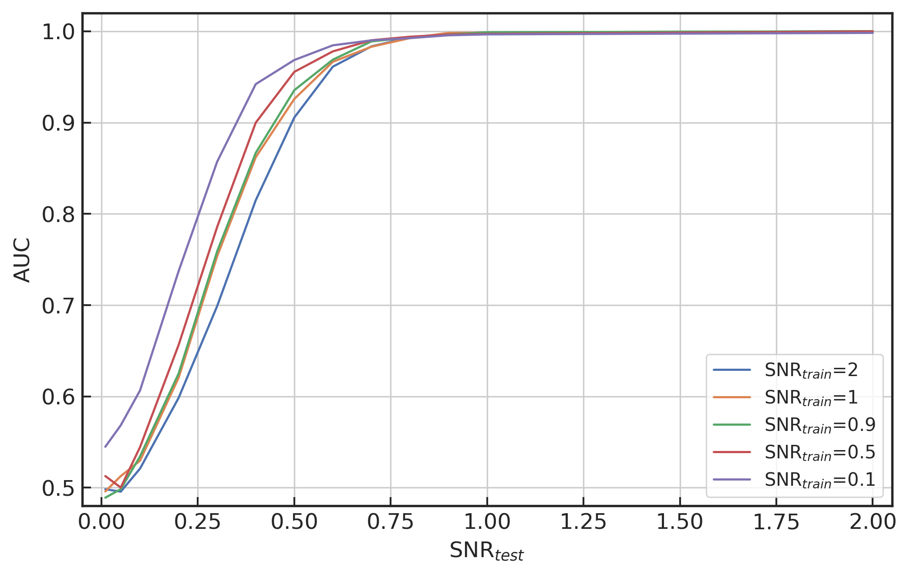{: style="zoom:18%"}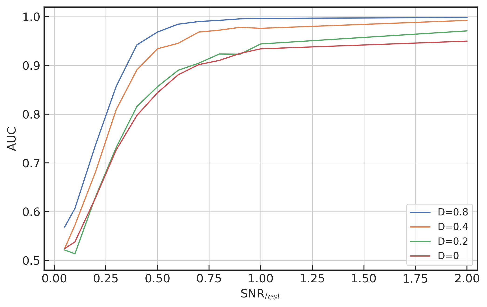{: style="zoom:18%"}

下面，我们要探讨的是训练集合中引力波波形信号的峰值在 1 秒中的均匀分布范围 $D$ 对模型泛化能力的影响。我们分别取训练集合中引力波信号峰值分布范围宽度在 $D=0, 0.2,0.4,0.8$ 秒制备训练数据集，它们分别对应于 $0.8$ 秒，$0.7\sim0.9$ 秒，$0.5\sim0.9$ 秒，$0.1\sim0.9$ 秒的数据样本位置范围内，其中 $D=0.8$ 所对应的 $0.1\sim0.9$ 秒波形峰值随机分布是默认的训练数据集的配置。考虑完全相同的网络模型结构、超参数和优化策略，在训练数据集有着不同的波形峰值分布范围 $D$ 下完成模型的训练并收敛后，在测试数据集上考察其引力波识别的泛化能力，如上方右图所示。可以看到，训练集数据的特征分布在时域上越宽泛，神经网络模型泛化能力会有很大的提升。因此，在本章中未特别说明的情况下，我们都默认训练集中引力波波形峰值分布范围都在 $0.1\sim0.9$ 秒之间随机排布。

>$D=0.8$ 和 $\text{SNR}_\text{train}=0.1$ 时，度量模型性能在不同的自旋参数 $s$ 和 $\text{SNR}_\text{test}$ 下的 ROC 图
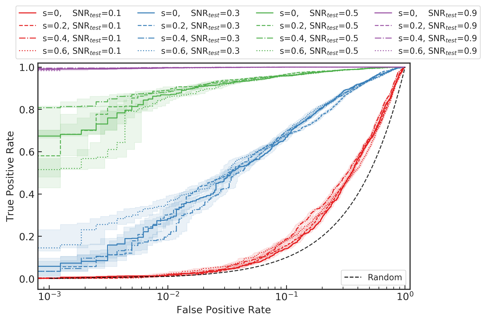{: style="zoom:30%"}

在上述的结果中，我们分别从训练数据集中引力波波形的振幅和相位(分别对应于信噪比和信号到达时间)等不同特点角度考察了神经网络模型对双星系统所产生的引力波波源中参数空间“内插”的泛化能力。为了考察神经网络模型关于引力波波源参数“外插”的泛化能力，我们生成了不同的自旋参数 $s$ 所对应的双星系统波源所产生的引力波波形，并以此根据不同信噪比来制备测试数据集，从而可以检验网络模型是否可以识别到训练集样本所对应的分布之外的引力波信号。如上方图像所示，引力波波源参数中自旋参数分别取 $s = 0,0.2,0.4,0.6$ 在不同信噪比下的引力波测试集上的 ROC 图像。可以看到，神经网络模型即使在极低信噪比环境中在波源参数空间的外插泛化上都有着很不错的性能表现。

在目前的引力波数据处理研究中，还很少有研究者应用深度学习技术对引力波信号的外插识别能力进行尝试与讨论。在本论文中，我们着重关注神经网络模型在波源参数空间外插的泛化性能作为主要研究对象。

 

## 4.5 引力波信号特征的可视化表示

 

匹配滤波方法识别强噪声下的弱引力波信号靠的是寻找数据中与理论模板一致的部分数据特征。如果想在没有理论模板的情况下也辨别出弱信号来，那么就需要数据处理方法能分辨噪声部分数据与信号数据部分不同的特征。针对这个问题，理解神经网络对数据特征的分辨能力是有趣和重要的问题。

在卷积神经网络中，特征的提取和分类识别都是自动学习的。深度神经网络工作原理的可解释性问题至今仍未解决 [@2017VidalMathematicsDeepLearning]。对卷积神经网络的可解释性研究 [@2017BauNetworkDissectionQuantifying] 不仅会对神经网络效率的保证，以及模型性能的提升是有必要的，也可以对训练数据中与标签相关的潜在特征有更加深入的理解。

可视化是最常用也是最直接的一种理解卷积神经网络的手段。例如在计算机视觉领域中，第一卷积层的权重可视化是很有帮助的，从中可以查看权重特征图像是否清晰平滑等来分析网络是否已经收敛。然而，在卷积网络模型中，首层的权重参数都是单通道长度为 16 的一维序列数据，所以很难从中分析出有参考价值的信息。

在卷积神经网络里，中间卷积层特征图的可视化有助于更好地理解深度网络内部机理，进一步了解一个训练好的神经网络究竟在各个卷积层中学习到了怎样的特征。此外，特征图的讨论会对原始数据有更好的理解。Zeiler 等人提出了联系特征图与原图像之间关系的可视化方法 [@2013ZeilerVisualizingUnderstandingConvolutional]。由于数据在卷积神经网络前向传播的过程中会保持数据的空间结构，即每层的特征图与原始时序信号数据具有在空间上的对应关系，其中具体对应的位置及大小可以通过卷积计算层的感受野来度量，而神经网络每次迭代更新是通过后向传播来训练的。所以，关于特征图的可视化可以总结为有两种途径：

1. 正向可视化方法。

    前向计算，即直接把每一层的特征图显示出来 [@2013ZeilerVisualizingUnderstandingConvolutional]。每个特征图都对应隐藏层上的一个有序节点，对应于原时序信号数据中的某一位置处激活了该节点特征。随着网络深度的增加，特征图会变得越来越稀疏，这相当于是对原数据降噪和深度提取。但是经过逐层卷积计算和池化后，特征图会越来越抽象，其维度也会逐渐降低。这将会导致很难从中理解相应特征图在对应的节点处从原始数据中学习到了怎样的特征。但尽管如此，激活后最显著的特征图通常与样本的识别特征是强相关的。

2. 逆向可视化方法。
    
    根据神经网络的最后一层中最显著的激活特征图进行反向计算，再利用卷积层的感受野得到原始输入数据中的对应区域，由此得到输入数据的某深层特征图在时域上的特征可视化图像，从中可以进一步看出输入时序信号数据的哪些特征区域激活了神经网络，从而理解该特征图从原数据中学习了何种特征。在图像识别领域中，该种途径可以对图像做物体定位和目标检测等 [@2015RenFasterRCNN] [@2016DaiRFCNObject] [@2016LiuSSDSingleShot]。

### 4.5.1 正向可视化方法

与传统的特征可视化相区别的是，待训练的低信噪比时序信号数据是通过模拟生成的，如上上上方的上图所示。用理论模型 SEOBNR [@2017CaoWaveformmodeleccentric] [@2019PanAccuracysourcelocalization] 生成的纯引力波特征信号作为训练数据中的完备特征信息作为指导，通过对比纯白噪声背景数据以及引力波信号 ($70M_\odot+70M_\odot$) 与噪声的混合模拟时序数据 (信噪比 $\text{SNR}_\text{amp}=1$ )，分别观察卷积神经网络是如何经过特征提取给出正确的分类，同时查看它们在各个隐藏层下的特征图表现。

将纯引力波信号、纯白噪声以及将其二者混合后的时序数据作为对照样本，送入已训练好的卷积神经网络中，可以得到 3 个卷积层的特征图，把它们排布成以横轴为神经元编号，纵轴为神经元的输出结果的格式。第一卷积层的特征图对比如下方图像所示。第二卷积层的特征图对比如下下方图像所示。第三卷积层的特征图对比如下下下方图像所示。

>输入引力波信号(上)、噪声(中)及其相互叠加数据(下)在卷积神经网络第一层的 16 个特征图
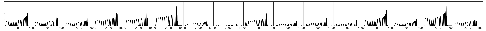{: style="zoom:50%"}
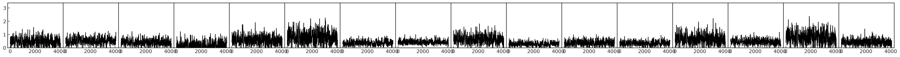{: style="zoom:50%"}
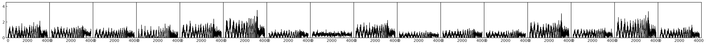{: style="zoom:50%"}

第一卷积层的特征图是直接从原始的时域数据样本中映射而来。从纯引力波信号的特征图（上方上图）中可以明显发现波形特征是非常规律且平滑的，空间方向上的特点与原引力波波形特点接近。但是，通过观察低信噪比(信噪比大约为 1) 的混合数据可见噪声的影响对特征图（上方下图）的影响非常大，与纯噪声情况的特征图（上方中图）相比几乎看不出差别，很难从第一卷积层的特征图（上方下图）中区分出是否含有引力波。

>输入引力波信号(上)、噪声(中)及其相互叠加数据(下)在卷积神经网络第二层的 32 个特征图
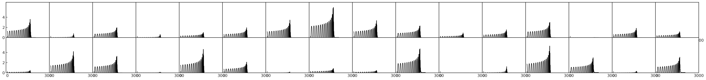{: style="zoom:50%"}
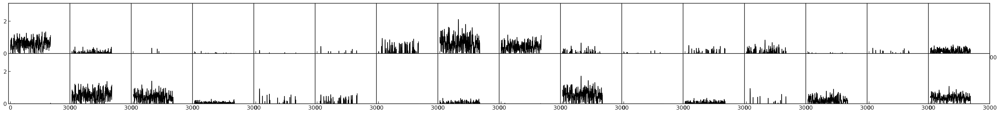{: style="zoom:50%"}
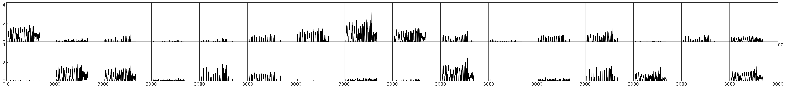{: style="zoom:50%"}

随着网络深度的递增，每层特征图的表达越来越抽象，各层经过激活的特征图表现也越来越稀疏，差异也越来越大。虽然低信噪比数据的特征使得混合数据的特征图表达非常不平滑，但是通过对比纯引力波信号、纯噪声数据和混合数据对应的特征图可知：在较深的卷积层中，部分特征图可以用来区分输入数据是否包含有引力波信号，比如在第三层的 64 个特征图中，第 4 行左起第 8 个特征图在有引力波信号情况下 (如下方下图所示) 激活强度比较强，但是在纯噪声情况下 (如下方中图所示) 表现较弱。在全连接神经网络的感知层之前，将第三卷积层的 64 个特征图全部平展开作为分类器的输入数据，根据这些特征图的差异得出输入数据中是否含有引力波信号的判断。

>输入引力波信号(上)、噪声(中)及其相互叠加数据(下)在卷积神经网络第三层的 64 个特征图
{: style="zoom:50%"}
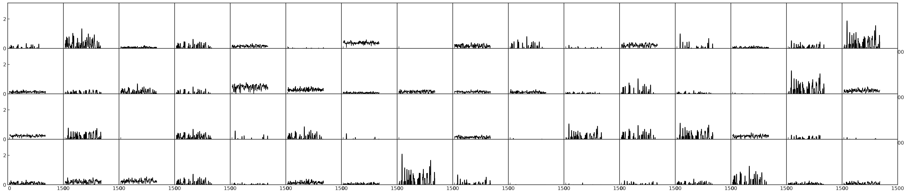{: style="zoom:50%"}
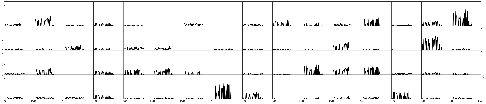{: style="zoom:50%"}

在卷积神经网络模型中，训练好的全连接层会根据输入的特征数据信息，给出分类预测的得分，可见下表。在最后，该得分会经过 Softmax 激活函数处理为具有一定“概率”意义的结果。可以看到，神经网络对纯引力波特征信号的分类给出了最肯定的得分，分差超过 30。判断纯噪声数据中不含有引力波信息也非常的肯定 (Softmax函数的概率超过 96% 认为其中不存在引力波)。含引力波信息的混合模拟信号输入卷积神经网络模型后，对错误分类类别直接给出了很低的负分得分判断，最终模型预测此低信噪比的时序信号中有 99.9% 的概率存在引力波。

>纯引力波、纯噪声以及混合数据输入下，神经网络最终给出的得分和 Softmax 概率

|          	|      	| 存在引力波   	|       	| 不存在引力波 	|
|:--------:	|:----:	|--------------	|:-----:	|--------------	|
|          	| 得分 	| Softmax 概率 	|  得分 	| Softmax 概率 	|
| 纯引力波 	|  20  	|       1      	|  -15  	|       0      	|
|  纯噪声  	| 1.58 	|     0.04     	| -1.58 	|     0.96     	|
| 混合数据 	| 5.64 	|    0.9999    	| -4.31 	|    0.0001    	|

卷积神经网络是逐层地实现特征提取的。可以通过 TSNE [@2008MaatenVisualizingdatausing] [@2016WattenbergHowUset] 非线性降维可视化技术，对上述不同混合噪声的引力波数据和纯噪声数据中每一层的输出特征图，降维到二维进行可视化，如下图所示。我们可以从高维的抽象特征图降维后，通过对比不同标签的数据样本的特征分布，明显地看到卷积神经网络是如何逐步递进地实现特征的提取和线性分类的过程。

>分别对第一卷积层 (左1)、第二卷积层 (左2)、第三卷积层 (右1) 以及全连接隐藏层 (右2) 所输出的特征图，通过 TSNE 降维可视化所得到的特征分布图像
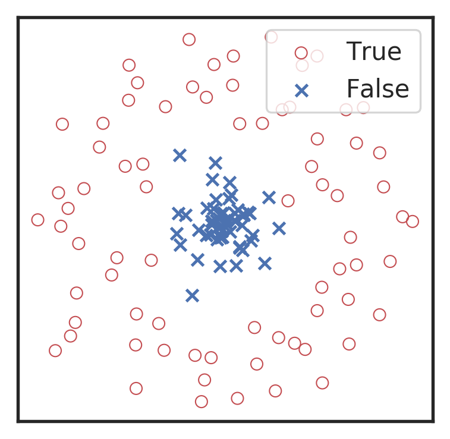{: style="zoom:25%"}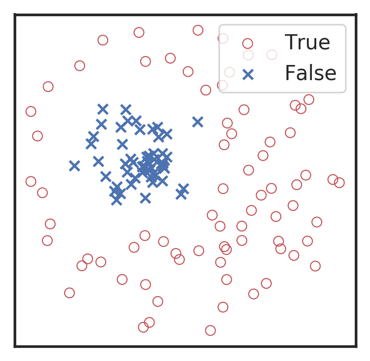{: style="zoom:25%"}{: style="zoom:25%"}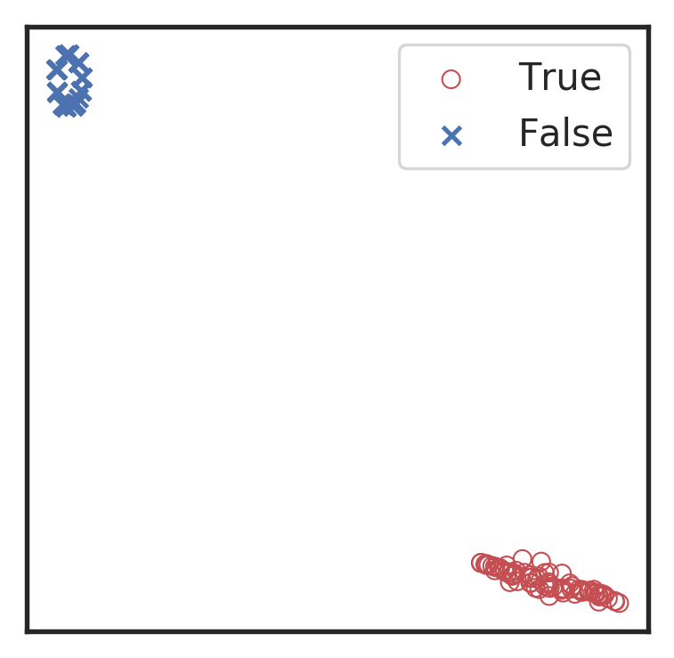{: style="zoom:25%"}

### 4.5.2 逆向可视化方法

>转置卷积网络结构的时域滤波器示意图
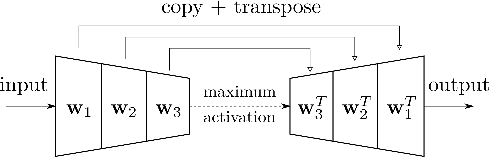{: style="zoom:20%"}

在神经网络的可视化研究中，除了直接观察各个卷积隐藏层的特征图外，还可以对激活最显著的节点特征进行“反向”传播。通过对池化和卷积运算中的矩阵参数进行迁移和矩阵转置，就可以将相应激活最显著的特征图映射到与输入数据相同的时域空间中，如上图所示。由此建立的引力波数据时域滤波器，通过对比输入到输出数据之间的差别，可以帮助我们理解卷积神经网络究竟是根据哪些显著特征给出分类判断。对第三层最显著特征节点 (对应上方上图中第 4 行左起第 8 个特征图) 进行了转置卷积操作映射回到时域上后，结果如下图所示。图中蓝色曲线表示的是最显著节点特征在时域上的可视化结果，红色曲线绘制的是对应的输入引力波数据，从上到下分别对应输入数据是纯引力波、纯噪声和混合数据的情况。从下图中可以看到，在不同的数据样本下，该特征节点反向可视化上的表现差异很大。在纯引力波输入情况下，该特征节点可以准确地记录引力波的特征信息，二者在时间坐标上表现出了相同的波形震荡周期规律。在纯噪声和混合数据情况下，反向可视化的结果会受到噪声的影响。尤为有趣的是最下图的混合数据的可视化图像，基于最显著特征图映射的时域滤波器可以表现出良好的降噪效果。

>经由最显著特征节点映射的时域滤波器，关于纯引力波信号(上)、纯噪声信号(中)以及混合数据后(下)的输入和输出可视化图像
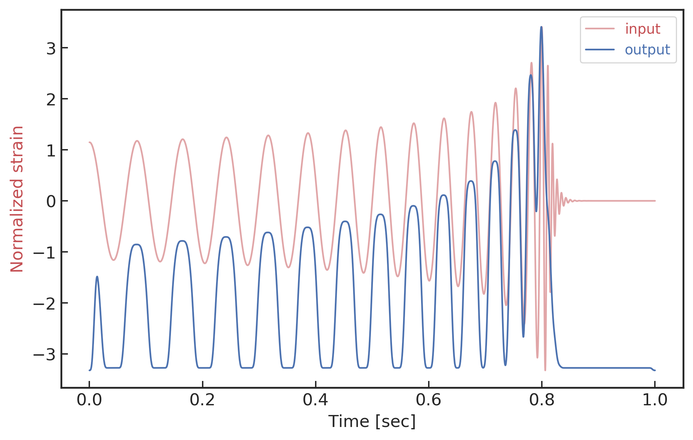{: style="zoom:20%"}
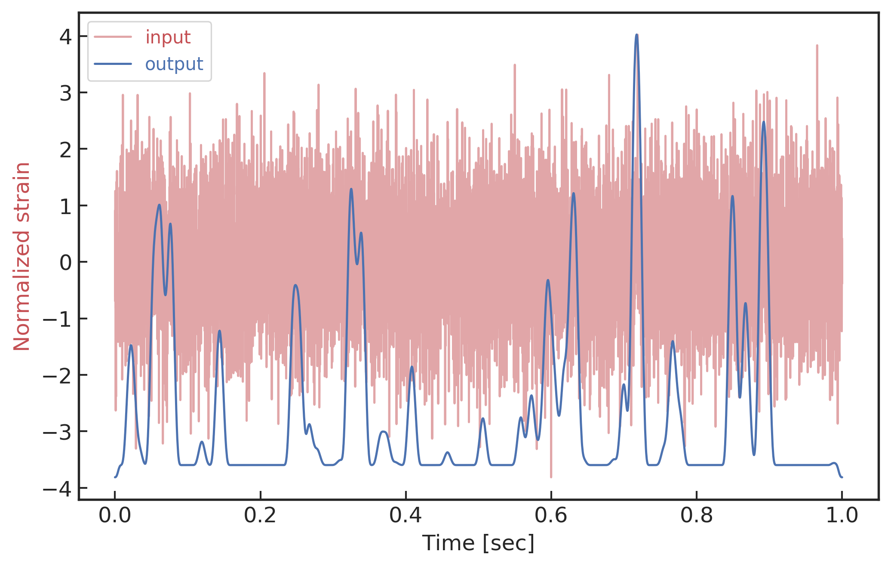{: style="zoom:20%"}
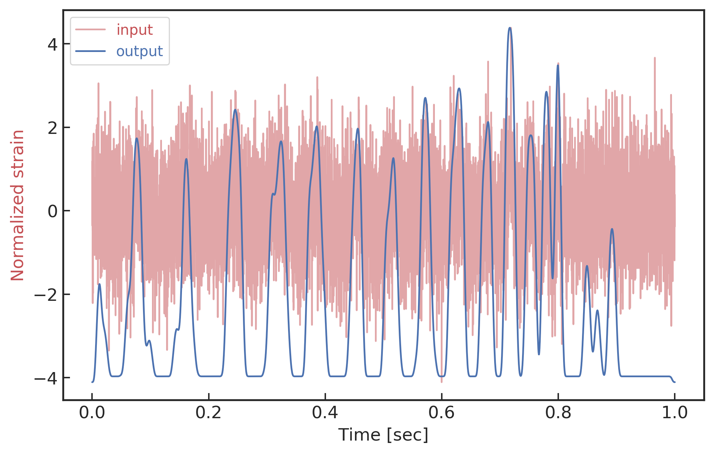{: style="zoom:20%"}

 

## 4.6 引力波波形特征的灵敏度分析

 

面对输入的数据，一个有趣的问题是卷积神经网络是主要根据数据样本中的哪一部分数据实现的分类判断呢？在考虑的引力波波形中，是旋进部分重要、还是双黑洞并合和铃震的部分重要？面对引力波数据流时，有限的输入数据窗口在引力波波形上的不同位置会对模型预测有着怎样的影响？

>$25M_\odot+25M_\odot$，$\text{SNR}_\text{amp}=1$ 数据样例的遮罩实验结果
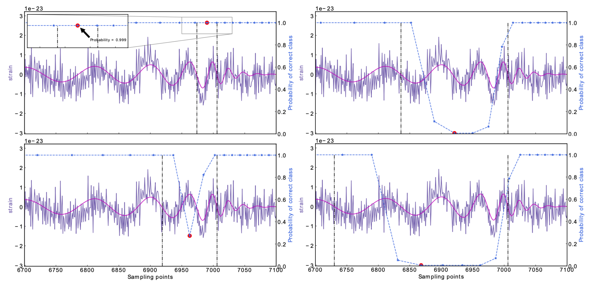{: style="zoom:50%"}

我们可以通过对数据样本中引力波信号部分的遮罩 (occlusion) [@2013ZeilerVisualizingUnderstandingConvolutional] 来考察这个问题。数据样本中被遮罩的纯引力波信号部分将会用一个值都为 0 的零窗函数来作用，并在整个时间窗口范围内的不同位置处作用，以此来考察在时域上不同位置处引力波波形被遮罩后的卷积神经网络对测试数据样本的分类能力。零窗函数的遮罩位置和窗口大小将根据引力波信号样本的波形周期特点来确定。如上方图像所示，对应的左上、左下、右上和右下这四个子图分别是根据引力波波形的 1、2、3 和 4 个波动周期在时域上的不同位置处进行截取和遮罩，同时将每个遮罩后模型给出的预测结果标记在被遮罩窗口范围 (黑色虚线为例) 的中点位置处 (红色点为例)。我们将混在噪声中的引力波波形 (图中紫色波形曲线) 峰值都固定在第 7000 个采样点处 ($0.85$ 秒处)，通过在数据样本上的不同位置处进行遮罩实验并给出预测概率结果 (图中蓝色虚线点)，我们发现遮罩区域在时域上不同位置处的大小越小，模型预测结果会表现趋于平滑，对模型决策的影响也越小。同时对于上方图中的波形样本来说，覆盖 4 个波形周期的遮罩处于第 $6800\sim7050$ 采样点处 ($0.83\sim0.86$ 秒处) 时，模型对混合数据的决策结果会表现出明显误判结果。这说明被遮罩的部分数据的特征对模型的分辨识别能力影响最强，而该被遮罩的部分正对应于引力波双黑洞旋进后期至并合部分的特征波形。

值得留意的是，由于不同波源参数的引力波波形差异较大，上述时域上的遮罩实验很难对数据集中所有波形样本给出一般统计意义的结果。事实上，上图中样例所示的波形特征灵敏度测试可以在一定程度上看作是基于时频域的遮罩实验，所以这种时频遮罩可以在一定程度上对应到引力波的波形特征就不难理解了。可见，神经网络对引力波信号识别的这个特点有一个潜在的用处。在未来的引力波探测实验中，随着探测精度的提高，很可能一段数据中包含着不止一个引力波信号。我们可以用这种遮罩的方式来判断信号的个数。如果随着遮罩的移动判断概率没什么变化，那说明数据中一定包含着不止一个引力波信号；反之则说明只有一个信号。

在实际的引力波数据处理流水线中，算法模型所面对的是连续的数据流。所以基于固定窗口输入数据的模型算法在引力波信号搜寻的过程中，都会采用有重叠的数据扫描方式，并且期待引力波并合的波形特征可以很好的被扫描到。一个有趣的问题是：引力波仅处在旋进状态下的波形特征是否可以对模型的预测结果造成影响。这亦是在考验神经网络的泛化能力，因为我们训练模型时的引力波波形峰值是在 1 秒窗口内的 $0.1\sim0.9$ 秒之间随机分布的。

>测试集上不同位置处的模型预测结果的箱型分布图
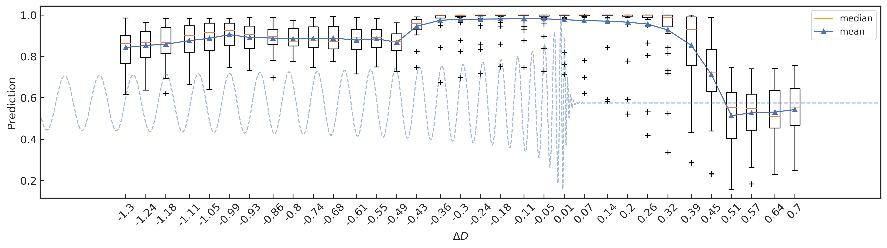{: style="zoom:50%"}

我们将所有 1610 个测试引力波波形延拓为 3 秒时长，并且波形的峰值都固定在 1.8 秒处 (以图中蓝色虚线波形所示为例)。分别随机的与 $\text{SNR}_\text{amp}=1$ 的噪声混合后，以 $1/16$ 秒为间隔滑动宽度为 1 秒的数据窗口作为网络模型的输入，共计有 33 个不同位置的滑动输入窗口。与上述的遮罩实验类似，每一次模型预测的结果都会标记在该输入数据窗口的中间位置处，并定义该位置与波形的峰值的距离为 $\Delta D$ (如最左侧起始滑动窗口中点到波形峰值的距离为 $-1.8+0.5=-1.3$ 秒)。最后可以分别对 33 个不同位置输入数据窗口处绘制关于 1610 种引力波波形样本预测结果的箱型分布，如上图所示。通过对比 $\Delta D <-0.49$ 与 $\Delta D>0.51$ 两部分中各个模型预测分布的均值 (蓝色三角点) 可以看到，网络模型的预测结果对于仅旋进部分的波形与纯噪声相比是有着很明显的影响。这意味着对于仅可观测到旋进部分的 GW170817 引力波事件而言，通过神经网络模型发现其波形信号是有可能的，而且对识别长时的连续引力波 (continues GWs) 信号来说也是很有意义的。此外，考虑到中位数 (橙色实线) 对异常值具有很好的鲁棒性，我们可以留意到 $\Delta D\in (-0.4, 0.4)$ 范围内的模型预测结果，半数以上的绝大部分波形样本都有着很高的预测结果。这亦不难理解，因为训练集中波形峰值的分布范围在 $D=0.8$ 秒内随机分布的。最后值得一提的是，图中的几乎所有的预测异常值 (黑色加号) 都对应于波源参数的总质量小于 $20M_\odot$ 的引力波波形样本。

必须要承认的是，上述的实验背景都是在理想的稳态且高斯模拟噪声下模型预测结果的灵敏度实验。在考虑更加复杂和真实的噪声环境下，神经网络模型的预测结果会因各类环境因素而产生干扰和差异。所以，本文中所得出的实验结果可以看做是理想环境下，神经网络模型对引力波波形特征的最佳灵敏度响应。更为贴近真实背景噪声下神经网络模型对引力波信号的识别和搜寻，将会在第[五](C5.md)章和第[六](C6.md)章详细介绍。

 

## 4.7 总结与结论

 

引力波的成功探测不但完成了广义相对论实验检验的最后一块拼图，而且还打开了引力波天文学这扇观测天体和宇宙的全新窗户 [@2017Caigravitationalwavephysics]。同时它还将可能改变引力物理学研究的格局。在引力波实验以前，由于其他的引力实验只能涉及较为弱引力场和低速的物理情形，以后牛顿参数衡量，相应参数小于甚至更小。而引力波探测对应的引力波源相应的参数在 1 的量级，是典型的强引力场强动态时空区域。引力物理学研究探讨的是广义相对论适用边界何在，失效后应该变成什么理论的问题。量子引力是该研究领域中典型的科学问题。在引力波探测之前，由于没有实验可供参考，人们只能利用理论推理的方式工作。随着引力波探测数据的增多，人们有可能会像对待别的物理问题一样，由实验结果指引人们思考问题的方向。可以想象，那样的话引力物理的研究方式将被极大地改变 [@2016CaoGravitationalwaveastronomy]。 

在目前的引力波数据处理中，匹配滤波方法占据了绝对的位置。不论是引力波信号的辨认还是波源参数的反演，都离不开匹配滤波方法。而匹配滤波方法工作的前提是准确完备的理论模板。粗略地说，这样的情况使得引力波探测只能测到完全在理论预言范围内的引力波。这限制了利用引力波探测发现完全未知事物的能力和可能性。

近年来深度学习数据处理方法得到极大发展，在数据处理的高效性和高迁移性方面表现突出。深度学习数据处理方法的高效性有希望进一步提高引力波的探测能力，把传统匹配滤波方法辨认不出的或者置信度不够的引力波信号识别出来。其高迁移性有可能让人们使用广义相对论构造的理论模板训练的神经网络发现超越广义相对论理论描述的引力波信号。这样引力波探测将实实在在地把引力物理变成实验主导的学科。

目前，深度学习方法在引力波数据处理中的应用研究目前还很少，更谈不上系统研究。本章作为这个问题的尝试性探索，引入了这个问题，并且在相关的网络结构、训练数据制备、训练优化、对信号识别的泛化能力、对数据的特征图表示以及对特征数据遮罩的响应等方面给出了细致讨论。我们不仅发现以卷积神经网络为代表的深度学习模型，确实在运算速度和信号识别能力上表现优秀，还发现基于数据驱动的算法模型在引力波波源参数的外插泛化上有着独特的优越性能。随后我们通过不同的可视化方法，对神经网络结构的细节做了一系列验证和实验，对部分网络结构的可解释性做了讨论。最后，我们着重关注了引力波波形特征对引力波信号识别灵敏度的影响。我们不仅发现在深度神经网络模型中引力波波形的不同特征对信号识别效果有很不同的影响，尤其是旋进后期与并合阶段的特征波形。此外，我们也对更现实的引力波数据流做了测试实验，发现对于较大的总质量引力波波形在旋进阶段就可以很好的被算法所识别。并且，我们发现训练集中的波形样本在时域上的分布，对滑动窗口预测引力波位置有着显著的影响。这些研究成果为构建深度学习系统、探索模型设计的策略和数据集的制备等提供了重要的参考依据。

\bibliography

