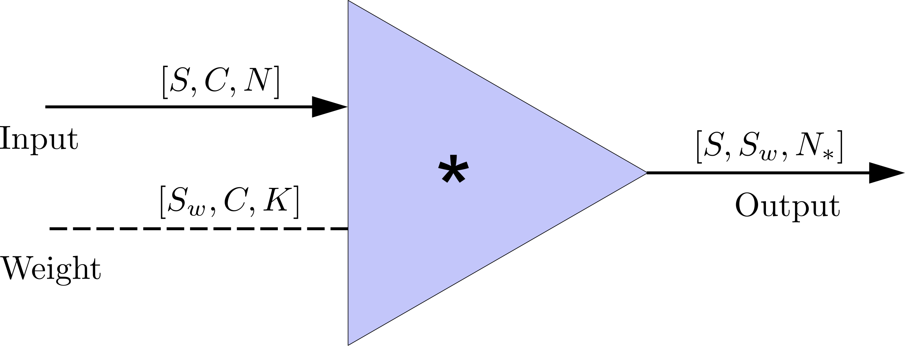
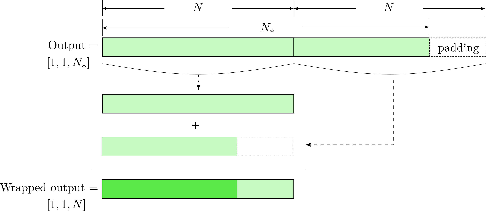
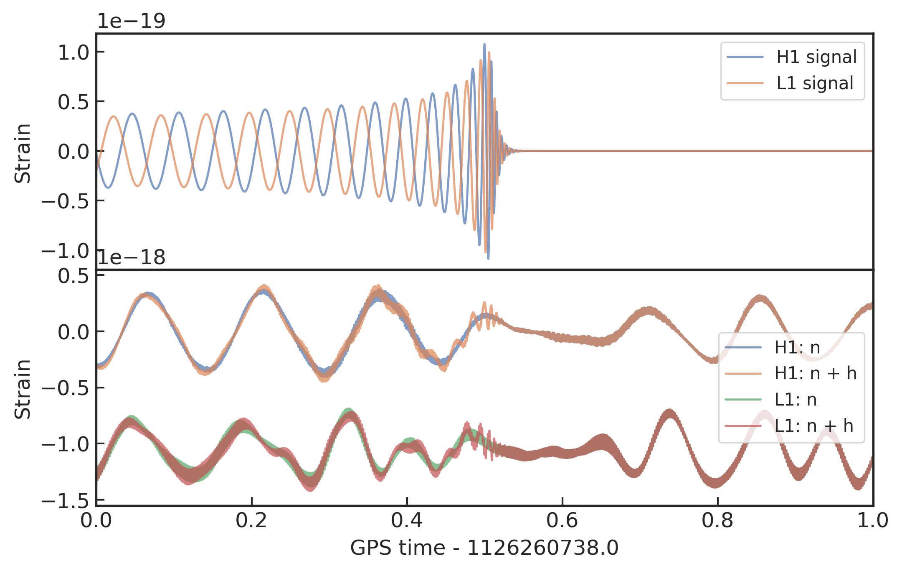
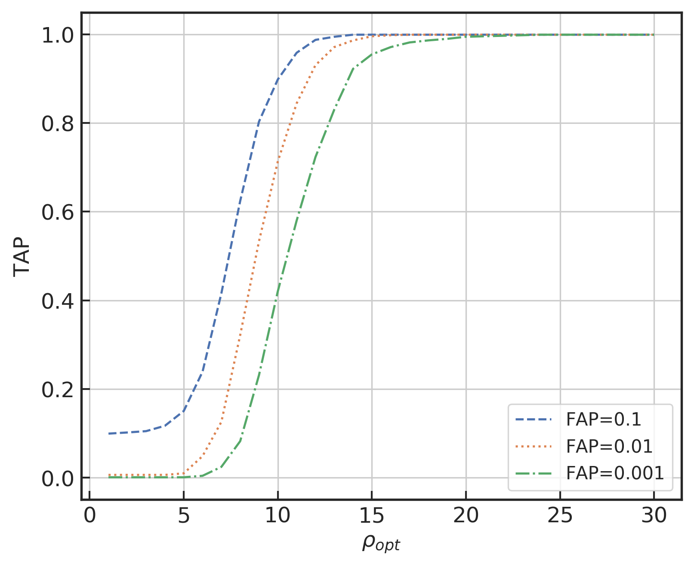
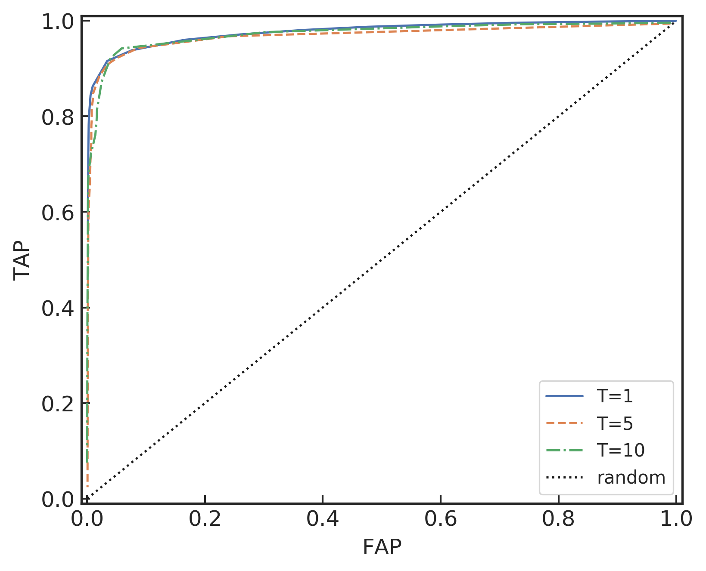
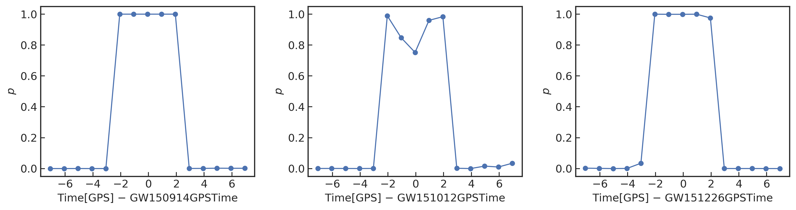
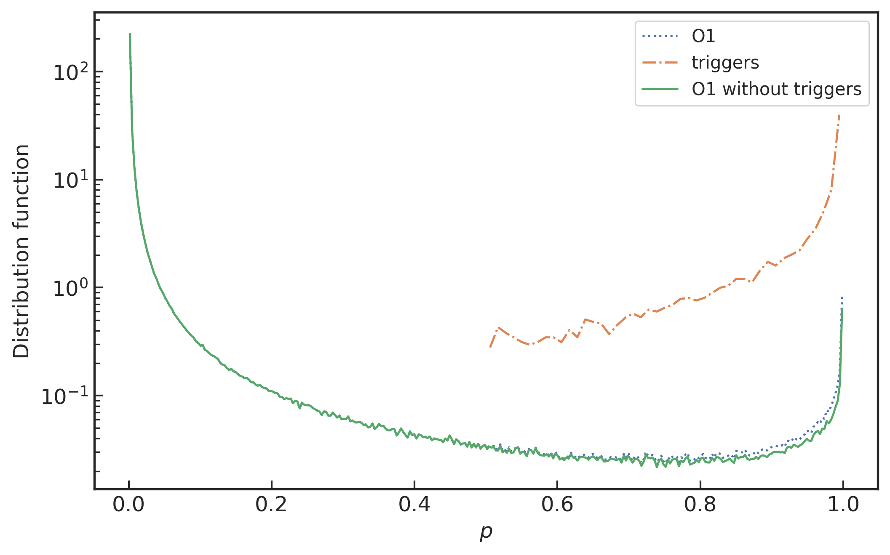

 

[TOC]

 

---

# 第六章 匹配滤波-卷积神经网络(MF-CNN)模型的应用研究

 

## 6.1 引言

 

第一个双黑洞 (black holes, BHs) 并合系统产生的引力波 (gravitational waves, GWs) 探测事件 (GW150914) 由 aLIGO (advanced Laser Interferometer Gravitational-wave Observatory) 组织 [@2015AasiAdvancedLIGO] 所发现并确认，这为整个物理学和天文学界带来了巨大的变革 [@2016AbbottObservationGravitationalWaves]，并于 2017 年获得了诺贝尔物理学奖。此后，硕果累累的重大引力波发现 [@2016AbbottGW151226ObservationGravitational] [@2017AbbottGW170104Observation50] [@2017AbbottGW170814ThreeDetector] 为实验物理、理论物理、计算机科学和工程学等诸多领域的交叉研究与科学合作带来了契机，也带动了数值相对论模拟中高性能计算 (high-performance computing, HPC) [@1915EinsteinFieldEquationsGravitation] [@2016AbbottDirectlycomparingGW150914] [@2016UsmanPyCBCsearchgravitational] 的爆发以及高吞吐量的数据分析基础设施的发展 [@2017HuertaBOSSLDGNovel] [@2017WeitzelDataAccessLIGO]。

匹配滤波技术 [@1999OwenMatchedfilteringgravitational]，作为 aLIGO 低延迟引力波探测方法中最灵敏的算法，目前是只针对 4D 的波源参数空间(自旋校准分量的准圆轨道致密双星系统) [@2013GerosaResonantplanelocking] [@2016RodriguezBinaryBlackHole] [@2015RodriguezBinaryBlackHole] [@2019HuertaEnablingrealtime] 上搜寻信号 $(m_1,m_2,s^z_1,s^z_2)$，这仅是 GW 探测器的 9D 模板参数空间 $(m_1,m_2,\vec{s}_1,\vec{s}_2,e)$ 的子集 [@2016AntoniniBlackholemergers] [@2013NaozResonantPostNewtonian] [@2014SamsingFormationEccentricCompact] [@2017HuertaCompletewaveformmodel] [@2014LehnerNumericalRelativityAstrophysics]。近年来，有研究表明对致密的恒星双星系统来说，基于这样的模板库搜寻方法是不充分的，会遗漏引力波信号 [@2016KlimenkoMethoddetectionreconstruction] [@2017HuertaCompletewaveformmodel] [@2014HuertaAccurateefficientwaveforms] [@2013HuertaEffecteccentricitybinary]。所以，将模板依赖的引力波搜寻算法推广到任意自旋过程的准圆轨道或带偏心率的 BBHs 模板 是有必要的，然而这在计算开销上却是令人望而却步的 [@2016HarrySearchingGravitationalWaves]。

基于上述的考虑，我们需要一个全新的范式来解决当前引力波探测算法的局限性和计算开销的挑战。一个理想的候选方案就是现在发展快速的深度学习技术。该技术是一个高扩展性的机器学习算法，可以直接从原始数据中学习，并无需做任何人工的特征工程，通过深度层状的“人工神经元”构造神经网络，依靠反向传播和梯度下降等优化算法实现网络模型的学习 [@2015LeCunDeeplearning] [@2016GoodfellowDeepLearning]。特别是近年来，在 GPUs 等硬件的进步和大数据技术基础上，深度学习已经在诸多商业应用和人工智能 (AI) [@2015LeCunDeeplearning] [@2015SchmidhuberDeeplearningneural] [@2017EstevaDermatologistlevelclassification] [@2017SilverMasteringgameGo] [@2017MoravvcikDeepStackExpertlevel] [@2016OordWaveNetGenerativeModel] [@2016OSheaConvolutionalRadioModulation] 研究领域中取得了巨大的成功，并已经在天体物理学领域 [@2017HezavehFastAutomatedAnalysis] [@2018HinnersMachineLearningTechniques] [@2017SedaghatEffectiveImageDifferencing] [@2017PearsonSearchingExoplanetsUsing] [@2017CaronAnalyzingγrays] [@2018GeorgeClassificationunsupervisedclustering] [@2016ZevinGravitySpyIntegrating] [@2017BahaadiniDeepMultiview] 内得以应用。

最初，将卷积神经网络用来处理时序序列数据的灵感，可以追溯到深度学习起步的早期阶段 [@1995LeCunConvolutionalnetworksimages]。自此之后，整个机器学习社区就开始建立了以卷积神经网络为代表的一系列工作，当中数据来源不仅有语音信号 [@2018CuocoWaveletBasedClassification]，也有时频能谱图 [@2018RazzanoImagebaseddeep] 作为数据表征。可见，由引力波观测所获得的时序数据与它们在原理和数据结构上非常相似的。卷积神经网络尤其在分类或回归任务中表现尤为优异，它们都是将数据的特征空间 $\mathbb{R}^d$ (比如说分辨率有限的图像或一段有限的语音片段)映射到一组有限的标签集合 (分类问题) 或者是一个低维实数向量 (回归问题)，由此达到提取特征信息和压缩特征空间维数的效果。

在早先的研究中，将卷积神经网络应用在引力波信号搜寻上的工作都是一个分类学习问题。George 和 Huerta [@2018GeorgeDeepNeuralNetworks] 通过模拟 1 秒时长的高斯噪声与一部分描述双黑洞并合系统的引力波信号模板进行混合，如此生成数据集的过程和 PyCBC [@2020NitzgwastropycbcPyCBCRelease] 流水线很类似。在数据集中，对应了并合时间 (coalescence time) 的引力波信号峰值是随机排布在后 0.2 秒时长的范围内。基于该数据集，他们训练了深度神经网络模型，模型输出数据是 0 或 1 来分别表示某 1 秒时长的时序样本中是否含有引力波信号。该模型是需要一个阈值 (threshold) 来把控最终的二分类决策结果。此外，他们还训练了第二个神经网络，用以确定对应的双星系统的一些基本的波源参数。可见，卷积神经网络对于在高斯背景噪声中探测某种非高斯特征是很有效的，这些非高斯性就对应于输入数据中特定的片段中，并且有着比传统机器学习方法优异的表现。

随后，他们也将卷积神经网络方法应用在了真实的 LIGO 数据中，所用到的引力波波源的参数也更加复杂和丰富，比如带有自旋和偏心率不为零的双黑洞系统 [@2018GeorgeDeepNeuralNetworks] [@2018GeorgeDeepLearningReal]。对于时长比较长的数据样本，都会通过滑动切片(sliding-window)的方式将数据切成有重叠的 1 秒时长的时序样本，用以方便输入到神经网络模型中。对于多探测通道的引力波数据来说，会先分别单独切片处理，然后再根据对应的 GPS 时间贴合在一起。尤为重要的是，作者认为他们的引力波探测和参数估计模型与匹配滤波技术相比，在相同的探测灵敏度下，无论是在错误率还是在计算效率上都更胜一筹 [@2018GeorgeDeepLearningReal]。我们将会在本章中解释这个结果，这对我们理解基于卷积神经的模型的性能度量是很重要的。

Gabbard 等研究者 [@2018GabbardMatchingMatchedFiltering] 用了一种很类似的方式：同样是包含有卷积层和全连接层的深度神经网络来解决一个二分类学习问题，数据是在对高斯噪声背景下切分为 1 秒时长的模拟引力波信号。然而，他们的研究核心是与匹配滤波技术的对比。他们得出结论其所构造的网络模型与同样在 1 秒时长的样本数据上通过匹配滤波方法搜寻引力波信号的性能灵敏度是可比拟的。在本文的第[五](C5.md)章，我们对比了上述研究者 [@2018GeorgeDeepLearningReal] [@2018GabbardMatchingMatchedFiltering] 所构造的算法模型和泛化性能，并提出了结构更简单且性能更加优异的神经网络模型。

另外，范锡龙老师等研究者 [@2017LiMethodDetectingGravitational] 另辟蹊径地给出了一种不同的处理方法。在他们的方法中，引力波数据输入到卷积神经网络之前，先使用小波分解来预处理数据，使得数据预先体现出了频域表征。他们也运用了滑动切片的办法来统一每个数据样本的时长。不过，他们的结果是基于高斯白噪声的，并且引力波波形是通过模拟的衰减正弦波生成的。

此外，也有一些引力波数据分析的工作是使用 CNN 模型来实现的。比如 glitch 的分类 [@2016ZevinGravitySpyIntegrating] [@2017BahaadiniDeepMultiview] [@2018RazzanoImagebaseddeep] [@2018BahaadiniMachinelearningGravity] [@2019CoughlinClassifyingunknowndiscovering] 和参数估计 [@2019ShenDeepLearningScale]。

基于对卷积神经网络的理解和目前已有的工作 (第[四](C4.md)章和第[五](C5.md)章)，我们通过结合上述前人的实践经验，将网络结构推广到适用于多探测器引力波数据的情形。我们在真实 LIGO 数据背景上构建卷积神经网络，并验证能否对真实引力波事件有显著的响应。经过反复的实验和调整，我们发现通过固定滑动窗口的方式扫描特定的引力波事件附近的数据，很难清晰的将真实的引力波事件信号识别出来，或者说，与其附近的非高斯噪声误报之间区别开，如下方图中的左图所示。为了解决传统卷积神经网络对真实引力波信号识别的实际难题，我们提出一种假设：卷积特征提取部分的初始参数替换为匹配滤波模板波形，会提升网络模型对真实引力波信号的辨别能力。这是因为匹配滤波算法在本质上是一个很长的模板波形与数据做卷积的过程，对应于网络中一个小卷积核与数据做卷积运算。只要是用正确的波形模板做匹配滤波，就应该能很轻易的识别出信号。所以与其让网络自己学习波形特征，不如直接将标准的波形模板作为其初始化模型参数的特征。正是基于这样的思路，我们构造了全新的卷积神经网络模型(MFCNN)，发现确实可以大幅度提高真实引力波信号的辨别能力，如下方图中的右图所示。

>GW150914 引力波事件附近 10 秒真实 LIGO 数据分别根据 CNN (左) 和 MFCNN (右) 网络模型的预测结果对比图

我们所构造的全新神经网络框架 [@2020WangGravitationalwavesignal]，称其为匹配滤波-卷积神经网络 (Matched-filtering Convolutional Neural Network, MFCNN)，它是在一个深度卷积神经网络 [@1998LecunGradientbasedlearning] 系统的基础上，部署了一个“匹配滤波”层作为引力波数据的预处理层，它可以直接以原始的引力波时序序列作为分类任务的输入数据，而无需部署额外的数据清理过程。

在本章中，我们将会进一步推广卷积神经网络在真实的 LIGO 噪声背景下来探测 GW 信号。我们将会首次阐述深度学习与匹配滤波技术中重要的数学联系 (第 [6.2](C6.md#62) 节)，从而给出神经网络版的信号处理 (白化) 和匹配滤波算法 (第 [6.3](C6.md#63) 节)，由此成功构建匹配滤波-卷积神经网络 (第 [6.4](C6.md#64_-mf-cnn) 节)。深度学习一旦从极少量的匹配模板信号中学习结束后，可以从非常低信噪比的时序信号里，在非高斯非稳态的 LIGO 噪声中实现真实引力波事件探测 (第 [6.7](C6.md#67_ligo) 节)。我们的结果证实了 MFCNN 可以在速度提高数个量级的基础上，对一些短噪声源 (如 glitch) 有着非常好的鲁棒性。我们也描述了 MFCNN 是如何处理多探测器中任意长的数据流 (第 [6.5](C6.md#65) 节)。尤为重要的是，本章的工作是相关研究领域中，首次利用深度学习技术成功地探测识别 LIGO 和 Virgo 在 O1 和 O2 上所有公开发布的真实引力波事件。

 

## 6.2 时域中的匹配滤波

 

在这一节中，我们将会先简要回顾匹配滤波技术的数学基础 (第 [2.4](C2.md#24) 节)。然后，我们将其从频域改写到时域上来表达。进而阐述清楚神经网络中的卷积运算与匹配滤波之间的关系。基于此，我们可以构建通过卷积神经网络来表达的匹配滤波方法。

根据第[二](C2.md)章中第 [2.4](C2.md#24) 节所介绍的匹配滤波技术，我们可以将匹配滤波信噪比的数学表达式，从频域改写为时域上来表达。考虑一个模板信号 $h(t)$ 和某探测器中的时序数据 $d(t)$。那么匹配滤波信噪比可以通过下面的公式计算：

$$\label{eqn:C6_timemfsnr}
    \rho_\text{mf}(t_0) \equiv \frac{1}{\sqrt{\langle h|h\rangle}}|\langle d|h \rangle(t_0)|
$$

其中，$t_0$ 是在给定时序数据上 $\rho_\text{mf}$ 的最大值似然所对应的信号到达时间，上式中分子的含时内积可定义为

$$\label{eqn:C6_timemfsnr_fenzi}
    \langle d|h \rangle(t) = 4\int^\infty_0\frac{\tilde{d}(f)\tilde{h}^* (f)}{S_n(f)}e^{2\pi ift}df
$$

其中，$\tilde{\cdot}$ 表示傅里叶变换，$S_n(|f|)$ 是关于探测器噪声的单边平均功率谱密度。公式 \eqref{eqn:C6_timemfsnr} 中的分母就是我们在第[二](C2.md)章中定义的内积：

$$
    \langle h|h\rangle = 4\int^\infty_0\frac{\tilde{h}(f)\tilde{h}^* (f)}{S_n(f)}df
$$

根据卷积定理和相关函数与卷积之间的关系，我们可以将公式 \eqref{eqn:C6_timemfsnr_fenzi} 中的白化和频域乘积都改写为时域卷积 ($*$) 的形式

$$
\begin{align}
    \langle d | h\rangle(t) &=4 \int_{0}^{\infty} \frac{\tilde{d}(f) \cdot \tilde{h}^{*}(f)}{S_{n}(f)} e^{2 \pi i f t} d f \\
    &=4 \int_{0}^{\infty}\left[\tilde{d}(f) \bar{S}_{n}(f)\right] \cdot\left[\tilde{h}(f) \bar{S}_{n}(f)\right]^{*} e^{2 \pi i f t} d f \\
    &=4 \int_{0}^{\infty} \tilde{d}(f) \cdot \tilde{h}^{*}(f) e^{2 \pi i f t} d f \\
    &=2 \bar{d}(t) * \bar{h}(-t) \label{eqn:C6_mfconv}
\end{align}
$$

在上式中，我们已经将白化过程改写为时域卷积的形式：

$$
\begin{align}\label{eqn:C6_whiten1}
    \bar{d}(t)&=d(t) * \bar{S}_{n}(t)\\
    \bar{h}(t)&=h(t) * \bar{S}_{n}(t)\label{eqn:C6_whiten2}
\end{align}
$$

其中，$\bar{S}_n(t)$ 可以通过如下式的逆傅里叶变换给出

$$
    \bar{S}_{n}(t)=\int_{-\infty}^{+\infty} S_{n}^{-1 / 2}(f) e^{2 \pi i f t} d f
$$

类似地，公式 \eqref{eqn:C6_timemfsnr} 中分母部分的不含时内积函数也可以在时域中表达为：

$$\label{eqn:C6_fenmu}
    \langle h | h\rangle=\left. 2[\bar{h}(t) * \bar{h}(-t)]\right|_{t=0}
$$

基于上述在时域上表达的匹配滤波信噪比公式 \eqref{eqn:C6_timemfsnr}, \eqref{eqn:C6_whiten1}, \eqref{eqn:C6_whiten2}, \eqref{eqn:C6_mfconv} 和 \eqref{eqn:C6_fenmu}，我们就可以将其进一步改写作卷积神经网络形式的白化滤波 (whitening filter)，匹配滤波 (matched filter) 以及归一化滤波 (normalization filter)。

 

## 6.3 用于匹配滤波的卷积神经单元

 

在深度学习的框架下，数据都会通过以多维数组的形式来表示。以一维的时序引力波数据来说，可以表示成三维的数据结构 $[S,C,N]$，其中 $S$ 对应于数据的样本数 (sample)，$C$ 对应于多探测器的通道数 (channel)，而 $N$ 表示的是数据采样数目 (number)，对应于数据长度。由此对于 $j\in\{\text{H1,L1}\}$ 双通道的卷积运算会基于给定的一组输入数据 (input)，及其对应的权重参数 (weight)，可计算给出相应的输出结果 (output)：

$$
    \text { output }[S, S_w, N_*]=\sum_{j}^{\text {channel }} \text { input }[S, j,N] * \text { weight }[S_w, j,K]
$$

其中，$*$ 是深度学习框架中的卷积运算操作，其相当于是在每个通道下并行地做了 $S\times S_w$ 次卷积运算，再将各通道的卷积结果线性加和得到的计算结果。输出数据的长度 $N_*$ 是同时依赖于其输入数据的结构 (input) 和可学习权重参数 (weight) [^weight] 的，

[^weight]: 偏置项可以吸收到权重项中。

$$
    N_{*}=\lfloor(N-K+2 P) / S\rfloor+ 1
$$

其中，$\lfloor\cdot\rfloor$ 表示向下取整，$P$ 和 $S$ 分别是补零的数目 (padding) 和卷积核移动步长 (stride)，详细计算原理可见第 [3.4.1](C3.md#341) 节。我们考虑把上述神经网络的卷积运算看作是平权的两个输入端和一个输出端所构成卷积运算单元，如下图所示。

>深度学习框架中一个卷积运算单元的示意图
{: style="zoom:15%"}

为了像池化层一样在不损失主要特征的前提下，能够压缩输出数据长度从而降低计算的复杂度，我们对卷积运算单元的输出数据执行包裹 (wrapping) 操作，通过 padding 的方式达到目标输出长度的整数倍后，进行折叠和相加，就可以使得输出数据长度与输入数据长度保持一致，如下图所示。该操作相当于是实现了模$N$的循环卷积 (modulo-$N$ circular convolution) [@1995OrfanidisIntroductionSignalProcessing]。

>对卷积运算单元输出数据进行 wrapping 操作的示意图
{: style="zoom:15%"}

对于单个探测器和某个波形模板来说，我们可以相应地将匹配滤波技术中白化公式 \eqref{eqn:C6_whiten1} 和 \eqref{eqn:C6_whiten2}、匹配滤波公式 \eqref{eqn:C6_mfconv} 和归一化内积公式 \eqref{eqn:C6_fenmu} 用深度学习框架中的卷积运算单元等价表示。假定有一段引力波数据 $d\,[1,1,N_d]$，则白化操作和关于波形模板 $h\,[1,1,N_h]$ 的匹配滤波和归一化可以表示为：

$$
\begin{align}
    \bar{d} \,[1,1,N_d] &= \omega\left( d \,[1,1,N_d] * \bar{S}_n \,[1,1,N_d] \right) \\
    \bar{h} \,[1,1,N_h] &= \omega\left( h \,[1,1,N_h] * \bar{S}_n \,[1,1,N_d] \right) \\
    \langle d|h\rangle(t) \,[1,1,N_d] &\sim \omega\left( \bar{d} \,[1,1,N_d] * \bar{h} \,[1,1,N_h] \right) \\
    \langle h|h\rangle \, &\sim \omega\left( \bar{h} \,[1,1,N_h] * \bar{h} \,[1,1,N_h] \right)|_{N_h=0}
\end{align}
$$

其中，我们用 $\omega$ 来代表 wrapping 操作。我们可以将上式分别改写作深度学习框架下的白化、匹配滤波和归一化的卷积神经单元，其权重参数分别对应为 $\bar{S}_n(t)$、$\bar{h}(t)$ 和 $\bar{h}(t)$。并且我们设定卷积运算的 padding 超参数根据对应权重的长度对应为 $N-1,N_h-1,N_h-1$，以确保其可以实现完整的 Flip-and-slide 卷积模式 (详情可见第 [3.4.1](C3.md#341) 节和第 [3.4.4](C3.md#344) 节)。由此，匹配滤波算法就可以由深度学习框架下的卷积神经单元来构成，如下图所示。

>分别对应为白化、匹配滤波和归一化内积的卷积运算单元示意图
{: style="zoom:15%"}

 

## 6.4 匹配滤波-卷积神经网络(MF-CNN)模型的构造

 

在本节中，我们将基于上节中所定义的白化、匹配滤波和归一化卷积神经单元来构建网络模型，我们称之为匹配滤波-卷积神经网络 (matched-filtering CNN, MF-CNN)。模型的构造总体上分为六个部分相串联，如下图所示。

>MFCNN 神经网络结构示意图

>??? note "上图网络的源代码 (source code)"
    

MFCNN 中的前三个部分分别对应的是白化、匹配滤波和归一化。它们是从匹配滤波算法受到的启发，分别实现了对数据的噪声估计、波形特征匹配和归一化操作。当某一个数据样本输入到网络之前，会先根据不同的探测器频道 (H1/L1) 分成独立的计算数据流。在白化 (Whitening) 阶段，模型需要先根据当前的数据信息估计噪声功率谱作为白化卷积计算单元的权重参数，进而实现对输入数据与 $C$ 个模板的去色操作。在匹配滤波 (Matched-filtering) 阶段，去色后的 $C$ 个模板将会作为网络的权重参数，与去色后的引力波数据分别进行时域卷积计算，其输出的数据结果将会与每个去色后的模板自卷积后输出的归一化 (Normalization) 结果相结合。从计算意义上来说，如此计算得到的结果 $\rho$ 对应于 $C$ 个模板与输入数据信号在各种可能到达时间下的匹配滤波信噪比。

与匹配滤波技术类似，我们在最大化切片 (Maximum-slicing) 部分中取两个探测器频道下每个模板中最大似然的信噪比，作为最佳匹配输出结果，我们称其为特征响应 (Feature Response)。具体来说，我们挑出对应不同模板下特征响应的最大值 $\rho_m[1,C,1]$，作为每个模板的输出特征：

$$
    \rho_{m}[1, C, 1]=\max _{N_d}\, \rho\left[1, C, N_d\right]
$$

与此同时，我们也可以从各个模板中挑出的最大特征响应 $\rho_m[1,C,1]$ 所对应的信号到达时间 $N_0$ 和相对最佳匹配模板 $C_0$，

$$
\begin{align}
C_{0} &=\underset{C}{\arg \max }\, \rho\left[1, C, N_d\right] \\
N_{0} &=\underset{N_d}{\arg \max }\, \rho\left[1, C, N_d\right]|_{C_0}
\end{align}
$$

其中，$\rho\left[1, C, N_d\right]|_{C_0}$ 表示从 $\rho$ 的数据结构中取相对最佳匹配模板 $C_0$ 所对应的时域信息。由此，就可以用 $\rho[1,C,N_d]|_{C_0,N_0}$ 来表示对应最佳匹配模板上最大化似然的匹配滤波信噪比。最后，将 H1 和 L1 各自对应的输出结果 $\rho_m[1,C,1]$ 合并成 $\rho_m[1,2,C]$。它表示某一段时序输入数据对应于 $C$ 个模板分别在 H1 和 L1 探测器上的特征响应。

将特征响应 $\rho_m[1,2,C]$ 作为典型卷积神经网络的输入数据特征，在第五、六部分中进行特征提取 (Feature Extraction) 和分类识别 (Classification)。从图上中可以看到，我们使用了两个卷积层和一个全连接层来判断时序输入中是否存在引力波信号。这样低容量的 CNN 有着较好的泛化能力。从图中还可以留意到，传统的卷积神经网络是如何用上节介绍的卷积神经单元来表达的。值得注意的是，CNN 部分的权重参数是可学习参数，会随着网络模型的迭代优化进行更新。在本文中，为了简化和明确我们的研究问题，波形模板作为卷积的权重参数是不会迭代更新的。

 

## 6.5 搜寻疑似引力波信号的策略

 

在实际的引力波信号搜寻过程中(如 O1 和 O2)，我们需要对持续时间很长的时序数据流识别和标记疑似引力波信号。以往的由传统 CNN 网络 [@2018GeorgeDeepLearningReal] [@2018GeorgeDeepNeuralNetworks] [@2018GabbardMatchingMatchedFiltering] 构建的引力波搜寻算法都是关于二分类的问题。目前二分类模型的基本搜寻策略是通过时序窗口移动的办法来延拓到比较长的时序数据。由于分类器的输入窗口大小都是固定的，所以这就需要引入一个新的额外参数，即滑动窗口的步长。此外，过去的研究都会将模拟信号的峰值放在样本中后部 20% (或本文第[四](C4.md)章取居中的80%) 的小范围内进行模型训练和测试实验，并不会覆盖到完整的窗口范围内。因此，无论是滑动窗口的大小还是步长，都对模型的性能度量和信号搜寻效果是有直接影响的，并且也很难解释。比方说，将 “FPR $\times$ 样本的时长 $=$ FP” 是不合理的，因为重叠区域会混淆这个定义。其次，根据所设定的滑动窗口的步长大小，可能会只有部分波形会落在有效的窗口范围内，所以没法确定地将其标记为 0 或 1。而且，也没有对模型输出结果的自然解释。最后，为了确定信号的到达时间，会需要一个很高的时域分辨率 (即很短的时间步长)，但这也会带来很高的计算开销。综上，基于滑动窗口的传统 CNN 构建二分类模型是很难有效的应用在流数据上的。

然而，本文所提出的 MFCNN 模型在性能度量和处理流数据上可以较好的克服上述难题。首先，考虑到 MFCNN 模型的前三部分本质上就是在做匹配滤波，所以疑似信号的到达时间落在输入窗口样本的任何范围内，都会在模型中产生一样的特征响应，从而会有一致预测结果。所以整个样本窗口范围都是有效的探测区间。此外，匹配滤波也会根据相对匹配最佳的波形模板输出该疑似引力波信号到达时刻的估计，以及该相对匹配最佳的模板波源参数。可见，MFCNN 模型在信号搜寻上可以借助匹配滤波技术的优势，为后续的数据处理和实验观测提供便利。然而为了简化研究，我们仅考虑在 MFCNN 模型训练完成后，目标是从真实的 LIGO 数据中能够搜寻到包含有引力波事件信号的数据段。

对于本文所提出的 MFCNN 模型，我们采用的信号搜寻策略是：考虑一段 $T=5$ 秒时长的有限时序序列作为模型的输入数据 $d$，以 1 秒为间隔移动时间窗口在数据流 $D$ 上标记模型预测概率 $p$。从内积计算公式 \eqref{eqn:C6_timemfsnr_fenzi} 中可以看到，我们需要计算每一段输入数据样本 $d$ 中的功率谱密度 $S_n$。由于 LIGO 中的噪声有着非稳态的特征，所以采用时长较长的时序数据作为输入来估计 $S_n$ 可以捕获到更一般且稳定的噪声功率背景。然而，时长越长的输入数据也会显著地影响计算效率。考虑到在 LIGO 数据中真实的双黑洞并合事件信号都不足一秒，我们折中选取了 5 秒时长作为模型输入数据的窗口长度，并且在每一次截取的数据窗口之间，我们都在数据流 $D$ 上向前 1 秒来滑动时间窗口，用以获得新的 5 秒输入数据。所以，理论上对于在数据流 $D$ 中某一秒时长的数据，会被截取过五次输入到网络模型中，并给出五个相关的预测概率结果。如果对于模型输出 $p$ 大于某一个给定阈值 $p_c$，我们的网络模型就会给出一个预警。如果有连续的 5 个以上预警出现，那么就将其视为一个疑似引力波信号。因此，如果我们的模型可以在某一秒的时间段中识别出引力波信号，那么模型就会在该时间区间上有连续 5 次的预警响应。

当确认了某疑似引力波信号后，那么一个很实际的问题就是：引力波信号究竟在预警数据区间段中什么位置。基于我们上述的信号搜寻方法，一个引力波信息是可能埋在连续五个及以上的预警时间区间中。考虑到模型输出的每一次预警判断也对应的是 5 秒的时间区间，我们取某疑似引力波信号所对应的第一个预警区间的最左端时刻和最后一个预警区间的最右端时刻之间的时间区间，以此作为该疑似引力波信号可能存在的预警时间区间。在标记疑似事件的时候，我们会记录下疑似事件的数据区间长度和中间时刻。

基于上述的讨论，我们给出基于模拟信号的模型性能度量方法。对于某测试数据流 $D$，将所有注入模拟信号的时间区间集合标记为 $D_{\mathcal{I}}$，而其他未注入信号的时间区间集合为 $D_{\mathcal{N}}=D-D_{\mathcal{I}}$。训练好后的 MFCNN 模型会基于上述的信号搜寻策略，会在数据流 $D$ 上给出所有模拟信号所在的预测时间区间集合，记作 $D_{\mathcal{P}}$。据此，我们定义正报几率 (true alarm probability, TAP) 和误报几率 (false alarm probability, FAP) 

$$
\begin{align}
    \text{TAP} &\equiv \frac{D_{\mathcal{I}} \cap D_{\mathcal{P}}}{D_{\mathcal{I}}}\\
    \text{FAP} &\equiv \frac{D_{\mathcal{N}} \cap D_{\mathcal{P}}}{D_{\mathcal{N}}}
\end{align}
$$

显然上述定义是依赖于阈值 $p_c$ 的，所以通过调整不同的 $p_c$，我们就可以给出由 TAP 和 FAP 所描述的 ROC 模型性能度量。考虑到在我们定义的模型预测时间区间中，即使是高信噪比的注入模拟信号，模型预测的时间区间会略大于实际注入信号的时间区间，但只要测试数据流足够长，该盈余的预测误差是可以忽略不计的。

 

## 6.6 数据准备与模型微调

 

当考虑引力波背景数据时，一般有两种选择：根据探测器设计灵敏度 (ASD) 模拟的高斯有色噪声、以及真实的 LIGO 引力波探测数据 (基于匹配滤波流水线尚未发现任何信号事件的数据)。在前者的稳态背景噪声中 (第[五](C5.md)章)，频谱分布的波动是均匀且稳定的，并不包含有 glitches。而正如本文第 [2.2.3](C2.md#223) 节中所讨论的，glitch 是实际引力波数据分析中非常重要的噪声来源之一。因此在本章中，我们使用真实的 LIGO 引力波数据来训练和测试模型性能。我们将会从 O1 数据 (来自 GWOSC [@2015VallisneriLIGOOpenScience]) 中随机地采样背景噪声样本，并且要求采样后的 LIGO 数据满足以下要求：

1. H1 和 L1 双探测器同时在线。
2. 不包含硬件模拟信号注入(hardware injections) [@2017BiwerValidatinggravitationalwave]
3. 不包含真实引力波事件 (GW150914，GW151012，GW151226) 附近的数据。

>(左) $62.50M_\odot+57.50M_\odot$ 引力波波形(上)与采样的某段真实引力波数据混合 ($\rho_\text{opt}\sim25$) 后的训练样本(下) 
>(右) 训练数据、测试数据、模板波形数据以及 11 个引力波事件波源的质量分布图
{: style="zoom:18%"}{: style="zoom:18%"}

我们使用 SEOBNRE 模型 [@2017CaoWaveformmodeleccentric] [@2019PanAccuracysourcelocalization] 生成模拟的引力波波形。与第[四](C4.md)章和第[五](C5.md)章的波源参数配置一致，本章只考虑准圆周、无自旋的双黑洞并合系统为引力波的波源，共生成训练和测试用的波形模板 3220 个。每个波形样本时长为 5 秒，采样率为 4096Hz。由于模型所具有的匹配滤波特性，我们无需要求波形峰值在样本某区间内随机排布，而是将波形峰值固定在样本数据的居中位置处。关于 LIGO 探测器的方向等参数，我们参考的是 LALSimulation [^lal] 中的默认设定，所以每个数据样本都会对应有两个频道维度，分别对应于 H1 和 L1 两个探测器。考虑到模型本身就包含有白化的数据预处理操作，所以我们的数据样本是直接根据匹配滤波信噪比将模拟信号与真实噪声相混合的，如上方左图所示为某一训练数据样本。在 MFCNN 模型中，我们取等质量比但不同总质量参数的双黑洞并合系统，作为模型内部的匹配滤波模板。为了提高计算效率，要求匹配滤波模板波形的时长为 1 秒。$C$ 作为模型内的波形模板数目，也是模型超参数之一。最后，训练数据集、测试数据集和模板波形 ($C=35$) 的质量分布，可如上方右图所示。为了方便比较，我们将 O1 和 O2 中 11 个真实的引力波事件也标记在图中。

[^lal]: [https://lscsoft.docs.ligo.org/lalsuite/lalsimulation/group__lalsim__detector__strain.html](https://lscsoft.docs.ligo.org/lalsuite/lalsimulation/group__lalsim__detector__strain.html)

>取 $p_c=0.5,C=35$，
>(左) 在 $\rho_{opt}=6,8,10,12$ 测试信号数据下 MFCNN 模型的 ROC 曲线 
>(右) 分别对应于 $\text{FAP}=0.1,0.01,0.001$ 时 MFCNN 模型关于 $\rho_{opt}$ 的引力波信号识别效率
{: style="zoom:20%"}{: style="zoom:20%"}

对 MFCNN 模型的训练策略与第[五](C5.md)章是一致的，也会采用逐步降低信噪比的方式来达到训练收敛。模型训练完成后，就可以将其放置在真实引力波数据流中测试模型的性能。我们通过调整不同的匹配滤波信噪比，在 O1 背景噪声中随机注入测试波形信号，就可以给出 MFCNN 模型在其上进行引力波信号搜寻的预测结果。显然，信噪比较高的信号是容易辨识的。如上方左图所示，信噪比较大的测试数据会有明显较好的 ROC 曲线。对于不同信噪比下的引力波信号，TAP 可以用来表示该信号的识别效率 (recognition efficiency)。对于误报几率在 0.1、0.01 和 0.001 时，不同信噪比的模拟信号识别效率曲线，如上方右图所示。

下面我们考察 MFCNN 模型内部匹配滤波模板的数目 $C$ 和输入数据的窗口大小 $T$ 这两个超参数对模型识别性能的影响。我们在 $[5,75]M_\odot$ 范围内均匀选取了不同数目的匹配滤波模板数目 $C=3,16,35,70,350$ 并以此测试模型的泛化性能，如下方左图所示。我们发现即使使用很少量的波形模板 ($C=3$)，MFCNN 模型也依然有着不错的信号识别能力。可以看到，在模板数量大于 20 左右，ROC 曲线的变化就大致不依赖于模板数目这个超参数。因此在本文中，我们默认取 $C=35$。此外，我们根据输入窗口的大小 $T=1,5,10$ 分别以 $0.2,1,2$ 秒作为滑动间隔并训练 MFCNN 模型。通过连续五次及以上滑动窗口的预警策略来确定疑似信号的预测范围，我们同样道理的可以给出 MFCNN 模型在该测试数据上的 ROC 性能度量，如下方右图所示。从图中可以看到模型的性能表现基本上并不依赖于超参数 $T$。

>MFCNN 网络的超参数微调。
>(左) 在 $\rho_{opt}=10,T=5$ 时，对于 $C=3,16,35,70,350$ 的 ROC 曲线 
>(右) 在 $\rho_{opt}=10,C=35$ 时，对于 $T=1,5,10$ 的 ROC 曲线
{: style="zoom:20%"}{: style="zoom:20%"}

 

## 6.7 真实 LIGO 引力波数据上的搜寻结果

 

LIGO 的第一次观测运行 (O1) 始于 2015 年 9 月 12 日 00:00 UTC (GPS 时间 1126051217) 至 2016 年 1 月 19 日 16:00 UTC (GPS 时间 1137254417)，其中 H1 和 L1 同时在线时间 [^O1] 占 42.8%，约 55 天。aLIGO 和 aVirgo 的第二次观测运行 (O2) 始于 2016 年 11 月 30 日 16:00 UTC (GPS 时间 1164556817) 至 2017 年 8 月 25 日 22:00 UTC (GPS 时间 1187733618)，其中 H1 和 L1 同时在线时间 [^O2] 占 46.4%，约 124 天。起初 LIGO 关于双黑洞并合事件信号搜寻中仅确认了两个引力波事件，分别是 GW150914 和 GW151226，另外还有因置信度不足的一例疑似引力波事件 LVT151012。在 LIGO 和 Virgo 研究团队的合作下，于 2019 年发布了第一份引力波事件官方目录 GWTC-1 [@2019CollaborationGWTC1Gravitational]，该目录列出了迄今为止在 O1 和 O2 中检测到的所有引力波事件，其中报告了在之前数据分析中未宣布的四种由黑洞碰撞产生的引力波，由此把确认的双星并合事件的总数变为 11 个，其中就包括由疑似事件转正的 GW151012，还有一例双中子星并合的引力波事件 GW170817。

[^O1]: [https://www.gw-openscience.org/summary_pages/detector_status/O1/](https://www.gw-openscience.org/summary_pages/detector_status/O1/)
[^O2]: [https://www.gw-openscience.org/summary_pages/detector_status/O2/](https://www.gw-openscience.org/summary_pages/detector_status/O2/)

### 6.7.1 搜寻 O1 和 O2 中的引力波信号

在这一节，我们将 MFCNN 模型应用在 LIGO 真实引力波探测数据上。模型超参数取为 $T=5,C=35$，同时我们设定阈值 $p_c=0.5$。从上上左图可以看到，在 $\rho_{opt}=10$ 时对应的正报几率和误报几率分别为 $\text{TAP}\approx0.7922,\text{FAP}\approx0.0228$。

>在 O1 中，确认的引力波事件(GW150914、GW151012 和 GW151226)的模型预测结果

对于某个数据样本，如果模型预测的置信概率 $p$ 大于某个设定的阈值 $p>p_c$，那么我们的网络模型就会对该样本给一个预警标记。如果有连续 5 个及以上的预警标记，则就视作触发了一个疑似引力波信号。如上图所示，我们绘制了 O1 中三个真实引力波事件 (GW150914，GW151012 和 GW151226) 附近处模型输出的预测结果。可以看到，我们的网络模型能够清晰的将三个引力波事件准确地标记出来。对于联合信噪比 ($\rho_\text{pycbc}$) 分别高达 23.6 和 13.1 的 GW150914 和 GW151226 来说，都有着理想的五次连续 $p=1$ 的置信预测结果，而在信噪比 9.5 的 GW151012 上模型的置信预测会略微逊色许多，但对于包含有信号的五个连续预警标准下，我们的模型预测结果仍可以确保信噪比最弱的引力波事件 GW151012 的每个预警预测有 $p>0.5$。

另外一个很有趣的问题就是考察模型在训练和预测的不同噪声背景下，是否可以顺利地将模型识别信号的能力泛化到其他噪声环境中。曾有研究者 [@2019GebhardConvolutionalneuralnetworks] 在 O1 数据上训练神经网络模型后，在 O2 数据上测试其模型的预测响应。与之类似，我们也将 MFCNN 模型直接在 O2 数据中考察其对真实引力波事件的预测结果。如下图所示，引力波数据 O2 中的全部 8 个引力波事件附近的模型预测结果。可以看到所有的真实引力波事件都可以清晰的识别和标记。在 [@2019GebhardConvolutionalneuralnetworks] 的工作中，他们针对双黑洞并合系统所训练的网络模型并没有成功识别到双中子星并合引力波事件 (GW170817)。然而，对于我们的 MFCNN 模型来说，可以非常清晰的将 GW170817 事件辨别出来。值得留意的是，该事件所对应双中子星系统的波源参数并不在我们模型训练集的质量分布范围内，如上上上上右图所示。由此可见，MFCNN 模型在非稳态噪声环境下也有着良好的外插泛化识别能力。

>在 O2 中，确认的引力波事件 (GW170104、GW170608、GW170729、GW170809、GW170814、GW170817、GW170818 和 GW170823) 的模型预测结果

除了 O1 上三个确认的引力波事件外，我们还将 MFCNN 模型应用在整个 O1 数据上搜寻疑似引力波信号。在本文中，我们设定阈值 $p_c=0.5$。如果有超过 5 次连续的模型预测结果并满足 $p_c>0.5$，我们就会标记该段连续预测结果为一次疑似引力波信号预警。

在不考虑数据质量的情况下，我们在 O1 数据中共找到 3363 个疑似信号 (不包含 GW150914、GW151012 和 GW151226)。在 LIGO 的公开数据中，会为数据标记不同的质量标签。数据被标记为 CBC-CAT3 意味着该段数据中并不包含有已确认的设备环境因素 [@2010SlutskyMethodsReducingFalse] 所造成的 glitch 噪声。当我们仅考虑满足数据质量 CBC-CAT3 的 O1 数据后，模型预测共计 2069 个疑似信号。可见，平均而言每 40 分钟会有一个疑似引力波信号。正如在 [@2019GebhardConvolutionalneuralnetworks] 中所谈到的，深度学习方法还无法很好的为每一个疑似信号就统计重要性上进行排序。所以我们很难分清楚这些疑似引力波信号中相互之间的优劣性。我们只能建议对这些疑似引力波信号进一步的数据分析和研究，与之相关的数据信息已经在线上公开 [^github]。

[^github]: [https://github.com/WuShichao/mfcnn_catalog](https://github.com/WuShichao/mfcnn_catalog)

在 GWTC-1 中报告了 O1 数据中新的三个疑似引力波信号，可以从 [@2019CollaborationGWTC1Gravitational] 中的表格 II 中查看到其详细数据信息。经过对比，该三个疑似引力波信号并不在我们模型所预测结果当中。[@2018Nitz1OGCfirst] 发布了第一次运行期间的引力波信号目录(1-OGC)。在 [@2018Nitz1OGCfirst] 的表格 I 中罗列了 20 个按误报率(false alarm rate，FAR) 排序的候选引力波信号。其中已确认的三个引力波事件排在该表格前三的位置，其余 17 个候选信号与我们的疑似引力波信号都没有交集。我们还考察了与 $\gamma$ 射线暴 (GRB)所关联的事件 [^GRB] 的关系。但是并没有任何记录的 GRB 事件与我们所给出的疑似引力波信号有所关联。

[^GRB]: [https://gcn.gsfc.nasa.gov](https://gcn.gsfc.nasa.gov)

在最近，2-OGC [@2019Nitz2OGCOpen] 声称在 O2 数据上新确认的引力波事件 GW170121、GW170304 和 GW170727。有趣的是，这些新发现的引力波事件信号也可以在我们的 MFCNN 模型上清晰地被识别并标注出来，如下图所示。

>由 2-OGC 发布的引力波事件(GW170121、GW170304 和 GW170727)的模型预测结果

### 6.7.2 疑似引力波信号的统计特性

考虑到 MFCNN 算法模型有着匹配滤波技术所没有的泛化识别能力，所以考察 MFCNN 模型所预测的疑似引力波信号有着怎样统计分布特征是一件很有趣的事情。然而我们仔细地检查了所有的疑似引力波信号与 O1 数据背景在时域、频域和时频域上特征差异，并没有发现任何明显可区分的差别。

>MFCNN 模型的输出预测结果 $p$ 分别关于完整 O1 数据和疑似引力波信号差异之间的对比
{: style="zoom:30%"}

基于匹配滤波方法的流水线在提取引力波信号时，误报率是某给定信号置信度的重要衡量指标。粗略地说，误报率反映的是引力波数据中纯噪声的某种统计特性。所以将纯背景噪声与疑似引力波信号的统计特征相互对比是很有意义，比方说 [@2016AbbottObservationGravitationalWaves] 的图 4 中所表现的纯噪声与疑似信号之间的统计性差异。尽管 MFCNN 模型并不能提供直接反映噪声统计性的误报率，但是我们依然可以对比纯噪声和疑似信号之间的统计性差异。如上图所示，可以看到疑似信号关于 $p$ 的统计分布与 O1 背景噪声响应之间有着明显的差异，这意味着疑似信号在统计意义上与 O1 数据相比服从不同的统计规律。

### 6.7.3 引力波信号与 glitch 的统计分析

目前在 O1 数据中已探明的 glitches 已在 [@2018CoughlinUpdatedGravitySpy] 中发布。Glitch 对引力波信号的识别和数据分析的影响是很大的。所以考察 MFCNN 模型对这些 glitches 的筛查情况是很重要的。如上小节中谈到，我们的 MFCNN 模型扫描和处理完整的 O1 数据的时候，并没有考虑 glitch。如果 MFCNN 在搜寻疑似引力波信号时对非高斯的 glitch 噪声报告预警，就意味着我们的网络模型并不能将引力波信号波形与 glitch 噪声波形区分开来。在 [@2018CoughlinUpdatedGravitySpy] 的公开报告中，O1 数据中共有 7368 个 glitches，其中 812 个落在了我们的疑似引力波信号所划定的预警范围内。这意味着我们的 MFCNN 模型对 glitches 的筛查能力可以达到 $\frac{7368-812}{7368}\approx90\%$。而且，我们发现 MFCNN 对具有高频、长时和信噪比较高的 glitch 筛查能力要更好。

根据 [@2018CoughlinUpdatedGravitySpy] 的数据报告，O1 中的 glitches 包含有 Blip、Kor\_Fish 等各种不同波形差异的 glitches。我们发现 MFCNN 模型对不同类型 glitch 的辨别能力也是有差别的。我们将 O1 数据中关于不同类型的 glitch 噪声的数目、所占的百分比以及 MFCNN 对其识别的比例总结在下表中。

>O1 中不同类型 glitches 的数目和所占的百分比，以及在 MFCNN 模型下的筛查率

$$
\begin{array}{c|c|c|c|c|c}
\hline & \text { Blip } & \text { Koi_Fish } & \text { Chirp } & \text { Repeating Blips } & \text { others } \\
\hline \text { Numbers in O1 } & 506 & 247 & 22 & 21 & 16 \\
\hline  \text { % in } \mathrm{O} 1 & 62 \% & 30 \% & 3 \% & 3 \% & 2 \% \\
\hline \text { % distinguishable } & 72 \% & 65 \% & 63 \% & 92 \% & >99 \% \\
\hline
\end{array}
$$

 

## 6.8 总结与结论

 

近些年来，已有不少研究工作将深度学习技术应用到引力波数据处理当中。然而，绝大多数的工作还仅限于模拟数据中，这既包括模拟的背景噪声，也包括模拟的引力波波形数据。在本章中，我们通过合理地数学改写匹配滤波算法，将其运用在卷积神经网络的结构中，成功地开发和构建出“匹配滤波-卷积神经网络” (MFCNN) 模型，并最终将其应用在完整的真实 LIGO 探测引力波数据中 (O1)。

MFCNN 是根据 O1 中抽样的小部分真实引力波数据作为训练的背景噪声，通过模拟的双星并合系统波源产生的引力波波形作为特征构建的模型。 训练好的 MFCNN 模型不仅可以清晰地探测到 O1 中确认的三个引力波事件，将其直接应用在 O2 数据中的 8 个引力波事件也是可以将它们探测出来。与 [@2019GebhardConvolutionalneuralnetworks] 的工作相比，虽然都可以将网络模型的识别能力泛化从 O1 泛化到 O2 中，但我们的结果指出 MFCNN 不仅可以对模板库中极少量的波形内插泛化，并且还可以泛化到训练数据集之外的新类型信号，所谓外插泛化，可以清晰地标记双中子星并合事件 GW170817。除了 O1 数据中的三个确认的引力波事件外，我们还报告了 2000+ 个疑似引力波信号，以供进一步深入研究和参考。通过与 GWTC-1 [@2019CollaborationGWTC1Gravitational] 和1-OGC [@2018Nitz1OGCfirst] 所报告的疑似引力波信号对比，我们并没有发现任何相符的信号事件，此外也没有任何与 GRB 事件相符的疑似引力波信号。

另外，值得注意的是真实的引力波信号探测是在非稳态非高斯噪声源 glitch 的环境下，可见 glitch 分类和聚类对于 GW 探测器的定标 (characterization) 在未来是尤为重要的 [@2016ZevinGravitySpyIntegrating]。我们考察了 O1 中所有已探明的 glitches，发现 MFCNN 模型对非高斯的 glitch 有着优秀的鲁棒性。从理论上来说，深度学习可以学习到 LIGO 探测器中噪声的特征模式，并且可以发展出优于匹配滤波算法的策略，从而适应非高斯噪声的背景环境。

考虑到所有的冗长计算消耗都体现在了深度学习算法的一次训练过程，所以训练时可以用 GPUs 完成繁重的计算量，训练完成后将连续的数据流实时地经由 CPUs 来数据分析和预测结果。由于 MFCNN 可以为每一次预测同时输出相对匹配最佳的模板参数和到达时间，所以将 MFCNN 当作内插泛化模板库的疑似引力波信号预警系统的话，将其部署在现行的引力波数据处理流水线上进行初步估测，可以更加快速和高效的缩小基于引力波模板探测的候选参数空间范围，进而会让现行的流水线用更少的模板和缩小的参数空间来得到更加详尽的参数估计和置信度测量，由此就实现了用最小的计算资源加速引力波在完整信号参数空间上的数据分析。

\bibliography